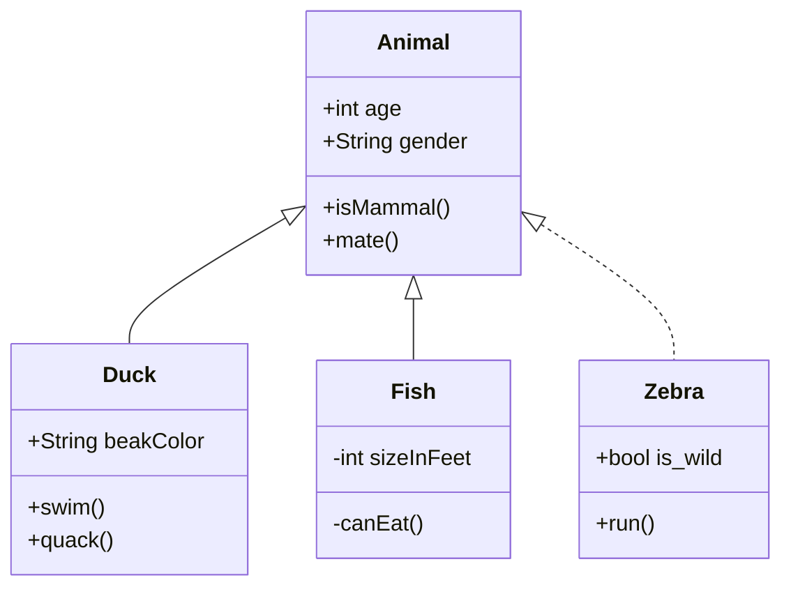

::: details 点击查看 $frontmatter

```md :no-v-pre :no-line-numbers
{{ $frontmatter }}
```

:::

~~删除线~~

## 创建文件夹

```bash
yarn init
yarn add --dev vitepress
```

::: code-tabs
@tab linux

```bash
mkdir docs && echo '# Hello VitePress' > docs/index.md
```

@tab windows

```bash
mkdir docs && echo # Hello VitePress > docs/index.md
# windows 系统 md 或者 mkdir 都是创建目录
```

:::

## 起步

本节将帮助您从头构建一个基本的 VitePress 文档站点。如果您已经有一个现有项目，并且希望将文档保存在项目中，请从步骤 3 开始。

- **Step. 1:** 创建并更改为新目录。

```bash
mkdir vitepress-starter && cd vitepress-starter
```

- **Step. 2:** 使用您喜欢的包管理器进行初始化。

```bash
yarn init
```

- **Step. 3:** 本地安装 VitePress。

    ```bash
    yarn add --dev vitepress
    ```

- **Step. 4:** 创建您的第一个文档。

    ```bash
    mkdir docs && echo '# Hello VitePress' > docs/index.md
    ```

- **Step. 5:** 添加一些脚本到 `package.json`.

    ```json
    {
        "scripts": {
            "docs:dev": "vitepress dev docs",
            "docs:build": "vitepress build docs",
            "docs:serve": "vitepress serve docs"
        }
    }
    ```

- **Step. 6:** Serve the documentation site in the local server.

    ```bash
    yarn docs:dev
    ```

    VitePress will start a hot-reloading development server at `http://localhost:3000`.

By now, you should have a basic but functional VitePress documentation site.

When your documentation site starts to take shape, be sure to read the

```text
[deployment guide](./deploy).
```

```bash
yarn add -D vuepress@next
```

安装 markdown-it-katex 数学解析库

```bash
yarn add markdown-it-katex
```



yarn create vuepress-theme-hope hope-blog

简单配置

## 使用 Git

可以使用 git 并部署到 Gitee Pages（Github Pages 也可以，但国内访问速度比较慢）

### 建立仓库

首先在 gitee 建立仓库

### 初始化 git

在本地项目中

```bash
git init
```

在项目中添加 gitee 远程仓库地址

```sh
git remote add gitee git@gitee.com:zedo/zedo.git
```

拉取远程仓库的代码

```sh
git pull gitee master
```

将临时目录和缓存目录添加到 `.gitignore` 文件中

```sh
echo 'node_modules' >> .gitignore
echo '.temp' >> .gitignore
echo '.cache' >> .gitignore
```

::: tip 提示
可以通过 `git status -sb` 查看当前纳入版本管理的文件，检测当前 `.gitignore` 文件是否生效
:::

::: warning 注意
如果是 Windows 系统，还需要检查 `.gitignore` 文件是否为 `UTF-8` 格式，否则 `.gitignore` 文件中不会生效。
:::

### 提交和推送

```bash
git add .
git commit -m "first commit"
git push gitee master
```

### 其他

清理本地缓存，如已经 `git add` 的文件

```sh
git rm -rf --cached .
```

<https://www.runoob.com/git/git-pull.html>

执行 `commit` 后，还没执行 `push` 时，想要撤销这次的 commit

```sh
git reset --soft HEAD^
```

[git commit 后，如何撤销 commit](https://www.jianshu.com/p/a9f327da3562)

[git push 的 -u 参数具体适合含义？](https://www.zhihu.com/question/20019419)

## markdown-it 相关

<https://github.com/markdown-it/markdown-it/blob/master/docs/architecture.md>

[markdown-it 原理解析](https://github.com/mqyqingfeng/Blog/issues/252)

[VuePress 博客优化之拓展 Markdown 语法](https://github.com/mqyqingfeng/Blog/issues/251)

[一篇带你用 VuePress + Github Pages 搭建博客](https://github.com/mqyqingfeng/Blog/issues/235)

[从零实现一个 VuePress 插件](https://github.com/mqyqingfeng/Blog/issues/250)

## 一些 v2 主题

[vuepress-theme-hope](https://github.com/vuepress-theme-hope/vuepress-theme-hope)

[vuepress-theme-gungnir](https://github.com/Renovamen/vuepress-theme-gungnir/)
