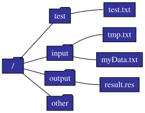
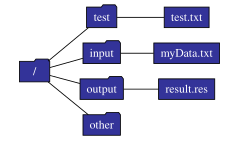

# 大数据技术与应用

提纲：

[[toc]]

## 1.大数据的概念

### 1.1 大数据的概念(P8-P10)

例：简述大数据的 4V 特征？并分别简要解释每个特征的意义？

> 4V 分别是：
>
> 数据量大(Volume)：数据量飙升，从 GB,TB 到 PB；2020 年，全球总共拥有约 $4.4\times 10^{41}\text{GB}$ 的数据量；
>
> 数据类型繁多(Variety)：也即多样化，终端多样，来源多样；
>
> 处理速度快(Velocity)：快速化，数据实时出现，用户需求实时变化，处理速度要求越来越高；
>
> 价值密度低(Value)：并非所有数据都有用，需要有效的算法挖掘价值

### 1.2 大数据的应用(P15)

例：请例举两个实际生活中大数据技术的应用实例？

> 汽车行业：利用大数据和物联网技术实现无人驾驶汽车
>
> 物流：利用大数据优化物流网络，提高物流效率，降低物流成本。

### 1.3 大数据关键技术(P16)

例：从数据分析全流程角度，大数据技术包含哪些内容？

每个内容请至少列出至少 2 个该内容包含的功能？

### 1.4 大数据的计算模式(P17)

例：大数据有哪些计算模式？每个计算模式下请列举至少 2 个代表产品？

1.5 大数据与云计算、物联网的关系（P27）

例：请简要说明大数据与云计算、物联网的联系与区别？

## 2. 大数据处理架构 Hadoop

### 2.1 Hadoop 生态系统(P31, 2.2)

例：给定如下的 Hadoop 生态系统，请简要说出该生态系统每个工具的主要功能？


### 2.2 Hadoop 的安装与使用(P34, 2.3.5&2.3.6)

例：在 Linux 下若以伪分布式的方式安装 Hadoop，若 Hadoop 启动成功，则输入 `JPS` 后应至少包含哪些 java 进程？

答：至少包含如下 3 个进程：

- NameNode
- SecondaryNameNode
- DataNode

## 3. 分布式文件系统 HDFS

本章为本课程的重点之一

### 3.1 HDFS 的相关概念(P49, 3.3)

块：HDFS 核心概念

HDFS 的一个块要比普通文件系统的块大很多

为什么这么设计？

- 支持面向大规模数据存储
- 降低分布式节点的寻址开销

缺点 ：

如果块过大会导致 MapReduce 就一两个任务在执行完全牺牲了 MapReduce 的并行度，发挥不了分布式并行处理的效果

例：假设 HDFS 中名称节点 NameNode 下 FsImage 中保存的文件目录结构以及 EditLog 中的内容如下图所示，回答如下问题：


1）若 16:00 时系统重启，且重启后至名称节点正常工作期间无任何操作，请给出此时的 FSImage 和 EditLog 的内容？

2）若此 HDFS 系统配置有第二名称节点，且第二节点每整点执行“检查点”操作，若系统在 15:08 分时名称节点出现故障，请给出解决措施，并给出最终恢复的名称节点中 FSImage 和 EditLog 的内容？

（1）EditLog 文件为空，FSImage 文件内容如下：



（2）解决措施略！（详见 51 页 3.3.3 节）

EditLog 文件为空，FSImage 内容如下：



3.2 HDFS 的存储原理（P54，3.5）

例：给定如下图所示的一个集群，集群中共有 4 个机架，每个机架上有 4 个节点。每个节点的标识如图所示，且每个节点的空间上限均为 1GB，设置 HDFS 块的大小为 128MB，复制因子为 3。假设目前 16 个节点的空间利用率分别为 [60%，70%，15%，25%，95%，95%，85%，88%，83%，25%，30%，33%，100%，90%，50%，20%] ，请回答如下问题。

1、假设节点 5 上的一个客户端向 HDFS 发出写请求，要求上传到 HDFS 一个 100MB 大小的本地文件，应如何分块，且应将块分配到哪几个节点上?

2、假设集群外的一个客户端向 HDFS 发出写请求，要求上传到 HDFS 一个 100MB 大小的本地文件，应如何分块，且应将块分配到哪几个几点上?

3、假设节点 9 上的一个客户端向 HDFS 发出写请求，要求上传到 HDFS 一个 200MB 大小的本地文件，应如何分块，且应将块分配到哪几个节点上?


1）若 3 个小题互相独立，没有关联，则：

1. 文件被划分到 1 个文件块当中；因复制比为 3，所以文件块会被额外复制 2 份，分别放在节点 3，节点 7 和节点 8 上。
2. 文件被划分到 1 个文件块当中；因复制比为 3，所以文件块会被额外复制 2 份，分别放在节点 3，节点 4 和节点 16 上。
3. 文件被划分到 2 个文件块中；因复制比为 3，所以每个文件块会被额外复制 2 份，文件块 1 分别放在节点 3，节点 9 和节点 10 上；文件块 2 分别放在节点 11，节点 12 和节点 16 上。

2）若 3 个小题存在递进关系，则：

1. 文件被划分到 1 个文件块当中；因复制比为 3，所以文件块会被额外复制 2 份，分别放在节点 3，节点 7 和节点 8 上。
2. 文件被划分到 1 个文件块当中；因复制比为 3，所以文件块会被额外复制 2 份，分别放在节点 3，节点 4 和节点 16 上。
3. 文件被划分到 2 个文件块中；因复制比为 3，所以每个文件块会被额外复制 2 份，文件块 1 分别放在节点 9、节点 10 和节点 16 上；文件块 2 分别放在节点 3、节点 11 和节点 12 上。

### 3.3 HDFS 命令行 API

例：现在的目录结构：


1. 请画出执行如下命令后的 HDFS 目录结构 (6 分)

    ```bash
    hdfs dfs –mkdir –p /input/tmp
    hdfs dfs –rm –r /other/
    hdfs dfs –put /home/hadoop/MyFile.txt /
    hdfs dfs –mv /*.txt /input
    hdfs dfs –cp /input/*.txt /input/tmp
    ```

2. 请画出执行如下命令后的 HDFS 目录结构（5 分）

    ```bash
    $if $(hdfs dfs –test –d /input/tmp);
    $then $(hdfs dfs –touchz /input/tmp/tmp.txt)
    $else $(hdfs dfs –mkdir –p /input/tmp && hdfs –dfs cp /other/* /input/tmp && hdfs –dfs touchz /input/tmp/tmp.txt)
    $fi
    hdfs dfs –rm /other/*.txt
    ```

1.

2.

### 3.3 HDFS 读程序写结果

假设 `/test/test1.txt`的原始内容为 `“This is a test file (回车)”` ，执行如下的 `Java`代码之后，请给出 `/test/test1.txt` 的内容。

```java
public static void dodo(Configuration conf, String content, String str2) {
    char[] chars = content.toCharArray();
    for (int i = 0; i < chars.length; i++) {
        if ('a' <= chars[i] && chars[i]<= 'z'){
            chars[i] -= 32;
        }
    }
    content = String.valueOf(chars);
    try (FileSystem fs = FileSystem.get(conf)) {
        Path remotePath = new Path(str2);
        FSDataOutputStream out = fs.append(remotePath);
        out.write(content.getBytes());
        out.close();
    } catch (IOException e) {
        e.printStackTrace();
    }
}

public static void main(String[] args) {
    Configuration conf = new Configuration();
    conf.set("fs.defaultFS", "hdfs://master:9000");
    String remoteFilePath = "/test/test1.txt";
    String content = "Hello Hadoop^_^!";
    dodo(conf,content,remoteFilePath);
}
```

内容为：

```text
This is a test file
HELLO HADOOP^_^!
```

3.4 HDFS 的存储机制（读写过程：P57，3.6）

例：简述 HDFS 的写入过程和读入过程，假设复制因子为 3？

答：
**读入时**：

1）客户端向 NameNode 请求上传文件，NameNode 检查目标文件是否已存在，父目录是否存在。

2）NameNode 返回是否可以上传。

3）客户端请求第一个 block 上传到哪几个 DataNode 服务器上。

4）NameNode 返回 3 个 DataNode 节点，分别为 dn1、dn2、dn3。

5）客户端请求 dn1 上传数据，dn1 收到请求会继续调用 dn2，然后 dn2 调用 dn3，将这个通信管道建立完成。

6）dn1、dn2、dn3 逐级应答客户端

7）客户端开始往 dn1 上传第一个 block（先从磁盘读取数据放到一个本地内存缓存），以 packet 为单位，dn1 收到一个 packet 就会传给 dn2，dn2 传给 dn3；dn1 每传一个 packet 会放入一个应答队列等待应答

8）当一个 block 传输完成之后，客户端再次请求 NameNode 上传第二个 block 的服务器。（重复执行 3-7 步）

**写入时**：

1）客户端向 NameNode 请求下载文件，NameNode 通过查询元数据，找到文件块所在的 DataNode 地址。

2）挑选一台 DataNode（就近原则，然后随机）服务器，请求读取数据。

3）DataNode 开始传输数据给客户端（从磁盘里面读取数据放入流，以 packet 为单位来做校验）。

4）客户端以 packet 为单位接收，先在本地缓存，然后写入目标文件。

## 4.分布式数据库 HBase

> 本章为本课程的重点之一

### 4.1 HBase 数据模型(P70, 4.3)

例：给定如下的数据，请按要求完成如下问题：

1）请将该数据转化为 HBase 数据模型；

2）分别画出该数据模型的概念视图和物理视图；

<table>
    <thead>
        <tr>
            <th><span>学号（行键）</span></th>
            <th><span>姓名</span></th>
            <th><span>语文</span></th>
            <th><span>数学</span></th>
            <th><span>英语</span></th>
            <th><span>时间戳(变量)</span></th>
        </tr>
    </thead>
    <tbody>
        <tr>
            <td rowspan="3">001<br></td>
            <td rowspan="3">张三</td>
            <td>88</td>
            <td>-</td>
            <td>89</td>
            <td>ts1</td>
        </tr>
        <tr>
            <td>86</td>
            <td>88</td>
            <td>79</td>
            <td>ts2</td>
        </tr>
        <tr>
            <td>92</td>
            <td>68</td>
            <td>-</td>
            <td>ts3</td>
        </tr>
        <tr>
            <td rowspan="2">002</td>
            <td rowspan="2">李四</td>
            <td>77</td>
            <td>88</td>
            <td>79</td>
            <td>ts3</td>
        </tr>
        <tr>
            <td>-</td>
            <td>57</td>
            <td>65</td>
            <td>ts1</td>
        </tr>
        <tr>
            <td rowspan="2">003</td>
            <td rowspan="2">王五</td>
            <td>98</td>
            <td>-</td>
            <td>99</td>
            <td>ts2</td>
        </tr>
        <tr>
            <td>65</td>
            <td>77</td>
            <td>-</td>
            <td>ts3</td>
        </tr>
    </tbody>
</table>

1\.

<table>
    <thead>
        <tr>
            <th rowspan="2"><span style="font-weight:bold">学号（行键）</span></th>
            <th><span style="font-weight:bold">信息</span></th>
            <th colspan="3"><span style="font-weight:bold">成绩</span></th>
        </tr>
        <tr>
            <th>姓名</th>
            <th>语文</th>
            <th>数学</th>
            <th>英语</th>
        </tr>
    </thead>
    <tbody>
        <tr>
            <td>001<br></td>
            <td>张三</td>
            <td>88(ts1)<br>86(ts2)<br>92(ts3)</td>
            <td>88(ts2)<br>68(ts3)</td>
            <td>89(ts1)<br>79(ts2)</td>
        </tr>
        <tr>
            <td>002</td>
            <td>李四</td>
            <td>77(ts3)</td>
            <td>88(ts3)<br>57(ts1)</td>
            <td>79(ts3)<br>65(ts1)</td>
        </tr>
        <tr>
            <td>003</td>
            <td>王五</td>
            <td>98(ts2)<br>65(ts3)</td>
            <td>77(ts3)</td>
            <td>99(ts2)</td>
        </tr>
    </tbody>
</table>

2\.

<table>
    <thead>
        <tr>
            <th><span>学号（行键）</span></th>
            <th><span>时间戳</span></th>
            <th><span>信息</span></th>
            <th><span>成绩</span></th>
        </tr>
    </thead>
    <tbody>
        <tr>
            <td rowspan="3">001<br></td>
            <td>ts1</td>
            <td rowspan="3">信息：姓名=张三</td>
            <td>成绩：语文=88，英语=89</td>
        </tr>
        <tr>
            <td>ts2</td>
            <td>成绩：语文=86，数学=88，英语=79</td>
        </tr>
        <tr>
            <td>ts3</td>
            <td>成绩：语文=92，数学=68</td>
        </tr>
    </tbody>
</table>

后略……

### 4.2 HBase 实现原理(P75, 4.4)

### 4.3 HBase 运行机制(P78, 4.5)

例：假设一个 HBase 集群中有 1 个 Master 服务器（表示为 MS ）以及 5 台 Region 服务器，分别标识为 RS1，RS2，RS3，RS4 和 RS5，HBase 中设置 Region 的默认大小为 128MB。假设目前 HBase 中存储了一个大小为 1GB 的数据表，该数据表被分成了 10 个 Region，分别标识为 R1，R2，…，R10，且集群中各 Region 服务器负载均衡，即 RS1 中存放了 R1 和 R2；RS2 中存放了 R3 和 R4；以此类推。假设 META 表被分割成 2 份（M1 和 M2）分别保存在 RS2 和 RS5 中，M1 表存放了 R1-R5 的信息，M2 表存放了 R6-R10 的信息，ROOT 表保存在 RS1 中。请回答如下问题。

1. 请根据如上的描述，分别写出 ROOT 表以及各个 META 表中完整的映射关系，画出 HBase 相应的三层映射结构。

2. 假设某个操作员按照上级的要求在如下表规定的时间对 HBase 进行相应的操作，且 HBase 在 12:00 正式启动完毕，假设表中的操作全部映射到 RS2，

    (1)请列出 14:00 时（假设 OP7 已完成）RS2 上 HLog 的内容。

    (2)若 14：00 时 RS2 发生故障，缓存的刷新频率为 1 小时 1 次（每个整点的 01 分开始刷新），若 Master 已经获知了 RS2 的故障信息并准备将 R3 和 R4 分别分配给 RS1 和 RS3，请描述整个分配过程，包括 HLog，缓存的内容变化，R3 和 R4 需要执行哪些操作以及各个服务器如何协作？

| **时间**  |  **操作**  |         **备注**          |
| :-------: | :--------: | :-----------------------: |
| **12:15** | OP1:写数据 | 写入约 30MB 数据，操作 R3 |
| **12:30** | OP2:读数据 | 读取约 20MB 数据，操作 R3 |
| **12:45** | OP3:删数据 |   删除一个列族，操作 R4   |
| **13:00** | OP4:读数据 | 读取约 10MB 数据，操作 R3 |
| **13:11** | OP5:写数据 | 写入约 50MB 数据，操作 R4 |
| **13:44** | OP6:删数据 |    删除一个列，操作 R3    |
| **13:56** | OP7:读数据 | 读入约 10MB 数据，操作 R3 |
| **14:12** | OP8:写数据 | 写入约 10MB 数据，操作 R4 |

1. 三层映射结构如下图

    

    2.(1) HLog 包含了该 Region 服务器下所有 Region 的更新信息，所以应包含 OP1,OP3,OP5 和 OP6 的所有操作信息以及操作数据，其他读信息并不会更新 Region 结构，所以不会存储。

    (2) ZooKeeper 服务器会实时监测每个 Region 服务器的状态，当 RS2 发生故障时，ZooKeeper 会通知 Master 服务器。Master 首先读取 HLog 文件，当前 HLog 文件中包含了 OP1,OP3,OP5 和 OP6 ，然而由于缓存是 1 小时刷新 1 次，在 13:01 时已经进行了缓存的刷新，即 OP1 和 OP3 的操作已经被应用 R3 和 R4 上去了。Master 在拿到 HLog 文件之后，将 HLog 文件拆成 2 个部分 H1 和 H2，H1 中保留了 R3 的所有更新操作，即 OP1 和 OP6 ，然后将 H1 和失效的 R3 一起发送给 RS1，RS1 拿到 R3 和 H1 后，按照 H1 中的操作对 R3 进行更新，实际上只进行了 OP6 的操作，写入自己的 HLog 以及缓存之中，并立即对缓存进行刷新，开始维护 R3；

    R4 相关的操作同理可得。

## 5.NoSQL 数据库

### 5.1 NoSQL 的四大类型(P102, 5.4)

例：简述 NoSQL 数据库的四大类型以及各类型的至少 2 个代表数据库？

### 5.2 CAP 理论(P105, 5.5.1)

一致性(Consistency)：是指在同一时刻，分布式系统中的所有数据备份为相同值；

可用性(Availability)：指集群中的某一个节点故障宕机后，集群还能响应客户端请求。

分区容忍性(Partition tolerance)：当分布式系统中因为一些原因导致无法通信而分成多个分区，系统还能正常对外服务。

CAP 理论在分布式系统中，只能实现其中两个特性。而分区容忍性 (P) 必须要实现，所以我们多数情况下需要在一致性 (C) 和可用性 (A) 之间进行权衡。

例：如图所示，假设 M1 和 M2 为两个分布式环境下的节点，M1 和 M2 为数据 V 副本的存放节点，进程 P1 向 M1 写入新值 val1，进程 P2 读取 M2 的值。当新值更新失败时，该分布式系统的操作如上图，请从 CAP 理论的角度解释图中的流程，并给出该系统基于 CAP 理论的设计原则？


答：该分布式系统采用 AP 设计原则，其他略。（详见第 106-107 页）

### 5.3 最终一致性(P108, 5.5.3)

例：什么是最终一致性？根据更新数据后各进程访问到数据的时间和方式的不同可以分为哪几类？

答：略。（详见 P108：5.5.3）

## 6.MapReduce

**本章所有内容均为知识点，为本课程的重点和难点之一。**

例 1（简答题）：请详细描述 MapReduce 的执行过程（从输入文件开始，包含 Map 端和 Reduce 端的 Shuffle 过程）
答（缩略版，详见 134 页 7.2.2 以及 135 页 7.2.3）：

1. 输入格式验证；
2. 逻辑切分；
3. 按分片加载数据并转化为键值对，输入给 Map 任务；
4. Map 任务输出键值对列表，并写入缓存；
5. 缓存满时启动溢写过程，对缓存数据进行分区、排序和合并操作；
6. 对溢写的所有文件进行归并；
7. Reduce 任务从各个 Map 经过 shuffle 过程得到的键值对列表中“领取”属于自己的数据；
8. 执行 Reduce 任务，执行用户定义的逻辑，并提交结果；
9. 验证结果是否符合配置要求；
10. 结果保存至 HDFS 分布式文件系统。

-

1. InputFormat 从 HDFS 中加载文件，并对其输入进行格式验证
2. InputFormat 把大文件切分（split，逻辑上）
3. RR（RecordReader）按分片加载数据并转化为键值对，输入给 Map 任务（Key-Value 的形式）；
4. Map 任务输出键值对列表，并写入缓存（中间结果）；
5. Shuffle：缓存满时启动溢写过程，对缓存数据进行分区、排序和合并操作；

### Shuffle

例 2（分析题）现需要用 MapReduce 实现大数据量的单词计数工作，请回答如下问题：

1. 若输入的待统计的文件共有 5 个，且大小分别是 110MB, 1MB, 1KB, 600MB 以及 30MB，请问应该设置几个 Map 任务？

2. 若待输入的文件为 3 个，且 3 个文件的内容分别为 “Hello World Bye World”, “Hello Hadoop Bye Hadoop”, “Bye Hadoop Hello Hadoop”，若分配 3 个 Map 任务，Reduce 任务个数为默认，请给出 Map 任务的输入，Map 任务的输出，Map 任务 shuffle 后经过 Combiner（合并）后的 Reduce 的输入，以及 Reduce 的输出结果。

答：

1. Map 任务每 64MB 为一块，大于该数值的文件需要 split，因此 110 分为两块，600 分为 $\displaystyle\left\lceil \frac{600}{64} \right\rceil=10$ 块，其他各一块，总共 15 块，即需要 15 个 Map 任务。

2.


例 3（程序设计题）现需要用 MapReduce 对海量的实数集进行排序，输入的文件内容为各个实数，输出的格式为 <实数，排序位次> ，已知这些数据的分布范围为 [m,n] 。注意，输入的数据中可能存在重复数据，若存在，只需要保留 1 个就好，请分别在以下条件下设计相应的算法完成排序过程。

(1) 仅有 1 个 Reduce 任务

(2) 存在 k（k>1）个 Reduce 任务

答：
（1）Map 端输入原始数据，并输出 <实数，1> 的键值对列表，在 Shuffle 过程中重写合并逻辑，对同样 key 的键值对统一合并为 <实数，1> ，并作为 Reduce 的输入；Reduce 直接对其得到的数据输出，并设置一个初始为 1 的累加器，没输出一个 key，累加器加 1，并同时输出 key 以及对应的累加器的值。

（2）Map 端与（1）相同，Shuffle 过程合并逻辑与（1）相同，但需要额外重写分区逻辑，将整个数据集分为 k 组，第 x 组的数据应该包括 $\left[ m+\left( x-1 \right) \left( \lfloor \frac{m-n}{k} \rfloor +1 \right) ,m+x\left( \lfloor \frac{m-n}{k} \rfloor +1 \right) \right)$ ；其他的 Reduce 操作与（1）相同。

> 注：本章内容有可能会出与 HDFS, HBase，Hive 以及 Storm 结合在一起的综合性大题（具体题目内容以期末考试卷面题目内容为准），请大家认真复习！

## 7.数据仓库 Hive

### 7.1 Hive 的 SQL 查询转换成 MapReduce 作业过程(P179, 9.3.2)

例：请给出 Hive 中 SQL 查询转换成 MapReduce 作业的过程？

答：（简要版，详见 9.3.2）

1、转化抽象语法树；

2、生成查询块；

3、生成操作树；

4、优化操作树；

5、生成可执行 MapReduce 作业；

6、优化 MR 作业并生成 MR 职业执行计划；

7、执行 MR 作业，输出。

### 7.2 Impala 查询执行过程(P182, 9.5.3)

例：请说明 Impala 的查询执行过程。

答（简要，详见 9.5.3）：

1、注册和订阅；

2、提交查询；

3、获取元数据和数据地址；

4、分发查询任务；

5、汇聚结果；

6、返回结果。

### 7.3 Impala 与 Hive 的异同(P183, 9.5.4)

例：试总结 Impala 与 Hive 的异同

答：（详见 9.5.4）

## 8.Spark

本章为本课程的重点难点之一

### 8.1 Scala 程序读写

例：请写出下列 Scala 语句 REPL 环境下的输出结果。

（1）`(1 to 100).filter(x => (x % 2) != 0).map(x => x).foldLeft(0)(_ + _)`
答：2500

（2）给出以下程序的输出结果

```scala
def main(args: Array[String]): Unit = {
    val array = Array(4,12,6,3,8,9,5)
    val ab = array.toBuffer
    val forLoop = new Breaks
    for (i <- 1 until ab.length){
        val value_i = ab(i)
        forLoop.breakable {
            for (j <- 0 to i - 1) {
                val value_j = ab(j)
                if (value_j > value_i) {
                    ab.remove(i, 1)
                    ab.insert(j, value_i)
                    forLoop.break()
                }
            }
        }
    }
    println(ab)
}
```

答：此程序实际为标准的冒泡排序过程，故输出为：

```text
3
4
5
6
8
9
12
```

### 8.2 Spark 与 Hadoop 的对比(P193, 10.1.3)

例：试说明 Spark 与 Hadoop 之间的联系和区别？

### 8.3 RDD 编程(P211, 10.5.2)

例：假设有如下的一个元素形成的 RDD：

```bash
scala> val list = List(1,2,3,4,5,6,7,8,9)
```

请分别给出执行如下 RDD 操作之后的结果：
(1) `list.reduce(_+_)`

(2) `list.reduceRight(_-_)`

(3) `list.reduceLeft(_-_)`

(4) `rdd.filter(i=>i>=5).count`

答：（1）$1+2+3+4+5+6+7+8+9=45$

（2）$1-(2-(3-(4-(5-(6-(7-(8-9)))))) = 5$

（3）$(((((((1-2)-3)-4)-5)-6)-7)-8)-9 =-43$

（4）过滤大于等于 5 的元素，然后计数，共有 5 个（5, 6, 7, 8, 9）

> <https://blog.csdn.net/itcats_cn/article/details/89068611>
>
> <https://blog.csdn.net/realize_dream/article/details/85882786>

### 8.4 Spark 运行基本流程

例：试简述 Spark 运行基本流程？


（1）首先为应用构建起基本的运行环境，即由 Driver 创建一个 SparkContext ，进行资源的申请、任务的分配和监控；

（2）资源管理器为 Executor 分配资源，并启动 Executor 进程；

（3）SparkContext 根据 RDD 的依赖关系构建 DAG 图，DAG 图提交给 DAGScheduler 解析成 Stage，然后把一个个 TaskSet 提交给底层调度器 TaskScheduler 处理；Executor 向 SparkContext 申请 Task，Task Scheduler 将 Task 发放给 Executor 运行，并提供应用程序代码；

（4）Task 在 Executor 上运行，把执行结果反馈给 TaskScheduler ，然后反馈给 DAGScheduler ，运行完毕后写入数据并释放所有资源。

### 8.5 RDD 的设计与运行原理(P199, 10.3.4)

例：给定如下图所示的 RDD 依赖关系 DAG，请指明其中哪些 RDD 的依赖关系为窄依赖，哪些为宽依赖？并根据此 DAG 图划分 stage ，给出你划分的 stage ？


答：
宽依赖：A->B, F->G

窄依赖：B->G, C->D, D->F, E->F

划分为 3 个 Stage：

Stage1：A

Stage2：C D E F

Stage3：A B C D E F G

## 9.流计算

### 9.1 流计算概述(P220, 11.1)

例：流计算应达到什么需求？

### 9.2 Storm 框架(P226, 11.4)

例：给定如下所示的 Storm 相关代码，请说明该拓扑的作用？该拓扑中定义了两个 Bolt，试述两个 Bolt 各自完成的功能，以及中间结果如何在两个 Bolt 之间传输？

```java
TopologyBuilder builder = new TopologyBuilder();
builder.setSpout ("sentences", new RandomSentenceSpout(), 5);
builder.setBolt("split", new SplitSentence(), 8)
     .shuffleGrouping ( "sentences");
builder.setBolt ("count", new WordCount (), 12)
  .fieldsGrouping ("split", new Fields("word"));
```

答：该 Topology 实现了单词统计的功能。该 Topology 中包含了两个 Bolt 处理器，同时，每个 Bolt 使用了 Groupings() 系列方法定义了 Tuple 的发送方式。

通过这两个 Bolt 的定义我们可以看出：

第一个 Bolt 用于单词的分割，该 Bolt 中的任务随机接收 Spout 发送的句子，并从接收的句子中提取出单词；

第二个 Bolt 接收第一个 Bolt 发送的 Tuple 进行处理（Bolt 是通过订阅 Tuple 的名称来接收相应的数据，第一个 Bolt 声明其输出 Stream 的名称为 “split” ，而第二个 Bolt 声明其订阅的 Stream 为 “split” ，因此第二个 Bolt 可以接收到第一个 Bolt 发送的 Tuple ），即统计分割后的单词出现的次数。通过 fieldsGroupings() 方法，在 “word” 上具有相同字段值的所有 Tuple （即单词相同的 Tuple）将发送到同一个任务中进行统计，从而保证了统计的准确性。

### 9.3 Spark Streaming 与 Storm 辨析(P233, 11.5.2)

例：简要说明 Spark Streaming 与 Storm 的区别与适用条件？

答：

主要区别：

1、实时性：一般 Storm 的时延性比 spark streaming 要低，原因是 Spark Streaming 是小的批处理，通过间隔时长生成批次，一个批次触发一次计算，Storm 是实时处理，来一条数据，触发一次计算，所以可以称 spark streaming 为流式计算，Storm 为实时计算。

2、吞吐量 ：Storm 的吞吐量要略差于 Spark Streaming，原因一是 Storm 从 spout 组件接收源数据，通过发射器发送到 bolt，bolt 对接收到的数据进行处理，处理完以后，写入到外部存储系统中或者发送到下个 bolt 进行再处理，所以 storm 是移动数据，不是移动计算；Spark Streaming 获取 Task 要计算的数据在哪个节点上，然后 TaskScheduler 把 task 发送到对应节点上进行数据处理，所以 Spark Streaming 是移动计算不是移动数据。批处理的吞吐量一般要高于实时触发的计算。

3、容错机制：storm 是 acker（ack/fail 消息确认机制）确认机制确保一个 tuple 被完全处理，Spark Streaming 是通过存储 RDD 转化逻辑进行容错，容错机制不一样，暂时无所谓好坏。

适用条件：

1、在需要纯实时的场景下使用 Storm 。

2、由于 Storm 可以动态调整实时计算程序的并行度，所以在需要针对高峰低峰时间段，动态调整实时计算程序的并行度，以最大限度利用集群资源（通常是在小型公司，集群资源紧张的情况）的情况下，考虑用 Storm 。

3、复杂的实时计算逻辑选用 Spark Streaming 。

4、Spark Streaming 有一点是 Storm 绝对比不上的，那就是 Spark 提供了一个统一的解决方案，在一个集群里面可以进行离线计算、流式计算、图计算、机器学习等，而 Storm 集群只能单纯的进行实时计算。

> [大数据基础](https://blog.csdn.net/Cenny_/article/details/119216063)
>
> [MapReduce 中 map 分片大小确定和 map 任务数的计算](https://wenku.baidu.com/view/4c1f850f677d27284b73f242336c1eb91a3733ed.html)
>
> [HBase 数据模型、概念视图和物理视图](https://blog.csdn.net/maoyg0821/article/details/80059041)
