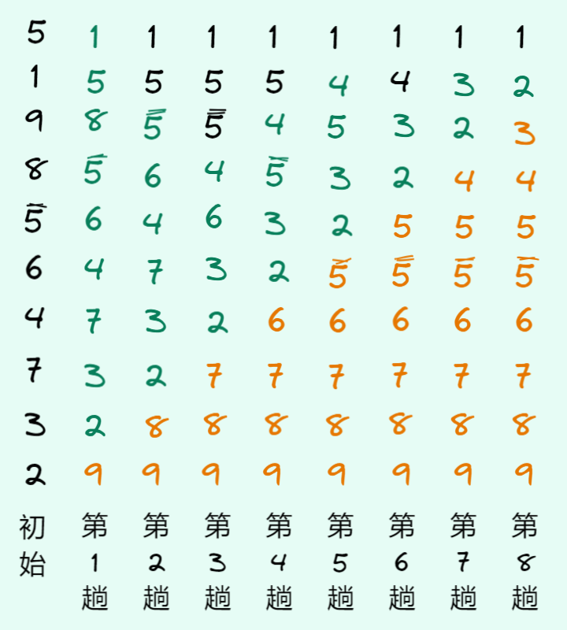

# 数据结构 - 交换排序

基本思想：所谓交换，就是根据序列中两个记录键值的比较结果来对换这两个记录在序列中的位置。

交换排序的特点是：将键值较大的记录向序列的尾部移动，键值较小的记录向序列的前部移动。

由于需要用到“交换”，这里先给出交换两个数的 `swap` 函数的定义：

```c
/**
 * 交换两个数
 * @param 数 a 的地址
 * @param 数 b 的地址
 */
void swap(int *a, int *b) {
    int tmp = *a;
    *a = *b;
    *b = tmp;
}
```

## 冒泡排序

冒泡排序的基本思想是：从前往后（或从后往前）两两比较相邻元素的值，若为逆序（即 arr[i-1] > arr[i]）就交换它们，直到整个序列比较完。这也叫第一趟冒泡。下一趟冒泡时，前一趟确定的最大（或最小）元素不再参与比较。每趟冒泡都会把序列中最大（或最小）的元素放在最终位置。这样最多需要 $n-1$ 趟冒泡就能把序列排好序。

下图是（向下）冒泡排序的过程，第一趟排序时：$5>1$，交换；$5<9$，不交换；$9>8$，交换；$9>\overline5$，交换； $9>6$，交换；$9>4$，交换；$9>7$，交换；$9>3$，交换；$9>2$，交换。这样，最大的元素 9 就交换到最后了。后面几趟冒泡过程的描述省略。每次排序，值最大的元素都会“沉底”。

::: tip

我们也可以“向上”冒泡，每次把最小元素“漂浮”到“水面”。

:::



上图中，我们将每趟冒泡“沉底”的元素用 <span style="color: #e67700"> 橘色</span> 标记（即排好序的元素），每趟冒泡发生交换的元素用 <span style="color: #087f5b">绿色</span> 标记。注意 $5$ 和 $\overline{5}$ 的相对位置没有发生改变。

下面的动图来自 [github](https://github.com/hustcc/JS-Sorting-Algorithm/blob/master/res/bubbleSort.gif)，它可以更直观的体现整个冒泡排序的过程：


### 代码实现

假设要让 [0, end] 中最大元素的位置放在 arr[end]，那么 end 的范围应该是 [0, n-1]，即 \[0, n)。对于 [0, end], [end+1, n-1] 两部分区间，后者是有序的，前者要让两两相邻元素比较，我们可以让它和它之前的元素比较，则用于该循环的变量范围是 [1, n-(end+1)]，即 \[1, n-end)。

```c
/**
 * 冒泡排序
 * @param arr 数组
 * @param n 数组长度
 */
void bubble_sort(int *arr, int n) {
    for (int end = 0; end < n; end++) {
        // 每次排序，最大元素都会在最右边
        for (int j = 1; j < n - end; j++) {
            if (arr[j - 1] > arr[j]) {
                swap(arr + j - 1, arr + j);
            }
        }
    }
}
```

优点：每趟排序结束后，都能把至少 1 个元素放在最终位置，同时能够局部排好其他元素。

### 优化

与[直接插入排序](insertion-sort.md#直接插入排序)相比，谁的效率更高？答案是直接插入排序！

请看下面这个例子：1 2 3 5 4 6 （接近有序），分别用直接插入排序和冒泡排序处理。

直接插入排序（序号代表趟数，<span style="color:red">红色</span>表示当前处理的，<span style="color:#087f5b">绿色</span>表示移动）：

1. 1 <span style="color:red">2</span> 3 5 4 6，比较 1 次，不发生移动；
2. 1 2 <span style="color:red">3</span> 5 4 6，比较 1 次，不发生移动；
3. 1 2 3 <span style="color:red">5</span> 4 6，比较 1 次，不发生移动；
4. 1 2 3 <span style="color:red">4</span> <span style="color:#087f5b">5</span> 6，比较 2 次，移动 1 个元素；
5. 1 2 3 4 5 <span style="color:red">6</span>，比较 1 次，不发生移动；

总共比较 $1\times 4+2=6$ 次，复杂度为 $\ds\sum_{i=1}^{n-1}{(1+c)}=O(n)$。

冒泡排序（<span style="color: #e67700"> 橘色</span>表示已排好序，<span style="color: #087f5b">绿色</span>表示发生交换）：

1. 1 2 3 <span style="color: #087f5b">4 5</span> <span style="color:#e67700">6</span>，比较 5 次，交换 1 次；
2. 1 2 3 4 <span style="color:#e67700">5 6</span>，比较 4 次，不发生交换；
3. 1 2 3 <span style="color:#e67700">4 5 6</span>，比较 3 次，不发生交换；
4. 1 2 <span style="color:#e67700">3 4 5 6</span>，比较 2 次，不发生交换；
5. 1 <span style="color:#e67700">2 3 4 5 6</span>，比较 1 次，不发生交换。

总共比较 $5+4+3+2+1=15$ 次，复杂度为 $\ds\sum_{i=1}^{n-1}{(n-i )}=O(n^2)$。

由此可见，插入排序对有序（接近有序、局部有序）序列的适应性更强。

除此之外，从上面冒泡排序的例子来看，如果某一趟排序中**没有发生交换**，就说明已经排好序了，后面的几趟排序就可以省略，算法可以结束。我们用一个变量 `exchange` 标记一趟遍历中是否发生交换来实现优化：

```c
// 冒泡排序（优化）
void bubble_sort(int *arr, int n) {
    for (int end = 0; end < n; end++) {
        // 每次排序，最大元素都会在最右边
        int exchange = 0; // 这里用一个变量标记是否发生交换
        for (int j = 1; j < n - end; j++) {
            if (arr[j - 1] > arr[j]) {
                swap(arr + j - 1, arr + j);
                exchange = 1;
            }
        }
        // 没有发生交换，说明已经有序
        if (exchange == 0) {
            break; // 也可以用 return;
        }
    }
}
```

### 复杂度分析

若序列有 n 个序列，总共需要 n-1 趟排序；第 $i$ 趟需要比较 $n-i$ 次。

最好情况：序列为完全顺序。此时只需要比较第一趟，序列不发生交换，算法就会终止，比较次数 $n-1$，移动次数 $0$。复杂度为 $O(n)$。

最坏情况：序列为完全逆序。此时每趟都需要比较，共 $\ds \sum_{i=1}^{n-1}{(n-i)}=\frac{n^2-n}{2}$ 次；每次比较都会交换，一次交换需要 3 步操作，共 $3\ds \sum_{i=1}^{n-1}{(n-i)}=\frac{3(n^2-n)}{2}$ 次操作。复杂度为 $O(n^2)$。

平均情况：先看标准版本，比较次数为 $\ds \sum_{i=1}^{n-1}{(n-i)}=\frac{n^2-n}{2}$，交换次数比最坏情况要少，但复杂度仍为 $O(n^2)$，因此标准版本冒泡排序平均时间复杂度为 $O(n)$。

在改进冒泡排序的情况下，与标准版本相比，需要执行更少的比较和交换次数，但如果讨论时间复杂度，平均和最坏情况下的时间复杂度与标准时间复杂度相同：$O(n^2)$。

空间复杂度：仅使用了常数个辅助变量，故为 $O(1)$。

稳定性：当 $\rm arr[j-1]=arr[j]$ 时并不会交换，故算法是稳定的，这个也可以从最开始的冒泡排序示例图体现出来。

## 快速排序

快速排序是 Hoare 于 1962 年提出的一种分治递归的交换排序方法，其基本思想为：任取待排序元素序列中的某元素作为基准值 (一般用 pivot 表示)，按照该排序码将待排序集合分割成两子序列，左子序列中所有元素均小于基准值，右子序列中所有元素均大于基准值，然后最左右子序列重复该过程，直到所有元素都排列在相应位置上为止。

基准一般选取序列中两端的元素，当然若要选取其他位置的元素，只需要交换到两端就好了。

例子：序列 $\{\textcolor{#e67700}{49},38,65,97,76,13,27,49^\ast\}$，选取 $\textcolor{#e67700}{49}$ 为基准，可以划分得到的如下区间：

$$
\{27,38,13\},\textcolor{#e67700}{49},\{76,97,65,49^\ast\}
$$

其中 $\{27,38,13\}$ 中每个值都比 49 小，$\{76,97,65,49^\ast\}$ 中每个值都比 49 大(>=)。

接着，再对 49 左右两边的子序列再次划分：

$$
\underline{\{13\},{\color{red} 27},\{38\}},\textcolor{#e67700}{49},\underline{\{49^\ast,65\},{\color{cyan}76},\{97\}}
$$

此时该序列就已经有序了。

将区间按照基准值划分为左右两半部分的常见方式有多种方法，这里给出常见的 3 种。

### 挖坑法

设有 3 个指针，`pivot` 始终指向“坑”的位置。初始时，指针 `begin` 和 `end` 分别在序列两端，选取首元素为“坑”，且首元素的值记为 `key`。

`begin` 和 `end` 都要往“坑”的方向走，中途若 `begin` 碰到比坑大的，或 `end` 碰到比坑小的，就要在原地“挖”一个新的“坑”，并把当前的值填到旧坑里。当 `begin` 和 `end` 相遇时结束，且相遇的位置就是 `key` 值在排序后的最终位置。

以上面给的序列为例子，初始时，首元素为 6，即 `key=49` ，带框的元素表示“坑”，**坑里面的值并不重要**：

$$
\begin{array}{cccc cccc}
\text{pivot}\\[-2pt]
\downarrow\\[-2pt]
\boxed{49} & 38 & 65 & 97 & 76 & 13 & 27 & 49^\ast\\[-2pt]
\uparrow &&&&&&& \uparrow \\[-2pt]
\text{begin} &&&&&&& \text{end} \\
\end{array}
$$

step1：坑在左边，`end` 指针往左边走，同时寻找比 `key` 小的值：

$$
\begin{array}{cccc cccc}
\text{pivot}\\[-2pt]
\downarrow\\[-2pt]
\boxed{49} & 38 & 65 & 97 & 76 & 13 & 27 & 49^\ast\\[-2pt]
\uparrow &&&&&& \uparrow \\[-2pt]
\text{begin} &&&&&& \text{end} \\
\end{array}
$$

step2：`end` 找到目标 27，在原地形成新坑（移动 `pivot` 指针），并把当前 `end` 处的值 27 填到旧坑里（`begin` 处）：

$$
\begin{array}{cccc cccc}
&&&&&& \text{pivot}\\[-2pt]
&&&&&& \downarrow\\[-2pt]
\color{red}27 & 38 & 65 & 97 & 76 & 13 & \boxed{27} & 49^\ast\\[-2pt]
\uparrow &&&&&& \uparrow \\[-2pt]
\text{begin} &&&&&& \text{end} \\
\end{array}
$$

step3：现在 `pivot = end`，指针 `begin` 往右找比 `key=49` 大的值；指针 `begin` 找到了目标 65，在原地新成新坑，并把目标 65 填到旧坑里（`end` 处）：

$$
\begin{array}{cccc cccc}
&& \text{pivot} \\[-2pt]
&& \downarrow \\[-2pt]
27 & 38 & \boxed{65} & 97 & 76 & 13 & \color{red}65 & 49^\ast\\[-2pt]
&& \uparrow &&&& \uparrow \\[-2pt]
&& \text{begin} &&&& \text{end} \\
\end{array}
$$

step4：`end` 往左边找比 `key=49` 大的值，找到了目标 13，在原地新成新坑并把目标 13 填进旧坑里：

$$
\begin{array}{cccc cccc}
&&&&& \text{pivot} \\[-2pt]
&&&&& \downarrow \\[-2pt]
27 & 38 & \color{red}13 & 97 & 76 & \boxed{13} & 65 & 49^\ast\\[-2pt]
&& \uparrow &&& \uparrow \\[-2pt]
&& \text{begin} &&& \text{end} \\
\end{array}
$$

重复以上步骤，可得：

$$
\begin{array}{cccc cccc}
&&& \text{pivot} \\[-2pt]
&&& \downarrow \\[-2pt]
27 & 38 & 13 & \boxed{97} & 76 & \color{red}97 & 65 & 49^\ast\\[-2pt]
&&& \uparrow && \uparrow \\[-2pt]
&&& \text{begin} && \text{end} \\
\end{array}
$$

最终，`begin` 和 `end` 相遇，此时把关键码 `key` 放到这个坑里

$$
\begin{array}{cccc cccc}
&&& \text{pivot} \\[-2pt]
&&& \downarrow \\[-2pt]
27 & 38 & 13 & \boxed{\color{red}49} & 76 & 97 & 65 & 49^\ast\\[-2pt]
&&& \uparrow ~\uparrow \\[-2pt]
&&& \!\!\!\!\text{begin}~\text{end} \\
\end{array}
$$

当 `begin` 和 `end` 相遇时，将 `key` 放入该位置，此时就完成了划分。

到此为止，我们已经将区间按照基准值 `key` 划分为左右两半部分，且 `key` 所在位置就是最终位置，我们还需要将它两边的子序列变为有序，那么整个序列就有序了，这时容易想到递归：因为序列已经被分为 `[0, pivot-1]`, `pivot`, `[pivot+1, n-1]`，三个部分，且左右两个部分都是排序的子问题，只需要再对左右两部分递归使用本函数即可。

#### 挖坑法代码实现

为了方便整理逻辑以及代码的可读性，我们可以先抽离出来一个子函数：划分并获取 pivot 的最终位置，也就是上文所述的那些步骤。

```c
// 用 '$' 开头的代表子函数

// 快排挖坑法的划分逻辑（返回值为坑的新位置）
int $partition_hole(int *arr, int begin, int end);

/**
 * 快速排序（挖坑法）
 *
 * @param arr 数组
 * @param begin 开始
 * @param end 结束
 * @param n 数组长度
 */
void quick_sort_hole(int *arr, int begin, int end) {
    if (begin >= end) return;

    int pivot = $partition_hole(arr, begin, end);

    // pivot 已经排到正确的位置了，如果它的左边、右边都排好序，那么整个数组就是有序的
    // 此时 [begin, end] 被分成了 [begin, pivot-1], pivot, [pivot+1, end]
    quick_sort_hole(arr, begin, pivot - 1);
    quick_sort_hole(arr, pivot + 1, end);
}
```

其中 `$partition_hole` 具体实现如下：

```c
int $partition_hole(int *arr, int begin, int end) {
    int pivot = begin; // 一般选最左边或最右边
    int key = arr[pivot];
    while (begin != end) { // begin < end
        // 坑在左边，end 从右边过来找比 key 小的数
        // ! 如果 'arr[end] >= key' 没有等号，可能会死循环！
        // 例如： 5 1 2 5 5 8 9
        while (begin < end && arr[end] >= key) {
            end--;
        }
        // 这时找到目标，把小的放到左边的坑里，自己形成新的坑位
        arr[pivot] = arr[end];
        pivot = end;

        // 坑在右边，begin 从左到右找比 key 大的数
        while (begin < end && arr[begin] <= key) {
            begin++;
        }
        // 这时找到目标，把大的放到右边的坑里，自己形成新的坑位
        arr[pivot] = arr[begin];
        pivot = begin;
    }
    // 这里是相遇的位置
    pivot = begin;
    arr[pivot] = key;

    // 返回该位置，用于分治
    return pivot;
}
```

思考：为什么我们代码中使用的是 `arr[right] >= arr[keyIdx]` 而非 `arr[right] > arr[keyIdx]`？

来看这个例子：{3, 1, 2, 3}，我们不妨简单地试一下走读代码。

$$
\begin{array}{c|cccc}
\boxed{3} & 3 & 1 & 2 & 3^\ast \\[-2pt]
&\uparrow &&& \uparrow \\[-2pt]
\text{key} &\text{begin} &&& \text{end} \\
\end{array}
$$

这时候，代码会进行判断：

```c
while (begin < end && arr[end] > key)
```

### 快速排序的优化

快排有一种名为“**三数取中**”的优化方法，该方法可以避免快排的极端情况。其中三数一般指序列两端以及中位数，如果两端的数是 arr[begin]，arr[end]，那么第三数就是 arr[(begin+end)/2]。

> 该优化方法一般考试、考研不要求掌握。

于是，在 `quick_sort_hole` 的基础上，只需要把三数取中得到的数与第一个数交换位置就实现了优化：

```c
// 三数取中，避免选到数组中最小的元素，导致快排是最坏情况
int $get_middle(const int *arr, int begin, int end) {
    int mid = (begin + end) >> 1; // 除 2
    // 选出三个数的中位数的下标
    int a = arr[begin], b = arr[mid], c = arr[end];
    return a > b
           ? b > c
             ? mid
             : (a > c ? end : begin)
           : a > c
             ? begin
             : (b > c ? end : mid);
}

// 快排挖坑法（三数取中优化）
void quick_sort_hole2(int *arr, int begin, int end) {
    if (begin >= end) return;

    // 三数取中后，与第一个数交换
    int index = $get_middle(arr, begin, end);
    swap(arr + begin, arr + index);

    int pivot = $partition_hole(arr, begin, end);

    // 下面与 quick_sort_hole 大致相同，但可做小区间优化，当然，该优化效果不明显
    quick_sort_hole2(arr, begin, pivot - 1);
    quick_sort_hole2(arr, pivot + 1, end);
}
```

快排最好情况是，`pivot` 每次都取到中位数，那么就相当于一颗满二叉树，复杂度为 $O(n\log n)$

### 左右指针法

<!-- https://www.cnblogs.com/steveyu/p/11662266.html -->

> 左右指针法也是经典快排，它基于 Hoare 提出的划分做了少许改进。这种方法是教材中最常见的。

左右指针法可看做挖坑法的变形。通过观察可发现，`pivot` 指针每次都会指向“坑”的位置，同时它和 `begin` 或 `end` 的指向也是一致的，只是找到一个目标后 `pivot` 就是在 `begin` 和 `end` 之间切换一下。根据这个现象，我们不妨让两个指针同时找目标，都找到之后交换位置，来看例子：

初始情况：

$$
\begin{array}{c|cccc cccc}
\boxed{49} & 49 & 38 & 65 & 97 & 76 & 13 & 27 & 49^\ast\\[-2pt]
&\uparrow &&&&&&& \uparrow \\[-2pt]
\text{pivot} &\text{left} &&&&&&& \text{right} \\
\end{array}
$$

step1：`left` 指针找比 `pivot` 大的、`right` 指针找比 `pivot` 小的；分别找到 65 和 27：

$$
\begin{array}{c|cccc cccc}
\boxed{49} & 49 & 38 & 65 & 97 & 76 & 13 & 27 & 49^\ast\\[-2pt]
&&&\uparrow &&&& \uparrow \\[-2pt]
\text{pivot} &&&\text{left} &&&& \text{right} \\
\end{array}
$$

step2：交换 `left` 和 `right` 指针指向的元素位置；此时两指针还未相遇，继续寻找：

$$
\begin{array}{c|cccc cccc}
\boxed{49} & 49 & 38 & \color{red}27 & 97 & 76 & 13 & \color{red}65 & 49^\ast\\[-2pt]
&&&\uparrow &&&& \uparrow \\[-2pt]
\text{pivot} &&&\text{left} &&&& \text{right} \\
\end{array}
$$

step3：两指针分别找到 97 和 13，交换位置；此时两指针还未相遇，继续寻找：

$$
\begin{array}{c|cccc cccc}
\boxed{49} & 49 & 38 & 27 & \color{red}13 & 76 & \color{red}97 & 65 & 49^\ast\\[-2pt]
&&&&\uparrow && \uparrow \\[-2pt]
\text{pivot} &&&&\text{left} && \text{right} \\
\end{array}
$$

step4：`right` 指针与 `left` 指向相遇，循环停止：

$$
\begin{array}{c|cccc cccc}
\boxed{49} & 49 & 38 & 27 & 13 & 76 & 97 & 65 & 49^\ast\\[-2pt]
&&&&\mk{-10}\nearrow~\nwarrow\mk{-10}  && \\[-2pt]
\text{pivot} &&& \text{left}\mk{-30} && \mk{-30}\text{right} \\
\end{array}
$$

step5：此时只要交换 `pivot` 所在位置和两个指针相遇的位置，划分就完成了：

$$
\begin{array}{c|cccc cccc}
\boxed{49} & \color{red}13 & 38 & 27 & \color{red}49 & 76 & 97 & 65 & 49^\ast\\[-2pt]
&&&&\mk{-10}\nearrow~\nwarrow\mk{-10}  && \\[-2pt]
\text{pivot} &&& \text{left}\mk{-30} && \mk{-30}\text{right} \\
\end{array}
$$

可见，这种方法的思想更加简单：同样是两个指针，`left` 找比 `pivot` 小的，`right` 找比 `pivot` 大的；两个同时找到时，交换指针的位置，重复以上操作，直至指针相遇。

> 假设 `pivot` 是首元素，如果 `left` 和 `right` 一定要分先后顺序，那就让 `right` 比 `left` 优先。

#### 左右指针法代码实现

区别只在于如何划分，总体上还是使用分治思想：

```c
/**
 * 快排（左右指针法）
 *
 * @param arr 数组
 * @param left 左指针
 * @param right 右指针
 * @return 基准值下标
 */
int $partition_classic(int *arr, int left, int right) {
    // 这里默认做了三数取中的优化
    int index = $get_middle(arr, left, right);
    swap(arr + left, arr + index);

    int keyIdx = left;

    while (left < right) {
        // right 指针找比 key 小的
        while (left < right && arr[right] >= arr[keyIdx]) {
            right--;
        }
        // left 指针找比 key 大的
        while (left < right && arr[left] <= arr[keyIdx]) {
            left++;
        }
        swap(arr + left, arr + right);
    }
    swap(arr + left, arr + keyIdx);

    // 返回该位置，用于分治
    return left;
}

// 左右指针法，比挖坑法快一小丢丢
void quick_sort_classic(int *arr, int begin, int end) {
    if (begin >= end) return;

    int pivot = $partition_classic(arr, begin, end);

    quick_sort_classic(arr, begin, pivot - 1);
    quick_sort_classic(arr, pivot + 1, end);
}
```

### 前后指针法

前后指针法也可以叫 Lomuto 划分。它只要进行一层循环的遍历，如果比首元素（选它为基准）小，则进行交换。然后继续进行寻找中轴。最后交换偏移的数和最左侧数

它的思想是：用一个指针 `cur` 去寻找比关键码小的元素位置，如果找到了，那么 `[prev+1, cur-1]` 之间的元素一定是比关键码要大的，这样只要把 `prev` 右移，再交换位置，就把比关键码小的元素调整到左侧，大的调整到了右侧。

还是一样的例子，初始情况如下（为了方便表示，如果指向同一位置，则会把 `prev` 放在上面）：

$$
\begin{array}{cccc cccc}
\text{keyIdx}\\[-2pt]
\downarrow\\[-2pt]
49 & 38 & 65 & 97 & 76 & 13 & 27 & 49^\ast\\[-2pt]
\uparrow & \uparrow \\[-2pt]
\text{prev} & \text{cur} \\
\end{array}
$$

step1：`cur` 寻找比 `arr[keyIdx]=49` 小的元素，每次遇到目标时，`cur` 停下来，`prev` 右移，再交换 `prev` 和 `cur` 的位置；此时 `cur` 所在位置恰好找到目标 38，移动 `prev` 并交换位置：

$$
\begin{array}{cccc cccc}
\text{keyIdx} & \color{orange}\text{prev}\\[-3pt]
\downarrow & \downarrow \\[-2pt]
49 & \color{red}38 & 65 & 97 & 76 & 13 & 27 & 49^\ast\\[-2pt]
 & \uparrow \\[-3pt]
 & \text{cur} \\
\end{array}
$$

step2：`cur` 继续寻找比 49 小的元素，找到目标 13：

$$
\begin{array}{cccc cccc}
\text{keyIdx} & \text{prev}\\[-3pt]
\downarrow & \downarrow \\[-2pt]
49 & 38 & 65 & 97 & 76 & 13 & 27 & 49^\ast\\[-2pt]
 &&&&& \uparrow \\[-3pt]
 &&&&& \color{orange}\text{cur} \\
\end{array}
$$

step3：`prev` 右移，然后交换 `prev` 和 `cur` 指向的元素的值：

$$
\begin{array}{cccc cccc}
\text{keyIdx} && \color{orange}\text{prev}\\[-3pt]
\downarrow && \downarrow \\[-2pt]
49 & 38 & \color{red}13 & 97 & 76 & \color{red}65 & 27 & 49^\ast\\[-2pt]
 &&&&& \uparrow \\[-3pt]
 &&&&& \text{cur} \\
\end{array}
$$

step4：`cur` 继续寻找比 49 小的元素，找到目标 27：

$$
\begin{array}{cccc cccc}
\text{keyIdx} && \text{prev}\\[-3pt]
\downarrow && \downarrow \\[-2pt]
49 & 38 & 13 & 97 & 76 & 65 & 27 & 49^\ast\\[-2pt]
 &&&&&& \uparrow \\[-3pt]
 &&&&&& \color{orange}\text{cur} \\
\end{array}
$$

step5：`prev` 右移，交换指针指向位置：

$$
\begin{array}{cccc cccc}
\text{keyIdx} &&& \color{orange}\text{prev}\\[-3pt]
\downarrow &&& \downarrow \\[-2pt]
49 & 38 & 13 & \color{red}27 & 76 & 65 & \color{red}97 & 49^\ast\\[-2pt]
 &&&&&& \uparrow \\[-3pt]
 &&&&&& \text{cur} \\
\end{array}
$$

step6：最后交换 `keyIdx` 和 `prev` 的指向位置，就完成了划分，且 `prev` 就是基准的位置：

$$
\begin{array}{cccc cccc}
\text{keyIdx} &&& \text{prev}\\[-3pt]
\downarrow &&& \downarrow \\[-2pt]
\color{red}27 & 38 & 13 & \color{red}49 & 76 & 65 & 97 & 49^\ast\\[-2pt]
 &&&&&& \uparrow \\[-3pt]
 &&&&&& \text{cur} \\
\end{array}
$$

其思想是：初始时，有两个指针 `prev` 和 `cur`，`cur` 每次遇到比 `key` 小的值，就停下来，让 `prev++`，然后交换 `prev` 和 `cur` 位置的值。当 `cur` 走完一趟，交换 `key` 和 `prev` 的位置的值。

```c
/**
 * 前后指针法
 *
 * @param arr 数组
 * @param begin 开始
 * @param end 结束
 * @return 基准下标
 */
int $partition_fb(int *arr, int begin, int end) {
    // 两个指针间隔的都是比 key 大的，小的往左翻，大的往右推
    int index = $get_middle(arr, begin, end);
    swap(arr + begin, arr + index);

    int keyIdx = begin;
    int prev = begin, cur = begin + 1;
    while (cur <= end) {
        if (arr[cur] < arr[keyIdx]) {// 此处可不用 <=
            prev++;
            swap(arr + cur, arr + keyIdx);
        }
        cur++;
    }
    swap(arr + keyIdx, arr + prev);
    return prev;
}

// 快排（前后指针法）
void quick_sort_fb(int *arr, int begin, int end) {
    if (begin >= end) return;

    int pivot = $partition_fb(arr, begin, end);

    quick_sort_fb(arr, begin, pivot - 1);
    quick_sort_fb(arr, pivot + 1, end);
}
```

我们发现，step1 时，有 `prev == cur` ，发生了不必要的交换，这点是可以优化的：

```diff
- if (arr[cur] < arr[keyIdx]) {// 此处没必要用 <=
-     prev++;
+ if (arr[cur] < arr[keyIdx] && ++prev != cur) {
     swap(arr + cur, arr + keyIdx);
  }
```

### 复杂度分析

#### 时间复杂度

假设我们要对有 $n$ 个元素的数组进行排序，将快排的时间复杂度写成一个函数  $T(n)$ 。那么:

$$
\begin{aligned}
T(n)&=O(n)+T(k-1)+T(n−k) \\
 &=cn+T(k-1)+T(n−k)
\end{aligned}\tag{1}\label{1}
$$

其中  $k$  表示一趟划分中小于 pivot 的元素个数， $O(n)$  表示一趟划分（即确定基准的最终位置）的时间复杂度，$c$ 是常数。$T(0)=T(1)=0$，因为没有或仅有 1 个元素的数组无需排序。

根据以上公式，我们可以知道快排的时间复杂度就是划分操作的时间复杂度加上对 pivot 左边元素进行快排的时间复杂度再加上对 pivot 右边进行快排的时间复杂度。

快排的性能取决于 $k$ 的值以及 $k$ 与 $n$ 的关系，而又因为 $k$ 与 pivot 有关，其性能最终取决于 pivot 的选取。

**最好情况**：每次选择的 pivot 恰好是序列中的中位数。此时原问题被划分成两个规模相等的子问题，满足递推方程：

$$
T(n)=\begin{cases}
 2T(n/2)+O(n), & n\ge1\\
 0, & n\le 1
\end{cases}
$$

我们可以用**递归树**或者直接迭代的方法求解，这里我们采用后者：设 $n=2^k$，$O(n)=cn$，$c$ 是常数，则

$$
\begin{aligned}
T(2^k) &=2T(2^{k-1}) +c2^k\\ &=2\left[ 2T(2^{k-2}) +c2^{k-1} \right] +c2^k\\
&=2^2T(2^{k-2}) +2\cdot c2^k\\
&=2^jT(2^{k-j}) +j\cdot c2^k
\end{aligned}
$$

取 $j=k$ 得 $T(2^k) =2^kT(1)+c\cdot k2^k=0+ck\cdot 2^k$，即

$$
T(n)=cn\log _2n
$$

因此快排在最好情况下的时间复杂度为 $O(n\log n)$。

**最坏情况**：每次划分得到的都是 n-1 个和 0 个元素，此时已经退化成标准版本的冒泡排序，复杂度为 $O(n^2)$。

可见**快速排序不适用于原本有序或基本有序的序列排序**。

**平均情况**：平均情况下的复杂度计算相对麻烦，其结论是 $O(n\log n)$。

由于 $\ref{1}$ 式中 $k$ 的任意性，我们对 $T(n)$ 取平均值，可得

$$
\begin{aligned}
 T_{{\rm avg}}\left( n \right) &=cn+\frac{1}{n}\sum_{k=1}^n{\left[ T_{{\rm avg}}\left( k-1 \right) +T_{{\rm avg}}\left( n-k \right) \right]}\\
 &=cn+\frac{2}{n}\sum_{k=0}^{n-1}{T_{{\rm avg}}\left( k \right)}
\end{aligned}
$$

作差分可得：

$$
\begin{gathered}
\begin{cases}
 nT_{{\rm avg}}\left( n \right) =cn^2+2\sum_{k=0}^{n-1}{T_{{\rm avg}}\left( k \right)}\\
 \left( n-1 \right) T_{{\rm avg}}\left( n-1 \right) =c\left( n-1 \right) ^2+2\sum_{k=0}^{n-2}{T_{{\rm avg}}\left( k \right)}\\
\end{cases} \\[4pt]
\Rightarrow nT_{{\rm avg}}\left( n \right) =c\left( 2n-1 \right) +\left( n+1 \right) T_{{\rm avg}}\left( n-1 \right)
\end{gathered}
$$

即求得递推方程：

$$
T_{{\rm avg}}\left( n \right) =\frac{n+1}{n}T_{{\rm avg}}\left( n-1 \right) +\frac{\left( 2n-1 \right) c}{n}
$$

于是

$$
\begin{aligned}
 T_{{\rm avg}}\left( n \right) &<\frac{n+1}{n}T_{{\rm avg}}\left( n-1 \right) +2c\\
 &<\frac{n+1}{n}\left[ \frac{n}{n-1}T_{{\rm avg}}\left( n-2 \right) +2c \right] +2c\\
 &=\frac{n+1}{n-1}T_{{\rm avg}}\left( n-2 \right) +2c\left( n+1 \right) \left( \frac{1}{n+1}+\frac{1}{n-1} \right)\\
 &<\frac{n+1}{n-1}T_{{\rm avg}}\left( n-2 \right) +2c\left( n+1 \right) \left( \frac{1}{n}+\frac{1}{n+1} \right)\\
 &<\frac{n+1}{n-1}\left[ \frac{n-1}{n-2}T_{{\rm avg}}\left( n-3 \right) +2c \right] +2c\left( n+1 \right) \left( \frac{1}{n}+\frac{1}{n+1} \right)\\
 &<\frac{n+1}{n-2}T_{{\rm avg}}\left( n-3 \right) +2c\left( n+1 \right) \left( \frac{1}{n-1}+\frac{1}{n}+\frac{1}{n+1} \right)\\
 &<\cdots <\frac{n+1}{2}T_{{\rm avg}}\left( 1 \right) +2c\left( n+1 \right) \left( \frac{1}{3}+\cdots +\frac{1}{n}+\frac{1}{n+1} \right)
\end{aligned}
$$

注意到 $\ds\frac{T_{{\rm avg}}\left( 1 \right)}{2}$ 为某常数，且

$$
\int_3^{n+1}{\frac{{\rm d}x}{x}}<\frac{1}{3}+\cdots +\frac{1}{n}+\frac{1}{n+1}<1+\int_3^{n+1}{\frac{{\rm d}x}{x}}=O\left( \ln \left( n+1 \right) \right)
$$

即 $\ds\frac{1}{3}+\cdots +\frac{1}{n}+\frac{1}{n+1}=O\left( \log n \right)$

故 $T_{{\rm avg}}\left( n \right) \le O\left( n \right) +O\left( n\log n \right) =O\left( n\log n \right)$，这就是平均情况下快速排序的时间复杂度。

#### 空间复杂度

在每次递归中，只需要通过常数级个数的指针交换对应的值，空间复杂度为 $O(1)$；但真正消耗空间的是递归。

平均和最优情况下：递归调用了 $\log n$ 层，所以空间复杂度为 $O(\log n)$。

最差情况下：退化为冒泡排序，空间复杂度为 $O(n)$。

### 三种快排的性能比较

我们取一百万个随机数来测试：

```c
// #include <stdlib.h>
// #include <time.h>

void compare_3_quick() {
    int n = 1000000;
    int *a = (int *) malloc(sizeof(int) * n);
    int *b = (int *) malloc(sizeof(int) * n);
    int *c = (int *) malloc(sizeof(int) * n);
    for (int i = 0; i < n; i++) {
        a[i] = rand();
        b[i] = a[i];
        c[i] = a[i];
    }

    int tick1 = clock();
    quick_sort_hole2(a, 0, n - 1);
    int tick2 = clock();
    quick_sort_classic(b, 0, n - 1);
    int tick3 = clock();
    quick_sort_fb(c, 0, n - 1);
    int tick4 = clock();

    printf("快排(挖坑法): %d\n", tick2 - tick1);
    printf("快排(左右指针法): %d\n", tick3 - tick2);
    printf("快排(前后指针法): %d\n", tick4 - tick3);

    free(a);
    free(b);
    free(c);
}
```

输出结果：

```text
快排(挖坑法): 156
快排(左右指针法): 155
快排(前后指针法): 174
```

可见，三种方法差距不是很大，最优的是左右指针法（经典快排）。

因为递归的时间和空间消耗比较大，当递归划分的区间比较小的时候，如果不再用递归去排序这个小区间，而是用其他排序对小区间处理（如插入排序），这样就能够减少很多递归次数，这就是**小区间优化**，这里不再详细介绍。
