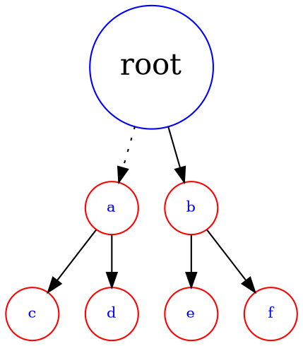
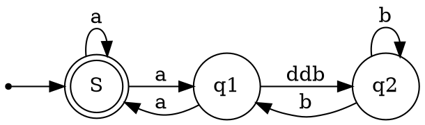

# 数据结构 - 树(C 语言描述)

## 树的概念和结构

### 相关概念




节点的度：一个节点含有的子树的个数称为该节点的度； 如上图：A的为6

叶节点或终端节点：度为0的节点称为叶节点； 如上图：B、C、H、I...等节点为叶节点

非终端节点或分支节点：度不为0的节点； 如上图：D、E、F、G...等节点为分支节点

双亲节点或父节点：若一个节点含有子节点，则这个节点称为其子节点的父节点； 如上图：A是B
的父节点

孩子节点或子节点：一个节点含有的子树的根节点称为该节点的子节点； 如上图：B是A的孩子节
点

兄弟节点：具有相同父节点的节点互称为兄弟节点； 如上图：B、C是兄弟节点

树的度：一棵树中，最大的节点的度称为树的度； 如上图：树的度为6

节点的层次：从根开始定义起，根为第1层，根的子节点为第2层，以此类推；

树的高度或深度：树中节点的最大层次； 如上图：树的高度为4

节点的祖先：从根到该节点所经分支上的所有节点；如上图：A是所有节点的祖先

子孙：以某节点为根的子树中任一节点都称为该节点的子孙。如上图：所有节点都是A的子孙

森林：由m（m>0）棵互不相交的多颗树的集合称为森林；（数据结构中的学习并查集本质就是
一个森林）

双亲（父亲）

::: tip

虽然叫“双亲”，实际上只有1个结点。

:::

### 代码结构设计

树的结构可以有很多种设计。

第一种，直接用指针记录孩子结点的地址：

```c
struct TreeNode {
    DataType data; // 该结点的值
    struct TreeNode* child1; // 指向该结点的第1个孩子结点
    struct TreeNode* child2; // 指向该结点的第2个孩子结点
    // ... 更多
}
```

这种方式显然不是最优的，因为孩子结点个数不确定，结构需要跟着变动。

于是，在 C++ 中可以借助 `vector` 容器，这样就可以不用关心孩子的个数：

```c++
struct TreeNode {
    DataType data;
    vector<struct TreeNode*> children; // 该结点的子节点指针数组
}
```


第三种，“左孩子右兄弟”，这是比较取巧的一种设计：

```c
struct TreeNode {
    DataType data;
    struct TreeNode* firstChild; // 指向第一个孩子结点
    struct TreeNode* nextSibling; // 指向其下一个兄弟节点
}
```

双亲表示法：

## 二叉树的概念和结构

```c
struct BinaryTreeNode{
    BTDataType data;
    struct BinaryTreeNode* left; // 指向该结点的左孩子
    struct BinaryTreeNode* right; // 指向该结点的右孩子
}
```

::: tip

二叉树可以看做二叉链，下面给出三叉链的结构

```c
struct BinaryTreeNode{
    BTDataType data;
    struct BinaryTreeNode* parent; // 指向该结点的双亲
    struct BinaryTreeNode* left; // 指向当前结点的左孩子
    struct BinaryTreeNode* right; // 指向当前结点的右孩子
}
```

其他的树常用三叉链，如：

- AVL 树
- 红黑树
- B 树

:::

### 二叉树的遍历

任何一颗二叉树都有3个部分：

1. 根结点
2. 左子树
3. 右子树

因此，根据不同部分的访问顺序，二叉树有3种遍历方式：

1. 前序遍历（先根遍历）：根结点，左子树，右子树
2. 中序遍历（中根遍历）：左子树，根结点，右子树
3. 后序遍历（后根遍历）：左子树，右子树，根结点

::: tip

二叉树的遍历需要用到分治算法，将原问题分成若干小规模的类似子问题，直至子问题不可再分割。

:::



二叉树的遍历序列中，如果没有中序遍历序列，则无法得知左右子树的界限，不能唯一确定一颗二叉树。

## OJ 练习题

1. [二叉树的前序遍历](https://leetcode.cn/problems/binary-tree-preorder-traversal/)
2. [二叉树的中序遍历](https://leetcode.cn/problems/binary-tree-inorder-traversal/)
3. [二叉树的后序遍历](https://leetcode.cn/problems/binary-tree-postorder-traversal/)
4. [二叉树的最大深度](https://leetcode.cn/problems/maximum-depth-of-binary-tree/)
5. [平衡二叉树](https://leetcode.cn/problems/balanced-binary-tree/)
6. [二叉树的层序遍历](https://leetcode.cn/problems/binary-tree-level-order-traversal/) （此题建议用 C++ 实现，用 C 语言较复杂）
