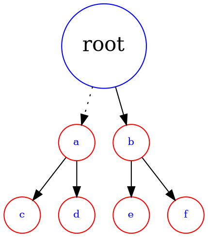
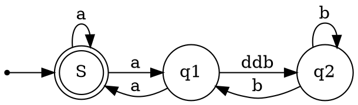

# 数据结构 - 二叉树

## 树的概念和结构

### 相关概念

<!--  -->



节点的度：一个节点含有的子树的个数称为该节点的度； 如上图：A 的为 6

叶节点或终端节点：度为 0 的节点称为叶节点； 如上图：B、C、H、I...等节点为叶节点

非终端节点或分支节点：度不为 0 的节点； 如上图：D、E、F、G...等节点为分支节点

双亲节点或父节点：若一个节点含有子节点，则这个节点称为其子节点的父节点； 如上图：A 是 B
的父节点

孩子节点或子节点：一个节点含有的子树的根节点称为该节点的子节点； 如上图：B 是 A 的孩子节
点

兄弟节点：具有相同父节点的节点互称为兄弟节点； 如上图：B、C 是兄弟节点

树的度：一棵树中，最大的节点的度称为树的度； 如上图：树的度为 6

节点的层次：从根开始定义起，根为第 1 层，根的子节点为第 2 层，以此类推；

树的高度或深度：树中节点的最大层次； 如上图：树的高度为 4

节点的祖先：从根到该节点所经分支上的所有节点；如上图：A 是所有节点的祖先

子孙：以某节点为根的子树中任一节点都称为该节点的子孙。如上图：所有节点都是 A 的子孙

森林：由 m（m>0）棵互不相交的多颗树的集合称为森林；（数据结构中的学习并查集本质就是
一个森林）

双亲（父亲）

::: tip

虽然叫“双亲”，实际上只有 1 个结点。

:::

### 代码结构设计

树的结构可以有很多种设计。

第一种，直接用指针记录孩子结点的地址：

```c
struct TreeNode {
    DataType data; // 该结点的值
    struct TreeNode* child1; // 指向该结点的第1个孩子结点
    struct TreeNode* child2; // 指向该结点的第2个孩子结点
    // ... 更多
}
```

这种方式显然不是最优的，因为孩子结点个数不确定，结构需要跟着变动。

于是，在 C++ 中可以借助 `vector` 容器，这样就可以不用关心孩子的个数：

```cpp
struct TreeNode {
    DataType data;
    vector<struct TreeNode*> children; // 该结点的子节点指针数组
}
```

第三种，“左孩子右兄弟”，这是比较取巧的一种设计：

```c
struct TreeNode {
    DataType data;
    struct TreeNode* firstChild; // 指向第一个孩子结点
    struct TreeNode* nextSibling; // 指向其下一个兄弟节点
}
```

双亲表示法：

## 二叉树的概念和结构

```c
struct BinaryTreeNode{
    BTDataType data;
    struct BinaryTreeNode* left; // 指向该结点的左孩子
    struct BinaryTreeNode* right; // 指向该结点的右孩子
}
```

::: tip

二叉树可以看做二叉链，下面给出三叉链的结构

```c
struct BinaryTreeNode{
    BTDataType data;
    struct BinaryTreeNode* parent; // 指向该结点的双亲
    struct BinaryTreeNode* left; // 指向当前结点的左孩子
    struct BinaryTreeNode* right; // 指向当前结点的右孩子
}
```

其他的树常用三叉链，如：

- AVL 树
- 红黑树
- B 树

:::

### 二叉树的遍历

任何一颗二叉树都有 3 个部分：

1. 根结点
2. 左子树
3. 右子树

因此，根据不同部分的访问顺序，二叉树有 3 种遍历方式：

1. 前序遍历（先根遍历）：根结点，左子树，右子树
2. 中序遍历（中根遍历）：左子树，根结点，右子树
3. 后序遍历（后根遍历）：左子树，右子树，根结点

::: tip

二叉树的遍历需要用到分治算法，将原问题分成若干小规模的类似子问题，直至子问题不可再分割。

:::



二叉树的遍历序列中，如果没有中序遍历序列，则无法得知左右子树的界限，不能唯一确定一颗二叉树。

### 遍历序列确定二叉树

此方法参看了以下视频：

<iframe src="https://player.bilibili.com/player.html?bvid=BV1Xu411d7qf"
    width="100%"
    height="500"
    allow="fullscreen"
    style="border: none"
    sandbox="allow-same-origin allow-scripts allow-popups">
</iframe>


```c
typedef int BTDataType;
typedef struct BinaryTreeNode {
    BTDataType data;
    struct BinaryTreeNode *left;
    struct BinaryTreeNode *right;
} BTNode;

/**
 * 创建二叉树结点
 * @param val 结点的值
 * @return 结点指针
 */
BTNode *createBTNode(BTDataType val);

/**
 * 前序遍历
 * @param root 根节点
 */
void PreOrder(BTNode *root);

/**
 * 中序遍历
 * @param root 根节点
 */
void InOrder(BTNode *root);

/**
 * 后序遍历
 * @param root 根节点
 */
void PostOrder(BTNode *root);

/**
 * 获取树的结点个数
 * @param root 根节点
 * @param pSize 返回型参数
 */
void TreeSize1(BTNode *root, int *pSize);

/**
 * 获取树的结点个数
 * @param root 根节点
 * @return
 */
int TreeSize2(BTNode *root);

/**
 * 获取树的叶子结点个数
 * @param root 根节点
 */
int TreeLeafSize(BTNode *root);

/**
 * 二叉树的高度(深度)
 * @param root 根节点
 */
int TreeHeight(BTNode *root);

#include "Queue.h"

/**
 * 层序遍历（广度优先遍历）
 * @param root 根节点
 */
void LevelOrder(BTNode *root);

/**
 * 前序遍历，返回遍历序列
 * @param root 根节点
 * @param returnSize 序列数组大小（输出型参数）
 * @return 前序遍历序列数组
 */
int *PreOrderTraversal(BTNode *root, int *returnSize);

/**
 * 是否为平衡二叉树
 * @param root 根节点
 */
bool isBalanced(BTNode *root);

/**
 * 销毁二叉树
 * @param root 根节点
 */
void DestroyTree(BTNode *root);
```

### 实现

```c
BTNode *createBTNode(BTDataType val) {
    BTNode *node = (BTNode *) malloc(sizeof(BTNode));
    node->data = val;
    node->left = NULL;
    node->right = NULL;
    return node;
}

void PreOrder(BTNode *root) {
    if (root == NULL) {
        // 此处是为了方便理解
        printf("NULL ");
        return;
    }
    // 递归：先序遍历依次访问根节点、左子树、右子树
    printf("%c ", root->data);
    PreOrder(root->left);
    PreOrder(root->right);
}

void InOrder(BTNode *root) {
    // 中序遍历只需要改变一下线序遍历代码的顺序
    if (root == NULL) {
        printf("NULL ");
        return;
    }
    InOrder(root->left);
    printf("%c ", root->data);
    InOrder(root->right);
}

void PostOrder(BTNode *root) {
    // 同上
    if (root == NULL) {
        printf("NULL ");
        return;
    }
    PostOrder(root->left);
    PostOrder(root->right);
    printf("%c ", root->data);
}

void TreeSize1(BTNode *root, int *pSize) {
    // 因为这里是递归，不像循环那样能够直接用局部变量计数，采用返回型参数
    // 在遍历的基础上加上计数即可
    if (root == NULL) {
        return;
    }
    (*pSize)++;
    TreeSize1(root->left, pSize);
    TreeSize1(root->right, pSize);
}

int TreeSize2(BTNode *root) {
    // 分治的思想：一棵树的结点个数是 1（根节点）+ 左子树结点个数 + 右子树结点个数
    return root == NULL
           ? 0
           : 1 + TreeSize2(root->left) + TreeSize2(root->right);
}

int TreeLeafSize(BTNode *root) {
    // 同样用分治的思想：一棵树的叶子结点个数，是左、右子树的叶子结点数之和
    return root == NULL
           ? 0 // 空树没有叶子
           : (root->left == NULL && root->right == NULL)
             // 非空树，且左右子树都为空，则该结点就是叶子
             ? 1
             : TreeLeafSize(root->left) + TreeLeafSize(root->right);
}

int TreeHeight(BTNode *root) {
    // 同样用分治的思想：一棵树的高度是 1 + 左右子树高度大者的高度
    // 访问顺序类似于后序遍历

    if (root == NULL) { // 空树高度为 0
        return 0;
    }

    // 注意：这里涉及到比较，应当用临时变量保存返回值，否则会冗余递归计算
    int lh = TreeHeight(root->left);
    int rh = TreeHeight(root->right);
    return 1 + (lh > rh ? lh : rh);
}

void LevelOrder(BTNode *root) {
    // 层序遍历。借助队列先进先出的特点
    // 思想：当上一层结点出队列的时候，下一层的入队列，那么出队顺序恰好就是要求的
    Queue queue;
    QueueInit(&queue);

    if (root) {
        QueuePush(&queue, root);
    }
    // 队列为空时遍历结束
    while (!QueueEmpty(&queue)) {
        BTNode *front = QueueFront(&queue);
        QueuePop(&queue);
        printf("%c ", front->data);

        // 父节点出队，并把左右子结点带入队列
        if (front->left) {
            QueuePush(&queue, front->left);
        }
        if (front->right) {
            QueuePush(&queue, front->right);
        }
    }
    printf("\n");
    QueueDestroy(&queue);
}


// PreOrderTraversal 的子函数，避免多次 malloc
// 每层递归都有一个 arrIdx，而我们想要所有函数共用同一个参数 arrIdx，因此用指针
void pre_order(BTNode *root, int *arr, int *arrIdx) {
    // 这里可以用普通的前序遍历，但是要把遍历到的元素放进数组
    if (root == NULL) return;
    arr[*arrIdx] = root->data;
    (*arrIdx)++;
    pre_order(root->left, arr, arrIdx);
    pre_order(root->right, arr, arrIdx);
}

int *PreOrderTraversal(BTNode *root, int *returnSize) {
    // 先算出结点个数，确定数组大小，然后把值放进数组
    int size = TreeSize2(root);
    int *arr = (int *) malloc(sizeof(int) * size);
    *returnSize = size;

    int i = 0; // 数组元素索引
    pre_order(root, arr, &i);

    return arr;
}

// 每个结点的左右子树的高度差绝对值不超过 1
bool isBalanced(BTNode *root) {
    // 同样是分治
    if (root == NULL) { // 空树满足平衡条件
        return true;
    }

    int lh = TreeHeight(root->left);
    int rh = TreeHeight(root->right);

    return abs(lh - rh) <= 1 // 当前结点满足，则还要检查左右子树根结点是否满足
           && isBalanced(root->left)
           && isBalanced(root->right);
}

void DestroyTree(BTNode *root) {
    // 同样是分治：由于销毁二叉树依赖父结点的指针，故采用后序遍历的顺序来释放结点是最合适的

    if (root == NULL) return; // 空树无需销毁

    DestroyTree(root->left);
    DestroyTree(root->right);
    free(root);
    root = NULL; // 实际不起作用，因为改变的是指针
}
```

## OJ 练习题

1. [二叉树的前序遍历](https://leetcode.cn/problems/binary-tree-preorder-traversal/)
2. [二叉树的中序遍历](https://leetcode.cn/problems/binary-tree-inorder-traversal/)
3. [二叉树的后序遍历](https://leetcode.cn/problems/binary-tree-postorder-traversal/)
4. [二叉树的最大深度](https://leetcode.cn/problems/maximum-depth-of-binary-tree/)
5. [平衡二叉树](https://leetcode.cn/problems/balanced-binary-tree/)
6. [二叉树的层序遍历](https://leetcode.cn/problems/binary-tree-level-order-traversal/) （此题建议用 C++ 实现，用 C 语言较复杂）
