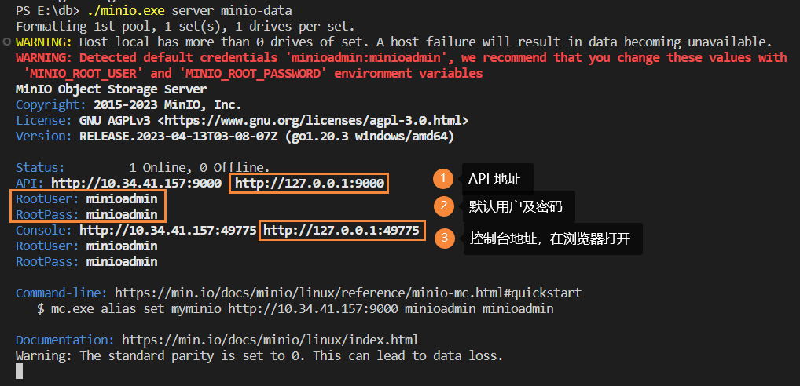
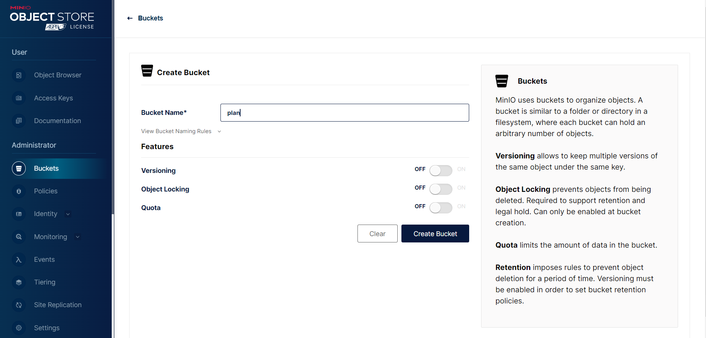
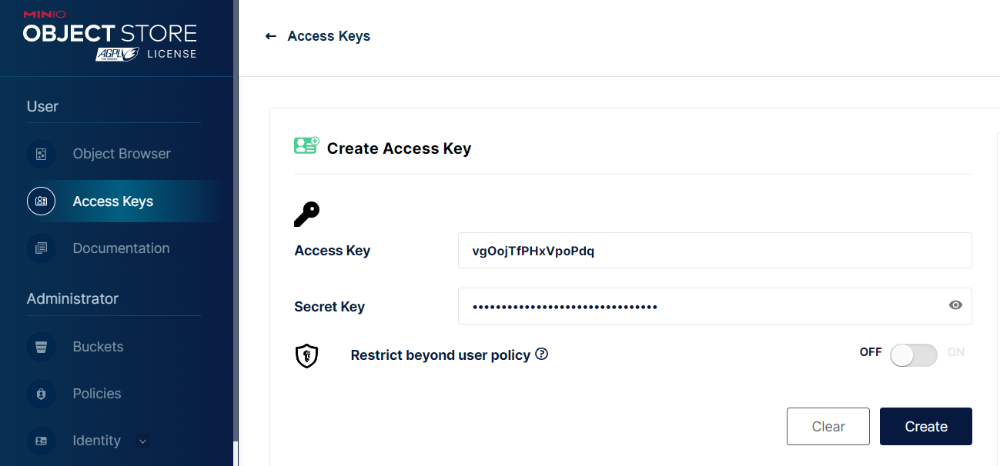

# SpringBoot 引入 MinIO 对象存储

## 介绍

MinIO 是一个对象存储解决方案，基于 GNU AGPL v3 协议开源。它兼容亚马逊 S3 云存储服务的 API，并支持其所有核心功能。

对象存储中的“对象”是指“二进制大对象”(Binary Large Object)，也常用 blob 表示，它通常是非结构化的数据，且大小是任意的，可以从几个字节到几 TB 不等。

MinIO 非常适用于存储，如图像、音频文件、电子表格和二进制可执行代码等，并提供了专用工具和功能，使用标准的 S3 兼容 API 来存储、列出和检索这些对象。

MinIO 对象存储使用 [桶](https://min.io/docs/minio/windows/administration/object-management.html#buckets) 来组织对象。桶类似于文件系统中的文件夹或目录，其中每个桶可以容纳任意数量的对象。MinIO 存储桶提供与 AWS S3 存储桶相同的功能。

官方 Java API 文档参考：[Java Client API Reference](https://min.io/docs/minio/linux/developers/java/API.html)

## 下载及使用

下载地址（本文是 windows 版本）：<https://min.io/download>

我们只需要下载 MINIO SERVER，Windows 版本的 exe 大概有 96.5MB。

下载完成后不要双击打开，在命令行中运行：

```sh
./minio.exe server minio-data
```

其中 `minio-data` 是文件存储的文件夹。随后我们可以得到以下信息



我们可以在浏览器打开 Console 那行的地址：`http://127.0.0.1:49775`，以默认的 `minioadmin` 为账号密码登录。

首先我们要创建“桶”，点击 “Create a Bucket”，在界面中填写名称然后点击“Create Bucket”：



为了在 SpringBoot 中使用，需要创建密钥。左侧点击 “Access Keys”，然后再右侧找到 “Create access key” 即可创建：



注意保存，secret key 只会显示一次，当然我们也可以重新生成密钥。

侧边栏的 “Object Browser” 可以管理我们创建的桶以及文件，可以自行体验。

### 修改默认端口

通过以下命令：

```sh
$minio.exe server -h

FLAGS:
 --address value          bind to a specific ADDRESS:PORT, ADDRESS can be an IP or hostname (default: ":9000") [%MINIO_ADDRESS%]
 --console-address value  bind to a specific ADDRESS:PORT for embedded Console UI, ADDRESS can be an IP or hostname [%MINIO_CONSOLE_ADDRESS%]
```

我们知道可以通过以下命令修改默认端口：

```sh
minio.exe server minio-data --address ":9000" --console-address ":30125"
```

域名可以省略，也可以填 `localhost`。

## 在 SpringBoot 中引入

pom.xml 中添加依赖：

```xml
<dependency>
    <groupId>io.minio</groupId>
    <artifactId>minio</artifactId>
    <version>${minio.version}</version>
</dependency>
```

当前最新版本为：[](https://mvnrepository.com/artifact/io.minio/minio)

application.yml 中配置 MinIO：

```yml
minio:
    url: http://localhost:9000 # 或者分成 endpoint [, port]
    access-key: 在 MinIO 控制台创建
    secret-key: 在 MinIO 控制台生成
    bucket-name: 桶名
```

创建 MinIO 配置类

```java
import io.minio.MinioClient;
import org.springframework.beans.factory.annotation.Value;
import org.springframework.context.annotation.Bean;
import org.springframework.context.annotation.Configuration;

@Configuration
public class MinioConfig {

    @Value("${minio.url}")
    private String url;

    @Value("${minio.access-key}")
    private String accessKey;

    @Value("${minio.secret-key}")
    private String secretKey;

    public static String BUCKET_NAME;

    @Value("${minio.bucket-name}")
    public void setBucketName(String value) {
        // 注入该类时修改静态变量
        BUCKET_NAME = value;
    }

    @Bean
    public MinioClient minioClient() {
        return MinioClient.builder().endpoint(url)
                .credentials(accessKey, secretKey)
                .build();
    }
}
```

至此，引入工作已完成。

## 常用封装

由于 MinIO 的文件列表在序列化之后字段“缺失”，因此定义 `FileVO` 类：

```java
/**
 * MinIO 文件
 */
@Getter
@Builder
@ToString
public class FileVO {
    /**
     * 文件名
     */
    String name;
    /**
     * 文件显示大小
     */
    String size;
    /**
     * 文件实际大小
     */
    Long bitSize;
    /**
     * 是否为目录
     */
    Boolean dir;
    /**
     * 更新时间
     */
    @JsonFormat(pattern = "yyyy-MM-dd HH:mm:ss")
    LocalDateTime updateTime;
}
```

以下是 `MinioService` 类，包括了基本的文件上传、列表、下载功能：

```java
import com.zedo.schedule.config.MinioConfig;
import com.zedo.schedule.entity.vo.FileVO;
import io.minio.*;
import io.minio.http.Method;
import io.minio.messages.Item;
import jakarta.annotation.Resource;
import jakarta.servlet.ServletOutputStream;
import jakarta.servlet.http.HttpServletResponse;
import lombok.SneakyThrows;
import lombok.extern.slf4j.Slf4j;
import org.springframework.stereotype.Service;
import org.springframework.web.multipart.MultipartFile;

import java.io.InputStream;
import java.net.URLEncoder;
import java.nio.charset.StandardCharsets;
import java.util.ArrayList;
import java.util.List;

/**
 * @author zedo
 */
@Service
@Slf4j
public class MinioService {
    @Resource
    MinioClient minioClient;

    public boolean upload(MultipartFile file) {
        try {
            BucketExistsArgs bucketArgs = BucketExistsArgs.builder()
                    .bucket(MinioConfig.BUCKET_NAME).build();
            // todo 检查 bucket 是否存在。
            boolean found = minioClient.bucketExists(bucketArgs);

            PutObjectArgs objectArgs = PutObjectArgs.builder()
                    .object(file.getOriginalFilename())
                    .bucket(MinioConfig.BUCKET_NAME)
                    .contentType(file.getContentType())
                    .stream(file.getInputStream(), file.getSize(), -1)
                    .build();

            ObjectWriteResponse objectWriteResponse = minioClient.putObject(objectArgs);
            System.out.println(objectWriteResponse.etag());
        } catch (Exception e) {
            e.printStackTrace();
            log.info(e.getMessage());
            return false;
        }
        return true;
    }

    /**
     * 查看文件对象
     *
     * @param prefix    查找路径
     * @param recursive 递归查找
     * @return 存储 bucket 内文件对象信息
     */
    @SneakyThrows
    public List<FileVO> listObjects(String prefix, Boolean recursive) {
        // prefix 以 "/" 结尾，避免对查询结果有影响
        prefix = prefix.endsWith("/") ? prefix : prefix + "/";
        // recursive 默认为 false
        Iterable<Result<Item>> results = minioClient.listObjects(
                ListObjectsArgs.builder()
                        .bucket(MinioConfig.BUCKET_NAME)
                        .prefix(prefix)
                        .recursive(recursive != null && recursive)
                        .build()
        );
        List<FileVO> files = new ArrayList<>();
        for (Result<Item> result : results) {
            Item e = result.get();
            FileVO.FileVOBuilder file = FileVO.builder()
                    .name(e.objectName())
                    .bitSize(e.size())
                    .size(formatSize(e.size()))
                    .dir(e.isDir());
            // 文件夹没有修改时间
            if (!e.isDir()) {
                // 加上 8 小时
                file.updateTime(e.lastModified().plusHours(8).toLocalDateTime());
            }
            // e.isDeleteMarker() 不必，因为 minio 不是软删
            files.add(file.build());
        }
        return files;
    }

    /**
     * 格式化文件显示大小
     *
     * @param size 文件实际大小
     * @return String
     */
    public static String formatSize(long size) {
        int i = 0;
        String[] powerLabels = {"B", "KB", "MB", "GB"};
        double s = (double) size;
        /// Math.pow(2, 10);
        final double pow = 1024D;
        while (s > pow) {
            s /= pow;
            i++;
        }
        return String.format("%.2f %s", s, powerLabels[i]);
    }

    /**
     * 根据指定的文件名获取下载链接
     *
     * @param filename 文件名
     * @return 下载链接
     **/
    public String downloadUrl(String filename) {
        GetPresignedObjectUrlArgs args = GetPresignedObjectUrlArgs.builder()
                .bucket(MinioConfig.BUCKET_NAME)
                .object(filename)
                .method(Method.GET)
                .build();
        String objectUrl;
        if (isFileNotExist(MinioConfig.BUCKET_NAME, filename)) {
            return "";
        }
        try {
            objectUrl = minioClient.getPresignedObjectUrl(args);
        } catch (Exception e) {
            throw new RuntimeException(e);
        }
        return objectUrl;
    }

    public void download(String filename, HttpServletResponse response) {
        if (isFileNotExist(MinioConfig.BUCKET_NAME, filename)) {
            return;
        }
        /// 以下方法首次会下载到项目根目录，之后就会抛异常: file already exists
        // minioClient.downloadObject(args)
        StatObjectResponse stat = getFileStat(MinioConfig.BUCKET_NAME, filename);
        if (stat == null) {
            return;
        }
        GetObjectArgs args = GetObjectArgs.builder()
                .bucket(MinioConfig.BUCKET_NAME)
                .object(filename)
                .build();
        try (InputStream inputStream = minioClient.getObject(args)) {
            response.setCharacterEncoding("UTF-8");
            // response.setContentType("application/octet-stream"); // 该类型会导致图片“损坏”
            response.setContentType(stat.contentType());
            // 强制下载
            response.setHeader("Content-Disposition", "attachment;filename=" + URLEncoder.encode(filename, StandardCharsets.UTF_8));

            ServletOutputStream outputStream = response.getOutputStream();

            byte[] buffer = new byte[1024];
            int len;

            // 从输入流中读取定量的字节，并存储在缓冲区字节数组中，读到末尾返回 -1
            while ((len = inputStream.read(buffer)) > 0) {
                outputStream.write(buffer, 0, len);
            }
            // inputStream.close(); try-with-resource 不需要手动关闭
        } catch (Exception e) {
            log.error("下载文件出错", e);
        }
    }

    /**
     * 检查文件是否存在
     *
     * @param bucketName 桶名
     * @param filename   文件名
     */
    public boolean isFileNotExist(String bucketName, String filename) {
        return getFileStat(bucketName, filename) == null;
    }

    /**
     * 获取文件 stat 信息
     *
     * @param bucketName 桶名
     * @param filename   文件名
     */
    private StatObjectResponse getFileStat(String bucketName, String filename) {
        StatObjectResponse stat;
        try {
            stat = minioClient.statObject(StatObjectArgs.builder()
                    .bucket(bucketName)
                    .object(filename).build());
        } catch (Exception e) {
            return null;
        }
        return stat;
    }
}
```

`MinioService` 的方法入参足够简单，只要传入控制层的参数即可，因此这里省略 Controller 的代码。
