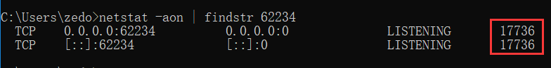
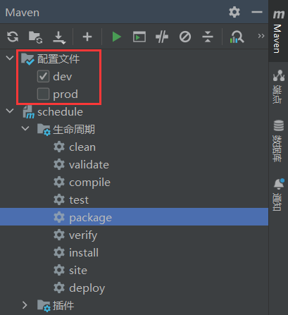

# SpringBoot 开发记录

## 终止进程解决端口占用

当我们重启 IDEA 时，提示我们 **“终止”** 或 **“断开连接”**，如果选择后者，那么下次启动 SpringBoot 项目时就可能会有类似如下报错：

```text
***************************
APPLICATION FAILED TO START
***************************

Description:

Web server failed to start. Port 62234 was already in use.

Action:

Identify and stop the process that's listening on port 62234 or configure this application to listen on another port.
```

这是因为之前关闭 IDEA 时的 “断开连接” 操作没有关闭运行在对应端口的进程，我们只需要手动关闭即可解决：

```batch
# 查看哪个进程占用了 62234 端口
netstat -aon | findstr 62234
```



```batch
# 强制杀死进程
taskkill -F -PID 17736
```

之后就可以重启 SpringBoot 项目了。

## 统一响应体简单封装

为了方便前端对数据的处理，后端通常会统一返回给前端的响应体结构，这里我采用的 json 结构如下：

```json
{
    "success": true,
    "code": 200,
    "msg": "成功",
    "data": {
        "id": 1,
        "username": "Trezedo"
    }
}
```

其中 `data` 是一个泛型，可以根据业务需要调整。

下面给出根据我个人的使用习惯封装的响应体 Java 类：

```java
import lombok.Getter;
import java.io.Serializable;

/**
 * 响应体
 *
 * @author Trezedo
 */
@Getter
public class Result<T> implements Serializable {
    /**
     * 请求是否成功
     *
     * @implNote 准确来说应该用 successful
     */
    private boolean success;
    /**
     * 状态码
     *
     * @apiNote 可以是 HTTP 状态码，或者是系统内部的状态码
     */
    private int code;
    /**
     * 信息
     */
    private String msg;
    /**
     * 数据
     */
    private final T data;

    public Result(T data) { this.data = data; }

    /**
     * @param data 数据
     * @return 响应实体
     */
    public static <T> Result<T> gen(T data) {
        return new Result<>(data);
    }

    /**
     * @return data 为 null 的响应实体
     */
    public static <T> Result<T> gen() {
        return gen(null);
    }

    /**
     * @implNote of, ok, failed 方法仅用于修改除 data 外的字段
     */
    public Result<T> of(boolean success, int code, String msg) {
        this.success = success;
        this.code = code;
        this.msg = msg;
        return this;
    }

    public Result<T> ok() { return of(true, 200, "成功"); }

    public Result<T> ok(String msg) { return of(true, 200, msg); }

    public Result<T> failed(String msg) { return of(false, 400, msg); }

    public Result<T> failed(String msg, int code) { return of(false, code, msg); }
}
```

> 代码使用到 [lombok](https://projectlombok.org/) 的 `Getter` 注解，当然也可以使用 IDEA 的快捷键 <kbd>Alt</kbd>+<kbd>Insert</kbd> 生成 Getter。

**使用方法**：先使用 `gen` 静态方法构造实体，之后再用 `of`/`ok`/`failed` 方法修改 `success`, `code`, `msg` 字段。

代码示例：

```java
// 自动推断泛型
User user = getUserById(id);
Result.gen(user).ok("获取成功"); // Result<User>

// 不能自动推断时 T 为 Object
Result.gen().failed("用户不存在", 400);     // Result<Object>
Result.gen(null).failed("用户不存在", 400); // Result<Object>

// 显式指定泛型
Result.<User>gen().failed("用户不存在", 400); // Result<User>
```

注意到上面的 `gen` 方法显式类型实参有时不能自动推断，需要手动指定。
这在控制器中可能不方便使用，因此下面再封装一个通用的 `IBaseController` 接口：

```java
public interface IBaseController {
    /**
     * 请求成功
     *
     * @param data 数据内容
     * @param <T>  对象泛型
     * @return 响应结果
     */
    default <T> Result<T> success(T data) {
        return Result.gen(data).ok();
    }

    /**
     * 请求失败
     *
     * @return 响应结果
     */
    default <T> Result<T> failed() {
        return Result.<T>gen().failed("请求失败");
    }

    /**
     * 请求失败
     *
     * @param msg 提示内容
     * @return 响应结果
     */
    default <T> Result<T> failed(String msg) {
        return Result.<T>gen().failed(msg);
    }

    /**
     * 请求失败
     *
     * @param errorCode 状态码
     * @param msg       提示内容
     * @return 响应结果
     */
    default <T> Result<T> failed(String msg, Integer errorCode) {
        return Result.<T>gen().failed(msg, errorCode);
    }
}
```

之所以封装成接口，是因为实际开发中可能会为了实现某种功能而让 Controller 继承一个抽象类，但在 Java 中一个类同时只能继承(extends)另一个类，而一个类可以同时实现(implements)多个接口。

> 我们可以有多种选择：
>
> 1. 直接让业务中的 Controller 实现 `IBaseController` 接口；
> 2. 先定义抽象类 BaseController 并实现 `IBaseController` 接口，再让业务中的 Controller 继承 BaseController。

## Mybatis Plus 多表条件查询

在 `xxxMapper.xml` 的 SQL 语句中使用 MybatisPlus 提供的 QueryWrapper 查询比纯写 xml 要方便。

类似如下需求，有学生(student)和专业(major)两个表：

```sql
create table major
(
    `id`    int auto_increment primary key,
    `name`  varchar(31)        not null comment '专业名称',
    `num`   varchar(15) unique not null comment '专业编号',
) comment '专业';

create table student
(
    `id`       int auto_increment primary key,
    `name`     varchar(7)  not null comment '姓名',
    `num`      varchar(15) not null comment '学号',
    `major_id` int         not null comment '专业',

    foreign key (major_id) references major (id)
) comment '学生';
```

专业表的 id 是学生表的一个外键，传给前端时需要替换为专业名称。

定义 VO 层的学生对象，这里选择继承与数据库表对应的类：

```java
import lombok.Data;
@Data
public class StudentVO extends Student {
    /**
     * 专业名称
     */
    private String majorName;
}
```

定义 DAO 接口：

```java
@Mapper
public interface StudentDAO extends BaseMapper<Student> {
    List<StudentVO> listVO(@Param(Constants.WRAPPER) QueryWrapper<Student> query);
}
```

> 后续这部分将提取一个通用的接口。

这里 `Constants.WRAPPER` 的值为 `"ew"`。接着在 xml 文件中编写 SQL，这里给出 2 种连接表的写法：

:::: tabs

@tab 方式 1

```xml
<!-- StudentMapper.xml -->
<select id="listVO" resultType="com.example.entity.vo.StudentVO">
    select s.id, s.name, s.num, s.major_id, m.name as major_name
    from student s
    left join major m on s.major_id = m.id

    <!-- 下面是 where 语句 -->
    <if test="ew!=null and ew.customSqlSegment!=''">
        ${ew.customSqlSegment}
    </if>
</select>
```

使用 `left join` 连接表；此处的 `if` 标签，一来可以避免 IDEA 对非标准 SQL 语法报错提示，二来能够避免查询条件为空导致语法错误。

@tab 方式 2

```xml
<!-- StudentMapper.xml -->
<select id="listVO" resultType="com.example.entity.vo.StudentVO">
    select s.id, s.name, s.num, s.major_id, m.name as major_name
    from student s, major m

    where s.major_id = m.id
    <if test="ew!=null and ew.sqlSegment!=null and ew.sqlSegment != ''">
        and ${ew.sqlSegment}
    </if>
</select>
```

使用 `where` 连接表，当然条件语句也可以改用 `<where>` 标签，但不会有 SQL 代码提示。
::::

最后给出具体用法，以下是测试程序：

```java
@SpringBootTest
class ApplicationTests {
    @Resource
    StudentDAO studentDAO;

    @Test
    void q() {
        QueryWrapper<Student> query = new QueryWrapper<>();
        // 注意这里需要用表别名，因为两个表都有 name 列
        // 表的别名在 SQL 中定义，一般取首字母
        query.like("s.name", "秦");
        List<StudentVO> list = studentDAO.listVO(query);
        Optional.ofNullable(list).orElse(new ArrayList<>()).stream()
                .filter(Objects::nonNull)
                .forEach(System.out::println);
    }
}
```

`customSqlSegment` 和 `sqlSegment` 的区别就是前者带 `WHERE`。

当然，除了用 QueryWrapper 查询，还有分页的需求，这同样可以用 MybatisPlus 的分页插件实现，需要将接口的返回类型和参数作如下修改：

```java
// 旧方式
List<StudentVO> getVOList(@Param(Constants.WRAPPER) QueryWrapper<Student> query);

// 新方式，增加 page 参数，修改返回类型
Page<StudentVO> pageVO(Page<StudentVO> page, @Param(Constants.WRAPPER) QueryWrapper<Student> query);
```

看着可能有些复杂，我们提取成一个通用的接口：

```java
/**
 * 自定义多表查询接口
 *
 * @param <T> 与数据库对应的 Java 类
 * @author zedo
 * @implNote 主要用于 POJO 转 VO，同时使用 MybatisPlus 的 QueryWrapper 做查询
 */
public interface IVOMapper<T> {
    /**
     * 分页查询
     *
     * @param page  分页对象
     * @param query 查询条件
     * @param <V>   视图层对象类型
     * @return 分页查询结果
     * @implNote 需要在对应的 Mapper.xml 中定义 id 为 pageVO 的 select 标签
     */
    <V extends T> Page<V> pageVO(Page<V> page, @Param(Constants.WRAPPER) QueryWrapper<T> query);
}
```

这里特地用泛型 `V` 表示 VO 层的对象，泛型 `T` 也可以和 `V` 用同样的类。为了使用上面的接口，需要以下操作：

1，添加 `xxxDAO` 继承的接口：

```java
@Mapper
public interface StudentDAO extends BaseMapper<Student>, IVOMapper<Student> {
}
```

2，编写对应的 `xxxMapper.xml`，需要有一个 `id="pageVO"` 的 `select` 标签，就像上面方式 1 的 `StudentMapper.xml` 那样。

<br>

::: tip
为了让分页生效，记得[配置分页插件](https://baomidou.com/pages/2976a3/#spring-boot)：

```java
@Configuration
public class MybatisPlusConfig {
    @Bean
    public MybatisPlusInterceptor mybatisPlusInterceptor() {
        MybatisPlusInterceptor interceptor = new MybatisPlusInterceptor();
        interceptor.addInnerInterceptor(new PaginationInnerInterceptor(DbType.MYSQL));
        return interceptor;
    }
}
```

:::

::: danger 重要提示
需要注意的是，如果你使用的 JDK 版本在 9 及以上，构建运行前可能需要加上以下 VM 参数，否则执行会抛出异常：

```sh
--add-opens java.base/java.lang.invoke=ALL-UNNAMED
```

见 [MybatisPlus Issues](https://github.com/baomidou/mybatis-plus/issues/4619)
:::

## WebMvc 配置

配置跨域、拦截器、静态资源等，有以下方式实现：

1. 实现 `WebMvcConfigurer` 接口（推荐）。
2. 继承 `WebMvcConfigurationSupport` 类。

代码示例如下：

```java
// 方式1
@Configuration
public class WebConfig implements WebMvcConfigurer {
}

// 方式2
@Configuration
public class WebConfig2 extends WebMvcConfigurationSupport {
}
```

注意两种方式**不能同时使用**！

如果你使用 IDEA，按下快捷键 <kbd>Ctrl</kbd>+<kbd>O</kbd> 打开重写函数面板，重写你需要的方法，例如：

- 配置跨域 `addCorsMappings`
- 添加拦截器 `addInterceptors`
- 静态资源处理 `addResourceHandlers`

## 激活指定 profiles

> [Set the Active Spring Profiles](https://docs.spring.io/spring-boot/docs/3.0.6/reference/htmlsingle/#howto.properties-and-configuration.set-active-spring-profiles)

springboot 默认使用 `.properties` 文件进行配置，我们也可以使用 `.yml` 或 `.yaml`。例如将 resources 目录下的的 `application.properties` 重命名为 `application.yml`。

通常一个项目会区分不同的环境，每种环境使用不同的配置，例如开发环境下的数据库使用 `localhost`，生产环境下使用某个公网 ip。

目录的结构如下：

```text
application.yml
application-dev.yml
application-prod.yml
```

### 配置文件方式 1

最常见的做法是在 `application.yml` 添加以下内容来激活配置文件：

```yml
spring:
    profiles:
        active: dev # 激活 application-dev.yml
```

### 命令行方式

打包后，通过命令行指定激活配置文件有两种方式：

```sh
# 第 1 种
java -jar -Dspring.profiles.active=prod demo.jar
java -Dspring.profiles.active=prod -jar demo.jar
# 第 2 种
java -jar demo.jar --spring.profiles.active=prod
```

> `-D` 方式设置 Java 系统属性要在 `-jar` 之前定义或紧跟 `-jar`。如果需要激活多个 profile 可以使用逗号隔开，如：`--spring.profiles.active=dev,test`

### 环境变量方式

windows 系统使用 `set` 临时设置环境变量：

```batch
set SPRING_PROFILES_ACTIVE=dev,test
java -jar demo.jar
```

linux/mac 系统使用 `export`：

```sh
export SPRING_PROFILES_ACTIVE=dev,test
java -jar demo.jar
```

### 配置文件方式 2

> 参考：[spring-boot 启动时，指定 spring.profiles.active](https://blog.csdn.net/jmlqqs/article/details/107289746)

另外，我们也可以在 maven 打包时使用 `-P` 参数进行切换：`mvn package -P prod`。

**但是**，更方便地，先在 pom.xml 定义 profiles：

```xml
<profiles>
    <profile>
        <id>dev</id>
        <!-- 默认激活 -->
        <activation>
            <activeByDefault>true</activeByDefault>
        </activation>
        <properties>
            <spring.profiles.active>dev</spring.profiles.active>
        </properties>
    </profile>
    <profile>
        <id>prod</id>
        <properties>
            <spring.profiles.active>prod</spring.profiles.active>
        </properties>
    </profile>
</profiles>
```

修改 `application.yml`：

```yml
spring:
    profiles:
        active: "@spring.profiles.active@"
```

> 由于 `application.properties` 和 `application.yml` 文件接受 Spring 样式的占位符 ( `${...​}` )，因此 Maven 过滤更改为使用 `@..@` 占位符。[Spring Boot Maven Plugin](https://docs.spring.io/spring-boot/docs/3.0.6/maven-plugin/reference/htmlsingle/#using)
> 这种方式虽然方便了一丢丢，但还是建议用环境变量来激活。

这样我们在打包时，在配置文件栏目可以选择需要激活的 profiles(多选)，然后执行 `package` 即可：



::: tip

如果是开发过程中切换配置文件，需要手动点击一下刷新按钮：


避免我们重启 Application 时 profile 占位符 `@spring.profiles.active@` 没有被 Maven 替换。

:::

以上几种方式的优先级：

```text
命令行方式 > Java 系统属性方式 > 系统变量方式 > 配置文件方式
```

## 更多

- [SpringBoot 项目 JAR 包瘦身](./springboot-thin-jar.md)
- [使用 Smart Doc 生成接口文档](./smart-doc.md)
- [SpringBoot 引入 MinIO 对象存储](./minio.md)
