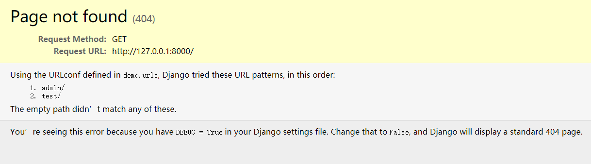

# Python 笔记

## 添加环境变量

如果你下载的是官方安装包，需要手动配置环境变量。

Windows 系统可以按下 `Win+R` 键，输入 `SystemPropertiesAdvanced`，点击最下方的**环境变量**。

以下假设安装 Python 的路径为 `E:\py`。

1. 新建 `PythonPath`，其值包括以下路径：`E:\py\`，`E:\py\Scripts`，`E:\py\Lib\site-packages`；
2. 双击 `Path` 编辑变量，新建值为 `%PythonPath%`。

## pip 包管理工具

Python 安装包自带包管理工具 pip，可以使用以下命令查看版本：

```sh
pip --version
pip -V # 简写
# 如果安装的是 python3，那么 pip 和 pip3 是等效的
```

一般我们安装一个 package 时要指定镜像，不然下载速度很慢，例如豆瓣源：

```sh
pip install numpy -i https://pypi.douban.com/simple/
```

其实我们可以设置全局镜像，不用每次安装都要指定镜像：

```sh
pip config set global.index-url https://pypi.douban.com/simple/
```

如果是 Windows 系统，它会提示：

```text
Writing to C:\Users\zedo\AppData\Roaming\pip\pip.ini
```

即它会把配置保存到 `%AppData%/pip/pip.ini`，内容如下：

```ini
[global]
index-url = https://pypi.douban.com/simple/
```

Linux/MAC 系统对应的应该是 `pip.conf`，具体位置它会提示。

这列举了一些镜像，我个人用豆瓣源较多：

- 豆瓣 <https://pypi.douban.com/simple/>
- 阿里云 <https://mirrors.aliyun.com/pypi/simple/>
- 清华大学 <https://pypi.tuna.tsinghua.edu.cn/simple/>
- 中科大 <https://pypi.mirrors.ustc.edu.cn/simple/>

以上镜像都支持 `https` 协议，如果是 `http` 协议，还需要设置 `trusted-host`，例如：

```ini
[global]
index-url = http://pypi.douban.com/simple/
trusted-host = pypi.douban.com
```

## 创建虚拟环境

推荐 B 站视频：<https://www.bilibili.com/video/BV1V7411n7CM/>

Python 3.3+ 自带了创建虚拟环境的工具：

```sh
# 查看帮助
python -m venv -h
# 创建
python -m venv [虚拟环境的名字]
```

虚拟环境名字可以取 `venv` 等等，等待片刻，它会在当前目录下创建对应的文件。

激活(这里是 Windows 系统)虚拟环境：

```sh
# 这里 [虚拟环境的名字] = env_demo
cd env_demo\Scripts
activate
```

这时候就会出现 `env_demo` 前缀：

```sh
(env_demo) E:\PyProjects\env_demo\Scripts>_
```

这时看一下环境变量，如果第一个是当前目录下的就是正确的：

```sh
(env_demo)$ echo %path%
E:\PyProjects\env_demo\Scripts;...
```

这时候用 `pip install xxx` 就会安装在当前虚拟环境下，但

```sh
(env_demo)$ pip -V
pip 22.3 from E:\envs\Python310\Lib\site-packages\pip (python 3.10)
# 上面的路径可能不是当前目录，但
# 只要 echo %path% 第一个路径对了就没问题
```

可以用 `pip list` 查看当前安装的所有包。

退出虚拟环境：

```sh
deactivate.bat
```

### 保存和复制虚拟环境

通过 `pip freeze` 命令可以导出当前环境所使用的包，从而实现保存和复制环境：

```sh
(env_demo)$ pip freeze
certifi==2022.9.24
charset-normalizer==2.1.1
idna==3.4
requests==2.28.1
urllib3==1.26.12
```

以上只是查看，还可以保存到文本文档：

```sh
pip freeze > requirements.txt
# 文件名可以是任意的，如 packages.txt
```

我们可以通过它来安装/卸载所有包：

```sh
pip install -r requirements.txt  # 安装
pip uninstall -r requirements.txt -y  # 卸载
```

## 使用 Jupiter Notebook

```sh
pip install jupyter
```

安装完成后可使用 `jupyter -h` 查看帮助。

### 启动 Jupiter

```sh
jupyter notebook # --port <port_number>
```

默认启用的端口号是 `8888`，如果端口占用，可以使用 `--port` 选项指定端口号。

更多可以参考：[Jupyter Notebook 介绍、安装及使用教程](https://zhuanlan.zhihu.com/p/33105153)。

## 安装其他库

opencv：

```sh
pip install opencv-python
```

## 使用 Django

Django 文档地址：<https://docs.djangoproject.com/zh-hans/>

安装命令：

```sh
pip install django
```

安装完成后可使用命令查看帮助：

```sh
django-admin help
```

使用命令行新建项目：

```sh
django-admin startproject demo
```

它会在当前路径创建一个名为 `demo` 的项目，这时可用 PyCharm 打开该项目。

进入 demo 所在路径，创建 `app`：

```sh
django-admin startapp app
```

此时的目录树如下：

```text
│  manage.py
│
├─app
│  │  admin.py
│  │  apps.py
│  │  models.py
│  │  tests.py
│  │  views.py
│  │  __init__.py
│  │
│  └─ migrations
│      │
│      └─ __init__.py
│
└─demo
    │  asgi.py
    │  settings.py
    │  urls.py
    │  wsgi.py
    └─ __init__.py
```

建议先看一下这部分的[官方文档](https://docs.djangoproject.com/zh-hans/4.1/intro/tutorial01/)，它描述得很清楚。

我们先建一个简单的接口，然后再运行项目

```py
# app/views.py
from django.http import HttpResponse

def hello():
    return HttpResponse('hello world')
```

```py
# urls.py
from django.contrib import admin
from django.urls import path

from app.views import hello  # 导入我们刚刚创建的接口

urlpatterns = [
    path('admin/', admin.site.urls),
    path('test/', hello),  # 以 'test/' 路径访问接口
]
```

:::tip

以上写法并不规范，仅作为入门示例

:::

接着我们运行项目：

```sh
python manage.py runserver
```

::: warning

如果没有使用虚拟环境，需要配置 `PYTHONPATH` 环境变量才能运行。

:::

django 默认在 `8000` 端口启动服务，浏览器打开 `http://127.0.0.1:8000/` 能够看到页面：



访问 `http://127.0.0.1:8000/test` 就能看到 `hello world` 了。

在 PyCharm 中运行项目后，django 会监听按键，当按下 `Ctrl+S` 后可快速刷新项目。

## GUI 库

PyQt 和 PySide 的区别：前者是第三方公司的产品，而后者才是 Qt 的亲儿子（Qt 公司的产品）。两者用法基本相同，但使用协议上有很大差别，PySide 可以在 LGPL 协议下使用，PyQt 则在 GPL 协议下使用。推荐使用 PySide。

文档地址：

- PySide：<https://doc.qt.io/qtforpython/>
- PyQt5：<https://www.riverbankcomputing.com/static/Docs/PyQt5/>

```sh
pip install PySide2  # 不区分大小写
# 或 pip install PyQt5
```

两者体积：PyQt5(56.9MB)，PySide2(139.7MB)

PySide 默认会下载 `Qt Designer`(Qt 设计师)，而 PyQt5 需要额外安装：

```sh
pip install PyQt5-tools
```

为了后续能够快速打开 `designer.exe` 以及全局使用 `uic.exe`(编译 `.ui` 文件用的)，建议添加把 `site-packages\PySide2\` 添加到环境变量。

如果使用 PyQt5，为了能够得到更好的提示，可以安装 `PyQt5-stubs`。
