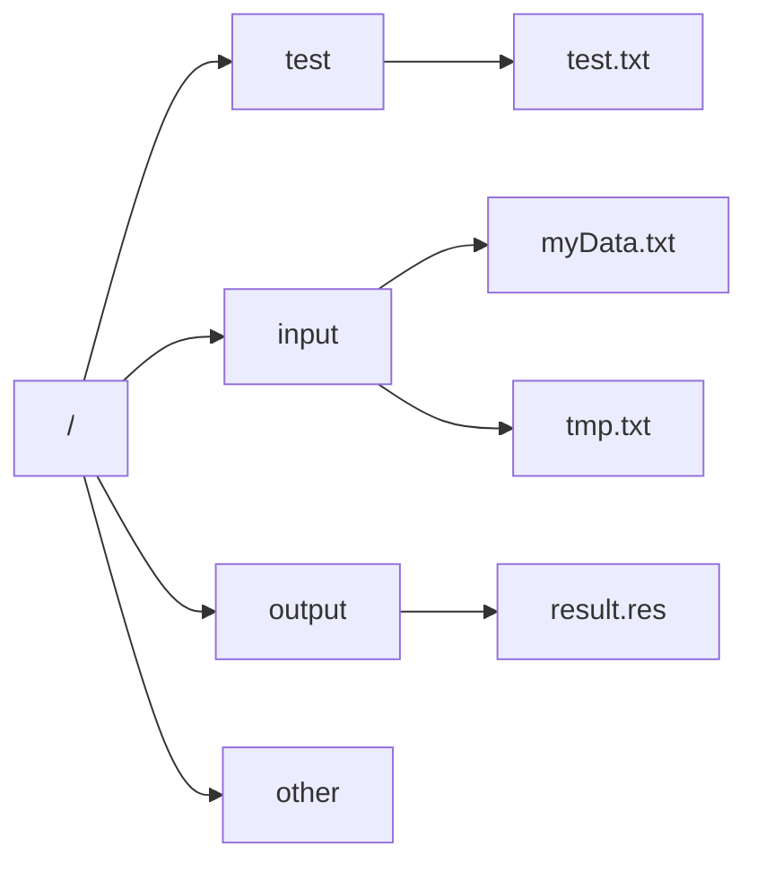
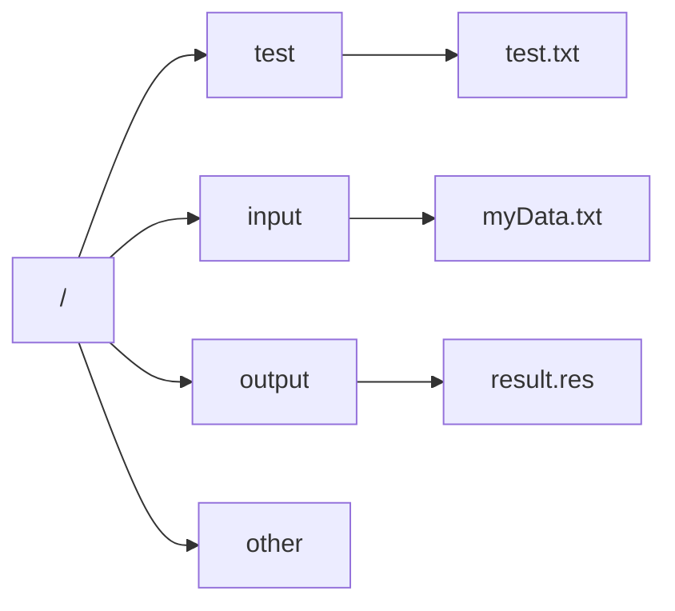

# 大数据技术与应用

提纲：

[[toc]]

## 1.大数据的概念

### 1.1 大数据的概念(P8-P10)

例：简述大数据的4V特征？并分别简要解释每个特征的意义？

> 4V分别是：
>
> 数据量大(Volume)：数据量飙升，从GB,TB到PB；2020年，全球总共拥有约 $4.4\times 10^{41}\text{GB}$ 的数据量；
>
> 数据类型繁多(Variety)：也即多样化，终端多样，来源多样；
>
> 处理速度快(Velocity)：快速化，数据实时出现，用户需求实时变化，处理速度要求越来越高；
>
> 价值密度低(Value)：并非所有数据都有用，需要有效的算法挖掘价值

[Link][1]
⋮

[1]: http://b.org	"本宝宝"

### 1.2 大数据的应用(P15)

例：请例举两个实际生活中大数据技术的应用实例？

> 汽车行业：利用大数据和物联网技术实现无人驾驶汽车
>
> 物流：利用大数据优化物流网络，提高物流效率，降低物流成本。


### 1.3 大数据关键技术(P16)

例：从数据分析全流程角度，大数据技术包含哪些内容？每个内容请至少列出至少2个该内容包含的功能？


### 1.4 大数据的计算模式(P17)

例：大数据有哪些计算模式？每个计算模式下请列举至少2个代表产品？

1.5 大数据与云计算、物联网的关系（P27）
例：请简要说明大数据与云计算、物联网的联系与区别？


## 2. 大数据处理架构Hadoop

### 2.1 Hadoop生态系统(P31, 2.2)

例：给定如下的Hadoop生态系统，请简要说出该生态系统每个工具的主要功能？


### 2.2 Hadoop的安装与使用(P34, 2.3.5&2.3.6)

例：在Linux下若以伪分布式的方式安装Hadoop，若Hadoop启动成功，则输入JPS后应至少包含哪些java进程？
答：至少包含如下3个进程：
  NameNode
  SecondaryNameNode
  DataNode

## 3. 分布式文件系统HDFS

**本章为本课程的重点之一**

### 3.1 HDFS的相关概念(P49, 3.3)

块：HDFS核心概念

HDFS的一个块要比普通文件系统的块大很多

为什么这么设计？

- 支持面向大规模数据存储
- 降低分布式节点的寻址开销

缺点 
如果块过大会导致MapReduce就一两个任务在执行完全牺牲了MapReduce的并行度，发挥不了分布式并行处理的效果

例：假设HDFS中名称节点NameNode下FsImage中保存的文件目录结构以及EditLog中的内容如下图所示，回答如下问题：


1）若16:00时系统重启，且重启后至名称节点正常工作期间无任何操作，请给出此时的FSImage和EditLog的内容？
2）若此HDFS系统配置有第二名称节点，且第二节点每整点执行“检查点”操作，若系统在15:08分时名称节点出现故障，请给出解决措施，并给出最终恢复的名称节点中FSImage和EditLog的内容？

（1）EditLog文件为空，FSImage文件内容如下：



（2）解决措施略！（详见51页3.3.3节）
     EditLog文件为空，FSImage内容如下：



3.2 HDFS的存储原理（P54，3.5）

例：给定如下图所示的一个集群，集群中共有4个机架，每个机架上有4个节点。每个节点的标识如图所示，且每个节点的空间上限均为1GB，设置HDFS 块的大小为128MB，复制因子为3。假设目前16个节点的空间利用率分别为[60%，70%，15%，25%，95%，95%，85%，88%，83%，25%，30%，33%，100%，90%，50%，20%]，请回答如下问题。

1、假设节点5上的一个客户端向HDFS发出写请求，要求上传到HDFS一个100MB大小的本地文件，应如何分块，且应将块分配到哪几个节点上?
2、假设集群外的一个客户端向HDFS 发出写请求，要求上传到HDFS一个100MB大小的本地文件，应如何分块，且应将块分配到哪几个几点上?
3、假设节点9上的一个客户端向HDFS发出写请求，要求上传到HDFS一个200MB大小的本地文件，应如何分块，且应将块分配到哪几个节点上?


1）若3个小题互相独立，没有关联，则：

1. 文件被划分到1个文件块当中；因复制比为3，所以文件块会被额外复制2份，分别放在节点3，节点7和节点8上。
2. 文件被划分到1个文件块当中；因复制比为3，所以文件块会被额外复制2份，分别放在节点3，节点4和节点16上。
3. 文件被划分到2个文件块中；因复制比为3，所以每个文件块会被额外复制2份，文件块1分别放在节点3，节点9和节点10上；文件块2分别放在节点11，节点12和节点16上。

2）若3个小题存在递进关系，则：

1. 文件被划分到1个文件块当中；因复制比为3，所以文件块会被额外复制2份，分别放在节点3，节点7和节点8上。
2. 文件被划分到1个文件块当中；因复制比为3，所以文件块会被额外复制2份，分别放在节点3，节点4和节点16上。
3. 文件被划分到2个文件块中；因复制比为3，所以每个文件块会被额外复制2份，文件块1分别放在节点9、节点10和节点16上；文件块2分别放在节点3、节点11和节点12上。


### 3.3 HDFS读程序写结果

例：现在的目录结构：


1. 请画出执行如下命令后的HDFS目录结构 (6分)

```bash
hdfs dfs –mkdir –p /input/tmp
hdfs dfs –rm –r /other/
hdfs dfs –put /home/hadoop/MyFile.txt /
hdfs dfs –mv /*.txt /input
hdfs dfs –cp /input/*.txt /input/tmp
```

2. 请画出执行如下命令后的HDFS目录结构（5分）

```bash
$if $(hdfs dfs –test –d /input/tmp);
$then $(hdfs dfs –touchz /input/tmp/tmp.txt)
$else $(hdfs dfs –mkdir –p /input/tmp && hdfs –dfs cp /other/* /input/tmp && hdfs –dfs touchz /input/tmp/tmp.txt)
$fi
hdfs dfs –rm /other/*.txt
```

1.

2.


### 3.3 HDFS读程序写结果

假设`/test/test1.txt`的原始内容为`“This is a test file (回车)”`，执行如下的`Java`代码之后，请给出`/test/test1.txt`的内容。

```java
public static void dodo(Configuration conf, String content, String str2) {
    char[] chars = content.toCharArray();
    for (int i = 0; i < chars.length; i++) {
        if ('a' <= chars[i] && chars[i]<= 'z'){
            chars[i] -= 32;
        }
    }
    content = String.valueOf(chars);
    try (FileSystem fs = FileSystem.get(conf)) {
        Path remotePath = new Path(str2);
        FSDataOutputStream out = fs.append(remotePath);
        out.write(content.getBytes());
        out.close();
    } catch (IOException e) {
        e.printStackTrace();
    }
}

public static void main(String[] args) {
    Configuration conf = new Configuration();
    conf.set("fs.defaultFS", "hdfs://master:9000");
    String remoteFilePath = "/test/test1.txt"; 
    String content = "Hello Hadoop^_^!";
    dodo(conf,content,remoteFilePath);
}
```

内容为：

```
This is a test file
HELLO HADOOP^_^!
```

3.4 HDFS的存储机制（读写过程：P57，3.6）

例：简述HDFS的写入过程和读入过程，假设复制因子为3？
答：
**读入时**：
   1）客户端向namenode请求上传文件，namenode检查目标文件是否已存在，父目录是否存在。
   2）namenode返回是否可以上传。
   3）客户端请求第一个 block上传到哪几个datanode服务器上。NN
   4）namenode返回3个datanode节点，分别为dn1、dn2、dn3。
   5）客户端请求dn1上传数据，dn1收到请求会继续调用dn2，然后dn2调用dn3，将这个通信管道建立完成。
   6）dn1、dn2、dn3逐级应答客户端
   7）客户端开始往dn1上传第一个block（先从磁盘读取数据放到一个本地内存缓存），以packet为单位，dn1收到一个packet就会传给dn2，dn2传给dn3；dn1每传一个packet会放入一个应答队列等待应答
   8）当一个block传输完成之后，客户端再次请求namenode上传第二个block的服务器。（重复执行3-7步）

**写入时**：
    1）客户端向namenode请求下载文件，namenode通过查询元数据，找到文件块所在的datanode地址。
    2）挑选一台datanode（就近原则，然后随机）服务器，请求读取数据。
    3）datanode开始传输数据给客户端（从磁盘里面读取数据放入流，以packet为单位来做校验）。
    4）客户端以packet为单位接收，先在本地缓存，然后写入目标文件。


## 4.分布式数据库HBase

**本章为本课程的重点之一**

### 4.1 HBase数据模型(P70, 4.3)

例：给定如下的数据，请按要求完成如下问题：
    1）请将该数据转化为HBase数据模型
    2）分别画出该数据模型的概念视图和物理视图

<style>
.tg  {border-collapse:collapse;border-color:#bbb;border-spacing:0;}
.tg td{background-color:#E0FFEB;border-color:#bbb;border-style:solid;border-width:1px;color:#594F4F;
  font-family:Arial, sans-serif;font-size:14px;overflow:hidden;padding:10px 5px;word-break:normal;}
.tg th{background-color:#9DE0AD;border-color:#bbb;border-style:solid;border-width:1px;color:#493F3F;
  font-family:Arial, sans-serif;font-size:14px;font-weight:normal;overflow:hidden;padding:10px 5px;word-break:normal;}
.tg .tg-5agr{border-color:inherit;color:#343434;text-align:left;vertical-align:top}
.tg .tg-2fux{border-color:inherit;color:#343434;text-align:center;vertical-align:top}
</style>
<table class="tg">
<thead>
  <tr>
    <th class="tg-5agr"><span style="font-weight:bold">学号（行键）</span></th>
    <th class="tg-5agr"><span style="font-weight:bold">姓名</span></th>
    <th class="tg-5agr"><span style="font-weight:bold">语文</span></th>
    <th class="tg-5agr"><span style="font-weight:bold">数学</span></th>
    <th class="tg-5agr"><span style="font-weight:bold">英语</span></th>
    <th class="tg-5agr"><span style="font-weight:bold">时间戳(变量)</span></th>
  </tr>
</thead>
<tbody>
  <tr>
    <td class="tg-2fux" rowspan="3">001<br></td>
    <td class="tg-2fux" rowspan="3">张三</td>
    <td class="tg-5agr">88</td>
    <td class="tg-5agr">-</td>
    <td class="tg-5agr">89</td>
    <td class="tg-5agr">ts1</td>
  </tr>
  <tr>
    <td class="tg-5agr">86</td>
    <td class="tg-5agr">88</td>
    <td class="tg-5agr">79</td>
    <td class="tg-5agr">ts2</td>
  </tr>
  <tr>
    <td class="tg-5agr">92</td>
    <td class="tg-5agr">68</td>
    <td class="tg-5agr">-</td>
    <td class="tg-5agr">ts3</td>
  </tr>
  <tr>
    <td class="tg-2fux" rowspan="2">002</td>
    <td class="tg-2fux" rowspan="2">李四</td>
    <td class="tg-5agr">77</td>
    <td class="tg-5agr">88</td>
    <td class="tg-5agr">79</td>
    <td class="tg-5agr">ts3</td>
  </tr>
  <tr>
    <td class="tg-5agr">-</td>
    <td class="tg-5agr">57</td>
    <td class="tg-5agr">65</td>
    <td class="tg-5agr">ts1</td>
  </tr>
  <tr>
    <td class="tg-2fux" rowspan="2">003</td>
    <td class="tg-2fux" rowspan="2">王五</td>
    <td class="tg-5agr">98</td>
    <td class="tg-5agr">-</td>
    <td class="tg-5agr">99</td>
    <td class="tg-5agr">ts2</td>
  </tr>
  <tr>
    <td class="tg-5agr">65</td>
    <td class="tg-5agr">77</td>
    <td class="tg-5agr">-</td>
    <td class="tg-5agr">ts3</td>
  </tr>
</tbody>
</table>


1.

<style>
.tg  {border-collapse:collapse;border-spacing:0;}
.tg td{border-color:black;border-style:solid;border-width:1px;font-family:Arial, sans-serif;font-size:14px;
  overflow:hidden;padding:10px 5px;word-break:normal;}
.tg th{border-color:black;border-style:solid;border-width:1px;font-family:Arial, sans-serif;font-size:14px;
  font-weight:normal;overflow:hidden;padding:10px 5px;word-break:normal;}
.tg .tg-f8tx{color:#000000;text-align:center;vertical-align:top}
</style>
<table class="tg">
<thead>
  <tr>
    <th class="tg-f8tx" rowspan="2"><span style="font-weight:bold">学号（行键）</span></th>
    <th class="tg-f8tx"><span style="font-weight:bold">信息</span></th>
    <th class="tg-f8tx" colspan="3"><span style="font-weight:bold">成绩</span></th>
  </tr>
  <tr>
    <th class="tg-f8tx">姓名</th>
    <th class="tg-f8tx">语文</th>
    <th class="tg-f8tx">数学</th>
    <th class="tg-f8tx">英语</th>
  </tr>
</thead>
<tbody>
  <tr>
    <td class="tg-f8tx">001<br></td>
    <td class="tg-f8tx">张三</td>
    <td class="tg-f8tx">88(ts1)<br>86(ts2)<br>92(ts3)</td>
    <td class="tg-f8tx">88(ts2)<br>68(ts3)</td>
    <td class="tg-f8tx">89(ts1)<br>79(ts2)</td>
  </tr>
  <tr>
    <td class="tg-f8tx">002</td>
    <td class="tg-f8tx">李四</td>
    <td class="tg-f8tx">77(ts3)</td>
    <td class="tg-f8tx">88(ts3)<br>57(ts1)</td>
    <td class="tg-f8tx">79(ts3)<br>65(ts1)</td>
  </tr>
  <tr>
    <td class="tg-f8tx">003</td>
    <td class="tg-f8tx">王五</td>
    <td class="tg-f8tx">98(ts2)<br>65(ts3)</td>
    <td class="tg-f8tx">77(ts3)</td>
    <td class="tg-f8tx">99(ts2)</td>
  </tr>
</tbody>
</table>


2.

<style>
.tg  {border-collapse:collapse;border-spacing:0;}
.tg td{border-color:black;border-style:solid;border-width:1px;font-family:Arial, sans-serif;font-size:14px;
  overflow:hidden;padding:10px 5px;word-break:normal;}
.tg th{border-color:black;border-style:solid;border-width:1px;font-family:Arial, sans-serif;font-size:14px;
  font-weight:normal;overflow:hidden;padding:10px 5px;word-break:normal;}
.tg .tg-f8tx{color:#000000;text-align:center;vertical-align:top}
</style>
<table class="tg">
<thead>
  <tr>
    <th class="tg-f8tx"><span style="font-weight:bold">学号（行键）</span></th>
    <th class="tg-f8tx"><span style="font-weight:bold">时间戳</span></th>
    <th class="tg-f8tx"><span style="font-weight:bold">信息</span></th>
    <th class="tg-f8tx"><span style="font-weight:bold">成绩</span></th>
  </tr>
</thead>
<tbody>
  <tr>
    <td class="tg-f8tx" rowspan="3">001<br></td>
    <td class="tg-f8tx">ts1</td>
    <td class="tg-f8tx" rowspan="3">信息：姓名=张三</td>
    <td class="tg-f8tx">成绩：语文=88，英语=89</td>
  </tr>
  <tr>
    <td class="tg-f8tx">ts2</td>
    <td class="tg-f8tx">成绩：语文=86，数学=88，英语=79</td>
  </tr>
  <tr>
    <td class="tg-f8tx">ts3</td>
    <td class="tg-f8tx">成绩：语文=92，数学=68</td>
  </tr>
</tbody>
</table>


后略……


### 4.2 HBase实现原理(P75, 4.4)

### 4.3 HBase运行机制(P78, 4.5)

例：假设一个HBase集群中有1个Master服务器（表示为MS）以及5台Region服务器，分别标识为RS1，RS2，RS3，RS4和RS5，HBase中设置Region的默认大小为128MB。假设目前HBase中存储了一个大小为1GB的数据表，该数据表被分成了10个Region，分别标识为R1，R2，…，R10，且集群中各Region服务器负载均衡，即RS1中存放了R1和R2；RS2中存放了R3和R4；以此类推。假设META表被分割成2份（M1和M2）分别保存在RS2和RS5中，M1表存放了R1-R5的信息，M2表存放了R6-R10的信息，ROOT表保存在RS1中。请回答如下问题。

1. 请根据如上的描述，分别写出ROOT表以及各个META表中完整的映射关系，画出HBase相应的三层映射结构。
2. 假设某个操作员按照上级的要求在如下表规定的时间对HBase进行相应的操作，且HBase在12:00正式启动完毕，假设表中的操作全部映射到RS2，
   (1)请列出14:00时（假设OP7已完成）RS2上Hlog的内容。
   (2)若14：00时RS2发生故障，缓存的刷新频率为1小时1次（每个整点的01分开始刷新），若Master已经获知了RS2的故障信息并准备将R3和R4分别分配给RS1和RS3，请描述整个分配过程，包括HLog，缓存的内容变化，R3和R4需要执行哪些操作以及各个服务器如何协作？

| **时间**  |  **操作**  |        **备注**        |
| :-------: | :--------: | :--------------------: |
| **12:15** | OP1:写数据 | 写入约30MB数据，操作R3 |
| **12:30** | OP2:读数据 | 读取约20MB数据，操作R3 |
| **12:45** | OP3:删数据 |  删除一个列族，操作R4  |
| **13:00** | OP4:读数据 | 读取约10MB数据，操作R3 |
| **13:11** | OP5:写数据 | 写入约50MB数据，操作R4 |
| **13:44** | OP6:删数据 |   删除一个列，操作R3   |
| **13:56** | OP7:读数据 | 读入约10MB数据，操作R3 |
| **14:12** | OP8:写数据 | 写入约10MB数据，操作R4 |

1. 三层映射结构如下图

   

   2.（1） HLog包含了该Region服务器下所有Region的更新信息，所以应包含OP1,OP3,OP5和OP6的所有操作信息以及操作数据，其他读信息并不会更新Region结构，所以不会存储！
     (2)ZooKeeper服务器会实时监测每个Region服务器的状态，当RS2发生故障时，ZooKeeper会通知Master服务器。Matser首先读取Hlog文件，当前HLog文件中包含了OP1,OP3,OP5和OP6，然而由于缓存是1小时刷新1次，在13:01时已经进行了缓存的刷新，即OP1和OP3的操作已经被应用R3和R4上去了。Master在拿到HLog文件之后，将HLog文件拆成2个部分H1和H2，H1中保留了R3的所有更新操作，即OP1和OP6，然后将H1和失效的R3一起发送给RS1,RS1拿到R3和H1后，按照H1中的操作对R3进行更新，实际上只进行了OP6的操作，写入自己的Hlog以及缓存之中，并立即对缓存进行刷新，开始维护R3；R4相关的操作同理可得。

## 5.NoSQL数据库

### 5.1 NoSQL的四大类型(P102, 5.4)

例：简述NoSQL数据库的四大类型以及各类型的至少2个代表数据库？

### 5.2 CAP理论(P105, 5.5.1)

例：如图所示，假设M1和M2为两个分布式环境下的节点，M1和M2为数据V副本的存放节点，进程P1向M1写入新值val1，进程P2读取M2的值。当新值更新失败时，该分布式系统的操作如上图，请从CAP理论的角度解释图中的流程，并给出该系统基于CAP理论的设计原则？


答：该分布式系统采用AP设计原则，其他略。（详见第106-107页）

### 5.3 最终一致性(P108, 5.5.3)

例：什么是最终一致性？根据更新数据后各进程访问到数据的时间和方式的不同可以分为哪几类？

答：略。（详见P108：5.5.3）

## 6.MapReduce

**本章所有内容均为知识点，为本课程的重点和难点之一。**

例1（简答题）：请详细描述MapReduce的执行过程（从输入文件开始，包含Map端和Reduce端的Shuffle过程）
答（缩略版，详见134页7.2.2以及135页7.2.3）：

   1. 输入格式验证；
   2. 逻辑切分；
   3. 按分片加载数据并转化为键值对，输入给Map任务；
   4. Map任务输出键值对列表，并写入缓存；
   5. 缓存满时启动溢写过程，对缓存数据进行分区、排序和合并操作；
   6. 对溢写的所有文件进行归并；
   7. Reduce任务从各个Map经过shuffle过程得到的键值对列表中“领取”属于自己的数据；
   8. 执行Reduce任务，执行用户定义的逻辑，并提交结果；
   9. 验证结果是否符合配置要求；
   10. 结果保存至HDFS分布式文件系统。


1. ImputFormat从HDFS中加载文件，并对其输入进行格式验证
2. ImputFormat把大文件切分（split，逻辑上）
3. RR（RecordReader）按分片加载数据并转化为键值对，输入给Map任务（Key-Value的形式）；
4. Map任务输出键值对列表，并写入缓存（中间结果）；
5. Shuffle：缓存满时启动溢写过程，对缓存数据进行分区、排序和合并操作；
6. 

### Shuffle


例2（分析题）现需要用MapReduce实现大数据量的单词计数工作，请回答如下问题：

   1. 若输入的待统计的文件共有5个，且大小分别是110MB,1MB,1KB,600MB以及30MB，请问应该设置几个Map任务？

   2. 若待输入的文件为3个，且3个文件的内容分别为“Hello World Bye Woeld”,“Hello Hadoop Bye Hadoop”,“Bye Hadoop Hello Hadoop”,若分配3个Map任务，Reduce任务个数为默认，请给出Map任务的输入，Map任务的输出，Map任务shuffle后经过Combiner（合并）后的Reduce的输入，以及Reduce的输出结果。

   答：

   1. 15个
      2.

     

例3（程序设计题）现需要用MapReduce对海量的实数集进行排序，输入的文件内容为各个实数，输出的格式为<实数，排序位次>，已知这些数据的分布范围为[m,n]。注意，输入的数据中可能存在重复数据，若存在，只需要保留1个就好，请分别在以下条件下设计相应的算法完成排序过程。

 (1)仅有1个Reduce任务

 (2)存在k（k>1）个Reduce任务

答：
（1）Map端输入原始数据，并输出<实数，1>的键值对列表，在Shuffle过程中重写合并逻辑，对同样key的键值对统一合并为<实数，1>,并作为Reduce的输入；Reduce直接对其得到的数据输出，并设置一个初始为1的累加器，没输出一个key，累加器加1，并同时输出key以及对应的累加器的值。
（2）Map端与（1）相同，Shuffle过程合并逻辑与（1）相同，但需要额外重写分区逻辑，将整个数据集分为k组，第x组的数据应该包括[m+(x-1)*((m-n)div k +1), m+x*((m-n)div k +1))，其中div为整除运算；其他的Reduce操作与（1）相同。

> 注：本章内容有可能会出与HDFS,HBase，Hive以及Storm结合在一起的综合性大题（具体题目内容以期末考试卷面题目内容为准），请大家认真复习！

## 7.数据仓库Hive

### 7.1 Hive的SQL查询转换成MapReduce作业过程(P179, 9.3.2)

例：请给出Hive中SQL查询转换成MapReduce作业的过程？

答：（简要版，详见9.3.2）1、转化抽象语法树； 2、生成查询块； 3、生成操作树； 4、优化操作树； 5、生成可执行MapReduce作业； 6、优化MR作业并生成MR职业执行计划； 7、执行MR作业，输出。

### 7.2 Impala查询执行过程(P182, 9.5.3)

例：请说明Impala的查询执行过程。

答（简要，详见9.5.3）：1、注册和订阅； 2、提交查询； 3、获取元数据和数据地址； 4、分发查询任务； 5、汇聚结果； 6、返回结果。

### 7.3 Impala与Hive的异同(P183, 9.5.4)

例：试总结Impala与Hive的异同
答：（详见9.5.4）

## 8.Spark

本章为本课程的重点难点之一

### 8.1 Scala程序读写

例：请写出下列Scala语句REPL环境下的输出结果。
（1）Scala> (1 to 100).filter(x=>(x%2)!=0).map(x=>x).foldLeft(0)(_+_)
答：2500

（2）给出以下程序的输出结果

```scala
def main(args: Array[String]): Unit = {
    val array = Array(4,12,6,3,8,9,5)
    val ab = array.toBuffer
    val forLoop = new Breaks
    for (i <- 1 until ab.length){
        val value_i = ab(i)
        forLoop.breakable {
            for (j <- 0 to i - 1) {
                val value_j = ab(j)
                if (value_j > value_i) {
                    ab.remove(i, 1)
                    ab.insert(j, value_i)
                    forLoop.break()
                }
            }
        }
    }
    println(ab)
}
```

答：此程序实际为标准的冒泡排序过程，故输出为：

```
3
4
5
6
8
9
12
```

### 8.2 Spark与Hadoop的对比(P193, 10.1.3)

例：试说明Spark与Hadoop之间的联系和区别？

### 8.3 RDD编程(P211, 10.5.2)

例：假设有如下的一个元素形成的RDD：

```bash
$ scala> val list = List(1,2,3,4,5,6,7,8,9)
```

   请分别给出执行如下RDD操作之后的结果：
   (1) `list.reduce(_+_)`
   (2) `list.reduceRight(_-_)`
   (3) `list.reduceLedt(_-_)`
   (4) `rdd.filter(echi=>echi>=5).count`
 答：（1）45 (2)5  (3)-43  (4)5

### 8.4 Spark运行基本流程

例：试简述Spark运行基本流程？


（1）首先为应用构建起基本的运行环境，即由Driver创建一个SparkContext，进行资源的申请、任务的分配和监控
（2）资源管理器为Executor分配资源，并启动Executor进程
（3）SparkContext根据RDD的依赖关系构建DAG图，DAG图提交给DAGScheduler解析成Stage，然后把一个个TaskSet提交给底层调度器TaskScheduler处理；Executor向SparkContext申请Task，Task Scheduler将Task发放给Executor运行，并提供应用程序代码
（4）Task在Executor上运行，把执行结果反馈给TaskScheduler，然后反馈给DAGScheduler，运行完毕后写入数据并释放所有资源

### 8.5 RDD的设计与运行原理(P199, 10.3.4)

例：给定如下图所示的RDD依赖关系DAG，请指明其中哪些RDD的依赖关系为窄依赖，哪些为宽依赖？并根据此DAG图划分stage，给出你划分的stage？


答：
  宽依赖：A->B, F->G
  窄依赖：B->G,C->D,D->F,E->F
  划分为3个Stage：
  Stage1：A
  Stage2：C D E F
  stage3：A B C D E F G

## 9.流计算

### 9.1 流计算概述(P220, 11.1)

例：流计算应达到什么需求？

### 9.2 Strom框架(P226, 11.4)

例：给定如下所示的Storm相关代码，请说明该拓扑的作用？该拓扑中定义了两个Bolt，试述两个Bolt各自完成的功能，以及中间结果如何在两个Bolt之间传输？

```java
TopologyBuilder builder = new TopologyBuilder();
builder.setSpout ("sentences", new RandomSentenceSpout(), 5);
builder.setBolt("split", new SplitSentence(), 8)
    	.shuffleGrouping ( "sentences");
builder.setBolt ("count", new WordCount (), 12)
		.fieldsGrouping ("split", new Fields("word"));
```

答：该Topology实现了单词统计的功能。该Topology中包含了两个Bolt处理器，同时,每个Bolt使用了Groupings()系列方法定义了Tuple的发送方式。通过这两个 Bolt的定义我们可以看出:第一个Bolt用于单词的分割，该Bolt中的任务随机接收Spout发送的句子，并从接收的句子中提取出单词;第二个 Bolt接收第一个Bolt发送的Tuple进行处理(Bolt是通过订阅Tuple的名称来接收相应的数据，第一个Bolt声明其输出Stream 的名称为“split”，而第二个Bolt声明其订阅的 Stream为“split”，因此第二个 Bolt可以接收到第一个Bolt发送的Tuple)，即统计分割后的单词出现的次数。通过fieldsGroupings()方法，在“word”上具有相同字段值的所有Tuple（即单词相同的Tuple)将发送到同一个任务中进行统计，从而保证了统计的准确性。

### 9.3 Spark Streaming与Storm辨析(P233, 11.5.2)

例：简要说明Spark Streaming与Storm的区别与适用条件？
答： 
主要区别：
1、实时性：一般Storm的时延性比spark streaming要低，原因是Spark Streaming是小的批处理，通过间隔时长生成批次，一个批次触发一次计算，Storm是实时处理，来一条数据，触发一次计算，所以可以称spark streaming为流式计算，Storm 为实时计算。

2、吞吐量 ：Storm的吞吐量要略差于Spark Streaming，原因一是Storm从spout组件接收源数据，通过发射器发送到bolt，bolt对接收到的数据进行处理，处理完以后，写入到外部存储系统中或者发送到下个bolt进行再处理，所以storm是移动数据，不是移动计算；Spark Streaming获取Task要计算的数据在哪个节点上，然后TaskScheduler把task发送到对应节点上进行数据处理，所以Spark Streaming是移动计算不是移动数据。批处#理的吞吐量一般要高于实时触发的计算。

3、容错机制：storm是acker（ack/fail消息确认机制）确认机制确保一个tuple被完全处理，Spark Streaming是通过存储RDD转化逻辑进行容错，容错机制不一样，暂时无所谓好坏。


答：适用条件：
1、在那种需要纯实时的场景下使用Storm
2、由于Storm可以动态调整实时计算程序的并行度，所以在需要针对高峰低峰时间段，动态调整实时计算程序的并行度，以最大限度利用集群资源（通常是在小型公司，集群资源紧张的情况）的情况下，考虑用Storm。
3、复杂的实时计算逻辑选用Spark Streaming。
4、Spark Streaming有一点是Storm绝对比不上的，那就是spark提供了一个统一的解决方案，在一个集群里面可以进行离线计算，流式计算，图计算，机器学习等，而storm集群只能单纯的进行实时计算。