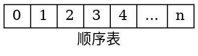

# 顺序表

::: tip 建议

在阅读本篇文章之前，建议先学会 C 语言的语法，包括但不限于：

- 指针
- 内存管理
- 结构体

:::

## 线性表

线性表（linear list）是 n 个具有相同特性的数据元素的有限序列。 线性表是一种在实际中广泛使用的数据结构，常见的线性表：顺序表、链表、栈、队列、字符串等等。

线性表在逻辑上是线性结构，也就说是连续的一条直线。但是在物理结构上并不一定是连续的，线性表在物理上存储时，通常以数组和链式结构的形式存储。

下面是顺序表和链表的示意图：

```dot
digraph "链表示意图" {
    rankdir = LR;

    /**
     * 把节点的形状设置为 record，默认的是圆角矩形
     */
    node [shape = record;];

    // 边的样式
    edge [style = "dashed"; arrowsize = 0.6;];
    pad = "0";
    margin = 0;

    // subgraph 以 cluster 开头才会有边框，label 才会生效
    subgraph cluster_linked_list {
        peripheries = 0;
        // penwidth = 0; // 可加粗
        // pencolor = transparent;
        // style = invis;
        // 去掉 cluster 的边框
        // https://forum.graphviz.org/t/how-to-remove-border-around-subgraphs/397/2
        // https://stackoverflow.com/questions/7357225/

        // gradientangle = 270;
        // a0 -> a1 -> a2 -> a3;

        // 填充渐变色 fillcolor = "lightskyblue:darkcyan"
        node1 [label = "<h>data|<n>next";];
        node2 [label = "<h>data|<n>next";];
        node3 [label = "<h>data|<n>next";];
        node4 [label = "<h>data|<n>next";];

        label = "链表";
        labelloc = "b";
    }

    // 冒号后面是结点方位，可以是 n,s,w,e 及他们的组合
    node1:n -> node2:h;
    node2:n -> node3:h;
    node3:n -> node4:h;
}
// 下面是另一种实现方式，参考了 https://stackoverflow.com/questions/70441786/
// digraph "链表" {
// rankdir = LR;
//
// node [shape = record;];
//
// node1 [label = "<h>data|<n>next";];
// node2 [label = "<h>data|<n>next";];
// node3 [label = "<h>data|<n>next";];
// node4 [label = "<h>data|<n>next";];
//
// label = "链表";
//
// node1:n -> node2:h;
// node2:n -> node3:h;
// node3:n -> node4:h;
// // dir = back; 反向箭头 arrowtail = odiamond; 箭头样式
//
// // 使用不可见的箭头加 weight>=2 强行修正位置
// node2:w -> node1:e [weight = 2; style = invis;];
// node3:w -> node2:e [weight = 2; style = invis;];
// node4:w -> node3:e [weight = 2; style = invis;];
// }
```





## 顺序表

### 概念及结构

顺序表是用一段**物理地址连续**的存储单元**依次存储数据元素**的线性结构，一般情况下采用数组存储。在数组上完成数据的增删查改。

由以上可知，顺序表的特性是：逻辑结构相邻的元素，在物理结构上也相邻。

顺序表一般可以分为：

1. 静态顺序表：使用定长数组存储。
2. 动态顺序表：使用动态开辟的数组存储。

对于动态顺序表，当容量不足够时，可以增容。

两者的代码定义如下（C 语言）：

```c
// 定义顺序表元素的类型
typedef int DataType;

// 静态顺序表
#define N 100
typedef struct SeqList {
    DataType arr[N]; // 定长数组
    int size; // 有效数据的个数
} SeqList;

// 动态顺序表
typedef struct SeqList {
    DataType *arr; // 指向动态开辟的数组
    int size; // 数组存储的数据个数
    int capacity; // 容量空间的大小
} SeqList;
```

### 基本操作的接口

静态顺序表只适用于确定知道需要存多少数据的场景。静态顺序表的定长数组导致 N 定大了，空间开多了浪费，开少了不够用。所以现实中基本都是使用动态顺序表，根据需要动态的分配空间大小，所以我们主要实现动态顺序表。

下面给出动态顺序表的相关函数申明：

```c
/**
 * 顺序表初始化
 * @param sl 头指针
 */
void Init(SeqList *sl);

/**
 * 顺序表销毁，防野指针
 * @param sl
 */
void Destroy(SeqList *sl);

/**
 * 打印顺序表
 * @param sl
 */
void Print(SeqList *sl);

/**
 * 查找值为 x 的元素下标，未找到则返回 -1
 * @param sl
 * @param x 查找的值
 * @return 下标
 */
int Find(SeqList *sl, DataType x);

/**
 * 检查容量，不够则扩容
 * @param sl
 */
void CheckCapacity(SeqList *sl);

/**
 * 在指定位置 pos 插入 x
 * @param sl
 * @param pos 插入元素的位置
 * @param x 插入元素的值
 */
void Insert(SeqList *sl, int pos, DataType x);

/**
 * 在指定位置 pos 删除元素
 * @param sl
 * @param pos 位置
 */
void Delete(SeqList *sl, int pos);
```

### 基本操作的实现

#### 初始化和销毁

顺序表的初始化比较简单。对于它的动态数组，将其首地址指针指向空即可，初始时其有效数据数和容量均为 0：

```c
// #include <stdio.h>
// #include <stdlib.h>

void Init(SeqList *sl) {
    sl->arr = NULL;
    sl->size = sl->capacity = 0;
}
```

由于只有当容量不够时才会扩容，因此我们把 `arr` 数组的扩容放在顺序表的插入运算当中，而非此处。

顺序表的销毁同样比较简单，因为动态数组是通过 `malloc` 函数创建而来，所以只要用对应的 `free` 函数去释放它申请的空间即可。

```c
void Destroy(SeqList *sl) {
    // 先释放指针所指的空间，然后将指针置空
    free(sl->arr);
    sl->arr = NULL;
    sl->size = sl->capacity = 0;
}
```

#### 遍历

此处就先以一个 `Print` 函数为例，把顺序表中的每个元素打印出来。

得到顺序表的头指针 `sl` 后，只要对它循环有效数据个数（`sl->size`）次即可：

```c
void Print(SeqList *sl) {
    printf("顺序表长度为 %d\n", sl->size);
    for (int i = 0; i < sl->size; i++) {
        printf("%d ", sl->arr[i]);
    }
    printf("\n");
}
```

根据以上的思想，我们还能够实现顺序表的查找功能，只需要在遍历的基础上加上比较就行：

```c
int Find(SeqList *sl, DataType x) {
    for (int i = 0; i < sl->size; i++) {
        // 如果元素的值等于 x，返回它的下标
        if (sl->arr[i] == x) {
            return i;
        }
    }
    return -1;
}
```

与之等价的 `while` 循环写法：

```c
int Find(SeqList *sl, DataType x) {
    int i = 0;
    while (i < sl->size) {
        if (sl->arr[i] == x) {
            return i;
        }
        i++;
    }
    return -1;
}
```

::: tip

`for` 循环更适合能够**随机存储**的数据结构，比如数组。

不论是顺序表、链表，还是之后会学习的队列、栈等数据结构，与它们相关的操作最常用的循环是 `while` 而非 `for`，我们要适应 `while` 循环的使用。

:::

##### 测试

到此为止，我们已经实现了 4 个功能，先来简单测试一下！

```c
void test1() {
    // 初始化顺序表
    SeqList sl;
    Init(&sl);

    // 目前我们还没有实现插入，暂时先手动建一个数组
    int n = 6;
    int *a = (int *) malloc(sizeof(int) * n);
    for (int i = 0; i < n; i++) {
        a[i] = 2 * i + 1;
    }

    // 手动设置顺序表
    sl.arr = a;
    sl.size = sl.capacity = n;

    // 测试打印
    Print(&sl);
    int val = 0;
    while (val < 2 * n) {
        printf("val: %d, index: %d\n", val, Find(&sl, val));
        val++;
    }
    Destroy(&sl);
}
```

::: details 查看输出结果

```text
顺序表长度为 5
0 2 4 6 8
val: 0, index: 0
val: 1, index: -1
val: 2, index: 1
val: 3, index: -1
val: 4, index: 2
val: 5, index: -1
val: 6, index: 3
val: 7, index: -1
val: 8, index: 4
val: 9, index: -1
```

:::

该结果是符合预期且正确的。

#### 插入

此处我们采用的是动态数组，当插入元素时，都需要先检查容量是否足够，如果不够就要先扩容再插入。所以我们不妨先实现检查容量并扩容的功能。

先简单分析一下满容量的条件。实际上根据前文设计的顺序表结构，很容易知道：当 `size` 和 `capacity` 相等时，表中存放的有效数据达到最大容量，即存满了，此时就需要扩容。

如何扩容？如果我们每次只扩容少量空间，当有新数据插入时很快就满了；如果我们一次性扩容大量数据，有很多空间就得不到充分利用，造成了浪费。为了避免比较极端的情况，我们做以下平衡：每次扩容都增大原来的 1 倍。

```c
void CheckCapacity(SeqList *sl) {
    // 如果存满了，容量翻一倍
    if (sl->size == sl->capacity) {
        // 初始时容量为 0，将 4 作为默认值；否则翻倍
        int newCapacity = sl->capacity == 0 ? 4 : sl->capacity * 2;
        // 尝试重新调整内存块大小
        DataType *tmp = (DataType *) realloc(sl->arr, newCapacity * sizeof(DataType));
        // 申请空间失败
        if (tmp == NULL) {
            printf("realloc fail\n");
            exit(-1);
        }
        sl->arr = tmp;
        sl->capacity = newCapacity;
    }
}
```

::: tip

代码第 7 行使用了在原数组上扩容的函数 [`realloc`](https://cplusplus.com/reference/cstdlib/realloc/)，如果从原数组首地址开始能够扩大到所申请的内存块大小，就直接在原数组之后开辟空间；否则会找另一块足够大的空间，然后把原数组复制到新数组，返回新数组首地址。当原数组首地址为空时，该函数退化为 `malloc`。

:::

现在我们完成了检查容量的操作，那么接下来只管插入的逻辑就行了。

```c
void Insert(SeqList *sl, int pos, DataType x) {
    // 检查 pos 合法性
    /*if (pos < 0 || pos > sl->size) {
        printf("pos 无效\n");
        return;
    }*/
    assert(pos >= 0 && pos <= sl->size);
    CheckCapacity(sl);
    // 从 pos 开始的元素往后移
    int end = sl->size - 1;
    while (end >= pos) {
        sl->arr[end + 1] = sl->arr[end];
        end--;
    }
    sl->arr[pos] = x;
    sl->size++;
}
```

推荐用断言 ([`assert`](https://cplusplus.com/reference/cassert/assert/))

实际上我们已经实现了最通用的插入操作，这里再额外提一下头插和尾插，因为两者是在顺序表中常用的操作。

先说尾插

```c
void PushBack(SeqList *sl, DataType x) {
    /*CheckCapacity(sl);

    // 直接插入即可
    sl->arr[sl->size] = x;
    sl->size++;*/

    // 调用，插入最后一个位置
    Insert(sl, sl->size, x);
}
```

再来看看头插，需要移动元素

```c
void PushFront(SeqList *sl, DataType x) {
    /*CheckCapacity(sl);

    // 将所有元素往后移
    int end = sl->size - 1;
    while (end >= 0) {
        sl->arr[end + 1] = sl->arr[end];
        end--;
    }
    sl->arr[0] = x;
    sl->size++;*/

    // 调用
    Insert(sl, 0, x);
}
```

##### 测试

#### 删除

```c
void Delete(SeqList *sl, int pos) {
    assert(pos >= 0 && pos < sl->size);
    // pos 之后的元素往前移
    int begin = pos + 1;
    while (begin < sl->size) {
        sl->arr[begin - 1] = sl->arr[begin];
        begin++;
    }
    sl->size--;
}
```

头删、尾删

```c
void PopBack(SeqList *sl) {
    // 软处理
    /*if (sl->size > 0) {
        // sl->arr[sl->size - 1] = 0; // 该操作可做可不做
        sl->size--;
    }*/

    // 硬处理
    /*// 断言，如果不满足条件就会报错
    assert(sl->size > 0);
    sl->size--;*/

    Delete(sl, sl->size - 1);
}
```

```c
void PopFront(SeqList *sl) {
    /*// 依次往前移动，然后修改 size
    int begin = 1;
    while (begin < sl->size) {
        sl->arr[begin - 1] = sl->arr[begin];
        begin++;
    }
    sl->size--;*/

    Delete(sl, 0);
}
```

##### 测试

### 扩展操作

原地移除元素：[27. 移除元素](https://leetcode.cn/problems/remove-element/)

合并两个有序数组：[88. 合并两个有序数组](https://leetcode.cn/problems/merge-sorted-array/)
