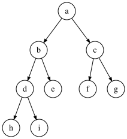

# 选择排序

选择排序的基本思想：每一次从待排序的数据元素中选出最小（或最大）的一个元素，存放在序列的起始位置，直到全部待排序的数据元素排完 。

## 直接选择排序

直接选择排序 (Straight Selection Sort) 又称**简单选择排序**，其思想是：在范围 `[i, n-1]` 的元素中选择关键码最大（小）的元素，若它不是这组元素中的最后一个（第一个）元素，则将它与这组元素中的最后一个（第一个）元素交换。对余下的 `[i, n-2]`（或 `[i+1, n-1]`）中的元素，重复上述步骤，直到只剩余 1 个元素。

动态示意图：


直接选择排序思考非常好理解，但是效率不是很好，且实际中很少使用。

### 代码实现

```c
/**
 * 无优化的直接选择排序
 * @param arr 数组
 * @param n 数组长度
 */
void select_sort_raw(int *arr, int n) {
    // 从第一个数开始，到倒数第二个数，每个数和它后面的比较，范围 [0, n-2]
    for (int i = 0; i < n - 1; i++) {
        int min = i; // 用于记录最小的元素下标
        // 从 arr[i] 的下一位开始，寻找比 arr[min] 更小的元素，更新 min 的位置
        for (int j = i + 1; j < n; j++) {
            if (arr[j] < arr[min]) {
                min = j;
            }
        }
        // 此时 arr[min] 是 [i, n-1] 中最小的
        if (min != i) {
            // 如果 arr[min] 不是最小的，就和 arr[i] 交换位置
            swap(arr + min, arr + i);
        }
    }
}
```

#### 优化

因为每次遍历才取出一个最大或最小的数，效率确实太低了。实际上每次遍历都能取出这趟遍历序列中的最大数和最小数，这就是一种优化思路：

```c
/**
 * 直接选择排序（优化）
 *
 * 交换排序的一种。原来的算法是一趟选一个，优化后同时交换一个大、一个小
 * 优化后复杂度：N + N-2 + N-4 + N-6 + ... + 0
 * 该算法较差，最好情况也是 O(n*n)
 * @param a
 * @param n
 */
void select_sort(int *a, int n) {
    int begin = 0, end = n - 1;
    while (begin < end) {
        int minIdx = begin, maxIdx = begin; // 最小数和最大数的下标
        // 在 [begin, end] 区间内，找到最大和最小元素的下标
        for (int i = begin; i <= end; i++) {
            if (a[i] < a[minIdx]) {
                minIdx = i;
            }
            if (a[i] > a[maxIdx]) {
                maxIdx = i;
            }
        }
        // 把最小的换到左边，最大的换到右边
        swap(a + begin, a + minIdx);
        // 如果 begin 跟 maxIdx 重叠，则需要修正一下
        // eg: 9,3,5,2,7,-1,9,4,0
        if (begin == maxIdx) { // 此时 begin 被换到了 minIdx
            maxIdx = minIdx;
        }
        swap(a + maxIdx, a + end);
        begin++;
        end--;
    }
}
```

### 算法分析

对比优化前后的直接选择排序，优化前每次问题的规模都比原来少 1 个：

$$
\sum_{k=0}^{n-1}{(n-k)} = n(n-1)-\frac{n(n-1)}{2}=O(n^2)
$$

优化后每次都比原来少 2 个：

$$
\sum_{k=0}^{\lfloor n/2\rfloor}{(n-2k)} \approx \frac{n^2}{2} - 2\cdot\frac{(n/2)(n/2+1)}{2}=O(n^2)
$$

但时间复杂度仍是一样的，为 $O(n^2)$。

空间复杂度：仅使用几个辅助变量，对数组原地操作，复杂度为 $O(1)$。

稳定性：不稳定，不能保证与最小（最大）元素交换时等值元素相对位置不变。

## 堆排序

堆排序 (Heap Sort) 是利用堆积树（堆）这种数据结构所设计的一种排序算法，是选择排序的一种。它通过堆来进行选择数据。需要注意的是**排升序要建大堆**，**排降序建小堆**。

若在输出堆顶的最小值（最大值）后，剩余 n-1 个元素的序列又能建成一个堆，则可得到 n 个元素的次小值（次大值），反复如此，就能得到一个有序序列，这个过程就是堆排序。

实现堆排序需要解决两个问题：

1. 如何由一个无序序列建成一个堆？
2. 如何在输出堆顶元素之后，调整剩余元素为一个新的堆？

### 相关性质

结构性：堆是用数组表示的完全二叉树；

有序性：任一结点的关键字是其子树所有结点的最大值（或最小值）；

- 若是最大值，则称该堆为“大根堆”或“大顶堆”；
- 若是最小值，则称该堆为“小根堆”或“小顶堆”。

堆的物理结构是一个线性表（数组）：

$$
\begin{gathered}
\begin{array}{ccccccccc}
0&1 & 2 & 3 &4&5&6&7&8\\
\end{array}\\[-4pt]
\begin{array}{|c|c|c|c|c|c|c|c|c|}
\hline
a & b & c & d & e & f & g & h & i \\
\hline
\end{array}
\end{gathered}
$$

而其逻辑结构是一颗完全二叉树：



可以发现，父子结点的下标之间有关系：

1. leftChild = parent $\times$ 2+1
2. rightChild = parent $\times$ 2+2
3. parent = (child-1)/2

如果有 $n$ 个元素，那么最后一个叶子结点下标为 $n-1$，其父结点（即最后一个非叶子结点）的下标为 $\lfloor(n-1-1)/2\rfloor=\lfloor n/2\rfloor-1$。从而我们可以得知叶子结点的下标是从 $\lfloor n/2\rfloor$ 开始的。

### 堆的调整

现在先解决第二个问题：输出堆顶元素之后，调整为（小根）堆，这个过程也叫**堆化 (heapify)**。其步骤如下：

1. 输出堆顶之后，用堆中**最后一个元素**替代它；
2. 将根节点值与左右子树的根节点值（就是左右孩子）比较，**较小者**与父亲比较，比父亲值小就交换（因为小根堆要求父结点值比孩子值小）；
3. 重复以上过程，直到调整至叶子结点，将得到新的堆。称这个从堆顶至叶子向下调整的过程为“**筛选**”(sift down)。

例子，以下完全二叉树中，结点 27 的左右子树都是小根堆：


1. 选出左右孩子较小者 15（15<19），比父亲 27 小，交换位置；
2. 选出左右孩子较小者 18（18<28），比父亲 27 小，交换位置；
3. 选出左右孩子较小者 25（49>25），比父亲 27 小，交换位置；
4. 此时已调整到叶子结点，结束。

::: tip

这个向下调整的过程也叫**向下调整算法 (sift down)**。但注意，在这个调整的过程中，根节点的左右子树都是小根堆。也就是说，**向下调整算法的前提是左右子树都是堆**。

:::

根据上面的思想，小根堆的向下调整算法的代码如下：

```c
// swap 函数用于交换两数，在“交换排序”中曾给出

/**
 * 堆排序的向下调整算法（建小堆）
 *
 * 前提：根的左右子树都是小堆
 * 选出左右孩子较小者，与父亲比较，如果比父亲小就交换，然后继续往下调整，调到叶子结点时终止
 * @param arr 数组
 * @param n 数组长度
 * @param root 根结点下标
 */
void min_heapify(int *arr, int n, int root) {
    int parent = root;
    int child = parent * 2 + 1; // child 是比父亲小的孩子，先默认选左孩子

    // 调整到叶子结点就终止。物理结构上超出长度 n 就是空结点
    while (child < n) {
        // 选出左右孩子中较小者（注意可能只有左孩子）
        if ((child + 1 < n) && arr[child + 1] < arr[child]) {
            child += 1;
        }

        // 较小者与父亲比较
        if (arr[child] < arr[parent]) {
            // 比父亲小就交换父子位置
            swap(arr + parent, arr + child);
            // 继续往下调整受影响的子树
            parent = child;
            child = parent * 2 + 1;
        } else {
            // 如果不比父亲大就停止，此时已经是小根堆
            break; // 也可用 return;
        }
    }
}
```

类似地，若要调整为大根堆，也可用向下调整的方法。只不过向下调整的第 2 个步骤要改成 _较**大**者与父亲比较，比父亲**大**则交换_，我们就能立即得到调整为大根堆的向下调整算法。因为和上面的 `min_heapify` 代码十分相似，且教材中常见的是使用 `for` 循环，因此下面给出的代码改用 `for` 循环：

```c
/**
 * 堆排序的向下调整算法（建大堆）
 *
 * 改用 for 循环
 */
void max_heapify(int *arr, int n, int root) {
    int parent = root;
    // child 是比父亲大的孩子，先默认选左孩子
    for (int child = parent * 2 + 1; child < n; child = child * 2 + 1) {
        // 选出左右孩子中较大者（注意可能只有左孩子）
        if ((child + 1 < n) && arr[child + 1] > arr[child]) {
            child += 1;
        }
        // 较大者与父亲比较
        if (arr[child] > arr[parent]) {
            // 比父亲大就交换父子位置
            swap(arr + parent, arr + child);
            // 继续往下调整受影响的子树
            parent = child;
        } else {
            // 不比父亲大就停止
            break;
        }
    }
}
```

不论是 `min_heapify` 还是 `max_heapify`，使用它们的前提是 `root` 的左右子树都是小根堆或大根堆。

### 堆的建立

上一小节我们讨论了如何将左右子树都是堆的完全二叉树调整为堆，因为向下调整算法有前提，我们先看看完全二叉树中有哪些简单的结构是堆：

- 单个结点的二叉树是堆；
- 完全二叉树中所有以叶子结点（下标 $i\ge\lfloor n/2\rfloor$）为根的子树是堆。

正因为叶子结点都是堆，我们只要从完全二叉树中最后一个**非叶子结点**开始，向前调整，当整颗树的根节点也调整完毕后，就得到了堆。即：

1. 将下标为 $\lfloor n/2\rfloor-1$ 的结点为根的二叉树调整为堆；
2. 将下标为 $\lfloor n/2\rfloor-2$ 的结点为根的二叉树调整为堆；
3. 将下标为 $\lfloor n/2\rfloor-3$ 的结点为根的二叉树调整为堆；
4. ……
5. 将下标为 $0$ 的结点为根的二叉树调整为堆。此时整棵树就是堆。

::: tip

因为它是从倒数第二层（叶子节点的上一层）开始调整，故也称向下调整算法为 **自底向上 (bottom-up)** 的建堆方式。

:::

我们先给出建堆的代码，然后再看一个例子：

```c
// 向下调整算法的前提是左右子树都是堆，从最后一个非叶子结点开始调

// 建大堆（将无序序列调整为大根堆）
for (int i = (n / 2) - 1; i >= 0; i--) {
    max_heapify(arr, n, i);
}

// 建小堆（将无序序列调整为小根堆）
for (int i = (n / 2) - 1; i >= 0; i--) {
    min_heapify(arr, n, i);
}
```

结合上面的原理，这里的代码应当很容易理解。

我们取一个无序序列 $\{49,38,65,97,76,13,27,\underline{49},17,32\}$，将其建立为大根堆。首先将它们摆放成完全二叉树：


到此为止我们就完成了建堆的操作。

### 排序

如何用一个堆进行排序？根据大根堆（小根堆）的性质，堆的根节点必然是所有结点中值最大（最小）的，如果我们将它输出，就相当于我们选出了序列中的最大值，接下来选出次大值（次小值），反复如此操作，就可以得到一个升序（降序）的有序序列。实质上，堆排序就是利用完全二叉树中父结点与孩子结点之间的内在关系来排序的。

以升序为例，因为每趟排序都能选出最大值，即选出 [0,end] 中的最大值并放到 end 处，接下来在 [0, end-1] 选出最大，放到 end-1 处。每次选到的最大值都在堆顶，要把它放到序列的最后只需要和最后一个叶子结点交换位置即可。只要选出 n-1 个最大值，剩下最后 1 个元素自然是最小值，因此 end 的范围是 [1, end-1]。代码如下：

```c
/**
 * 堆排序
 *
 * @param arr 数组
 * @param n 数组长度
 */
void heap_sort(int *arr, int n) {
    // 这里完成建堆操作，复杂度 O(n)
    // 向下调整算法的前提是左右子树都是堆，不能直接使用，从最后一个非叶子结点开始调整
    for (int i = (n / 2) - 1; i >= 0; i--) {
        // 要升序建大堆，要降序建小堆
        max_heapify(arr, n, i); // 建大堆
        // min_heapify(arr, n, i); // 建小堆
    }

    // 依次选出最大值
    for (int end = n - 1; end >= 1; end--) {
        // 此时已经是堆，交换堆顶和最后一个叶子结点，可选出最大值并放在末尾
        swap(arr + 0, arr + end);
        // [0, end] 最大数已选出，用向下调整算法把 [0, end-1] 堆化，找出次大数
        max_heapify(arr, end, 0); // 降序则应调用 min_heapify
    }
}
```

请看下面这张动图（来自 [wikipedia](https://en.wikipedia.org/wiki/Heapsort)）以加深理解：


思考：为什么排升序不用小根堆选出最小值？

例如序列 $\{0,3,1,4,5,6,2,9\}$ ，初始情况如下：


它已经满足小根堆的条件，现在我们把堆顶输出，情况是这样的：


可以发现，结点 3 原本的右孩子 5 现在成了 结点 1 的左孩子，结点 1 也是类似这种情况。也就是说，第二个数去做根了，剩下的结点关系全乱了，只能重新建堆。每次都如此，效率太低，还不如直接遍历选（最大或最小）数。

### 算法分析

我们先计算首次将无序序列调整为堆所需要的时间复杂度，实际上也是计算交换了多少次。

同一层的结点最多交换的次数是相同的，于是总交换次数 = 每层的节点数 $\times$ 该层节点最多交换的次数。

为了方便计算，我们不妨假设某个堆为满二叉树，其高为 $h$，则 $h=\log_2(n+1)$，第 $k$ 层的结点数为 $2^{k-1}$。

每次调整可能有多次交换，且最多交换到根节点（堆顶）结束。堆化是从倒数第二层（即第 h-1 层）开始调整，因此第 1 层最多会发生 $h-1$ 次交换，第 2 层最多会发生 $h-2$ 次交换，以此类推可得第 $k$ 层最多发生 $h-k$ 次交换。

由此可得堆化的复杂度为：

$$
T(n)=\sum_{k=1}^{h-1}{2^{k-1}\cdot(h-k)}
$$

利用错位相减法求解：

$$
\begin{gathered}
    T(n)=\sum_{k=1}^{h-1}{2^{k-1}(h-k)}=(h-1)+\sum_{k=2}^{h-1}{2^{k-1}(h-k)}\\
    2T(n)=\sum_{k=1}^{h-1}{2^k(h-k)}=\sum_{k=2}^{h-1}{2^{k-1}(h-k+1)}+2^{h-1}\\
    \begin{aligned}
        \Rightarrow T(n)&=\sum_{k=2}^{h-1}{2^{k-1}}+2^{h-1}-(h-1)\\
        &=\frac{2(2^{h-2}-1)}{2-1}+2^{h-1}-(h-1)\\
        &=2^h-h-1\\
    \end{aligned}
\end{gathered}
$$

即

$$
\begin{aligned}
    T(n)&=2^{\log _2(n+1)}-\log_2(n+1)-1\\
    &=n-\log_2(n+1)\\
    &= O(n)
\end{aligned}
$$

可见初始堆化所需时间不超过 $O(n)$。

排序阶段（不含初始堆化），每层结点最多交换 $1$ 次就完成堆化。复杂度和其高度一致，为 $O(\log n)$，即一次重新排序所需时间不超过 $O(\log n)$。$n-1$ 次循环所需时间不超过 $O(n\log n)$。

因此堆排序总的时间复杂度不超过 $O(n)+O(n\log n)=O(n\log n)$。

堆排序的时间主要耗费在初始堆和调整建新堆时进行的反复筛选上。堆排序最坏情况下的时间复杂度也为 $O(n\log n)$，这是堆排序的最大优点，无论待排序序列中的元素是正序还是逆序，都不会使堆排序处于最好或最坏的状态。

空间复杂度： $O(1)$，排序仅需一个辅助变量用来交换。

稳定性：不稳定，堆排序的交换是利用父子的大小关系，无法保证等值元素相对顺序不变。

堆排序不适用于待排序元素个数较少的情况，但对于元素个数较大时是很有效的。

## 测试

> 测试用到的函数及 `main` 函数请看 [插入排序 - 测试](insertion-sort.md#测试) 部分。

先验证一下代码运行结果是否符合预期

```c
void testSelectionSorts() {
    int n = random(10, 20);
    int *a1 = gen_random_array(n, 100);
    int *a2 = copy_arr(a1, n);
    int *a3 = copy_arr(a1, n);
    print_array(a1, n);

    printf("直接选择排序:\n");
    select_sort_raw(a1, n);
    print_array(a1, n);

    printf("直接选择(优化):\n");
    select_sort(a2, n);
    print_array(a2, n);

    printf("堆排序:\n");
    heap_sort(a3, n);
    print_array(a3, n);

    free(a1);
    free(a2);
    free(a3);
}
```

```text
56 46 17 25 97 14 8 48 35 92 45 83 85
直接选择排序:
8 14 17 25 35 45 46 48 56 83 85 92 97
直接选择(优化):
8 14 17 25 35 45 46 48 56 83 85 92 97
堆排序:
8 14 17 25 35 45 46 48 56 83 85 92 97
```

我们取十万个随机数来测试性能：

```c
void compareSelectionSorts() {
    int n = 100000;
    int *a1, *a2, *a3;
    set_random_arrays((int **[]) {&a1, &a2, &a3}, 3, n);

    int tick1 = clock();
    select_sort_raw(a1, n);
    int tick2 = clock();
    select_sort(a2, n);
    int tick3 = clock();
    heap_sort(a3, n);
    int tick4 = clock();

    printf("直接选择排序: %d\n", tick2 - tick1);
    printf("直接选择排序(优化): %d\n", tick3 - tick2);
    printf("堆排序: %d\n", tick4 - tick3);

    free(a1);
    free(a2);
    free(a3);
}
```

```text
直接选择排序: 10466
直接选择排序(优化): 6074
堆排序: 19
```

可见直接选择排序的优化效果提升了 $70\%$ 左右，而堆排序的速度和 [快速排序](exchange-sort.md) 相当，毕竟两者的时间复杂度都是 $O(n\log n)$。
