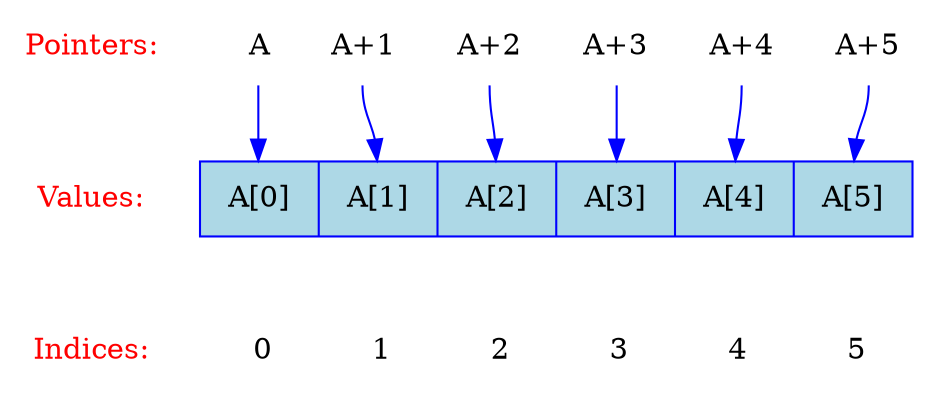
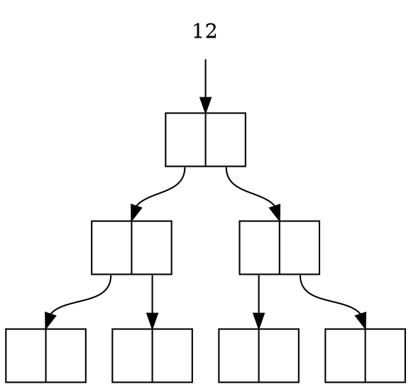
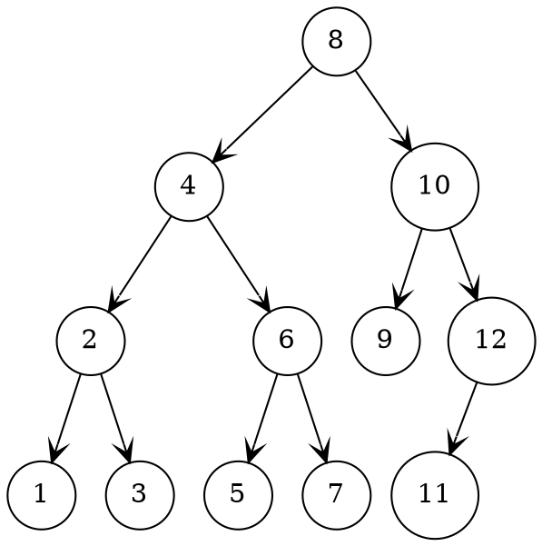
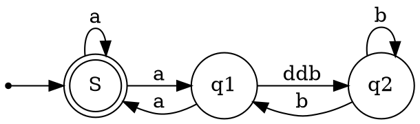

# Graphviz 工具

Graphviz 是一款开源的图形可视化软件，专门用于将结构化信息（如图、网络、树等）自动渲染为可视化图形。它的核心思想是让用户用文本描述节点与关系，再由软件自动完成布局与渲染，从而摆脱手动拖拽图形的繁琐工作。Graphviz 是一个将“描述”转化为“图形”的强大工具，尤其适合技术写作场景。

<!-- more -->

好处说完了，那坏处呢？真正用起来你就会发现，想要画出满意的图并不是那么容易的——最初我想把它用于绘制链表的示意图，在 [单链表](../../../notes/data-structure/linear-list/singly-linked-list.md) 一文中大量使用，这里也记录一下曾经使用的 `dot` 代码 版本。

循环单链表（原图参考 [StackOverflow](https://stackoverflow.com/questions/50494263/circular-list-in-graphviz-or-how-to-bend-the-edge)）：

```dot
digraph "链表示意图" {
    rankdir = "LR";
    //
    margin = 0;
    label = "单链表、循环单链表";

    node [shape = record; height = 0.3;];
    edge [tailclip = false; arrowsize = 0.6;];

    subgraph "循环链表" {
        label = "";
        peripheries = 0;

        cnode1 [label = "{<data> d₁| <next> &#9679;}";];
        cnode2 [label = "{<data> d₂ | <next> &#9679;}";];
        cnode3 [label = "{<data> d₃ | <next> &#9679;}";];

        edge [tailclip = false; arrowsize = 0.6;];

        // cnode3:next:s -> cnode1:data:s;
        // cnode3 -> cnode2 -> cnode1 [style=invis];

        subgraph {
            node [shape = point; height = 0;];
            pHead;
            pTail;
        }
        pHead:n -> cnode1;
        pHead:s -> pTail:s [dir = none;];
        cnode1:next:c -> cnode2:data;
        cnode2:next:c -> cnode3:data;
        cnode3:next:c -> pTail:n [dir = none;];
    }

    subgraph "单链表" {
        peripheries = 0;

        node1 [label = "{<data> d₁| <next> &#9679;}";];
        node2 [label = "{<data> d₂ | <next> &#9679;}";];
        node3 [label = "{<data> d₃ | <next> &#9679;}";];

        null [label = "NULL";shape = plaintext;];

        node1:next:c -> node2:data;
        node2:next:c -> node3:data;
        node3:next:c-> null;
    }

    // 对齐
    subgraph {
        rank = same;
        cnode1;
        node1;
    }
}
```

另一个实现版本，虽然能实现线段拐弯是直角，但没法精准控制线段两端位置：

```dot
digraph "链表示意图" {
    rankdir = "LR";
    margin = 0;
    label = "单链表、循环单链表";
    splines = ortho;           // 启用正交边（直角连线）
    node [shape = record, height = 0.3];
    edge [tailclip = false, arrowsize = 0.6];

    // 循环链表节点（上方）
    cnode1 [label = "{<data> d₁| <next> &#9679;}", group = "circ"];
    cnode2 [label = "{<data> d₂ | <next> &#9679;}", group = "circ"];
    cnode3 [label = "{<data> d₃  | <next> &#9679;}", group = "circ"];

    // 单链表节点（下方）
    node1 [label = "{<data> d₁| <next> &#9679;}", group = "sing"];
    node2 [label = "{<data> d₂ | <next> &#9679;}", group = "sing"];
    node3 [label = "{<data> d₃ | <next> &#9679;}", group = "sing"];
    null [label = "NULL", shape = plaintext];

    // ----- 强制垂直对齐（不可见边，同时拉开上下间距）-----
    // edge [style = invis, constraint = true, minlen = 2];
    // cnode1 -> node1;
    // cnode2 -> node2;
    // cnode3 -> node3;

    // ----- 主链连线（水平）-----
    edge [style = solid, constraint = true];
    cnode1:next:c -> cnode2:data;
    cnode2:next:c -> cnode3:data;

    node1:next -> node2:data;
    node2:next -> node3:data;
    node3:next -> null;

    // ----- 回路连线（直角）-----
    node [shape = point,  label = "", width = 0];
    pt_a; pt_b;

    // 辅助点与对应节点在同一水平线上
    { rank = same; cnode3; pt_a; }
    { rank = same; cnode1; pt_b; }

    // 回路连线，关闭约束以避免影响主链，设置权重确保垂直/水平方向
    edge [dir = both, constraint = false, tailclip = false; arrowtail = ".";arrowhead = ".";];
    cnode3:next:ws -> pt_a [weight = 2];   // 垂直向下
    pt_a -> pt_b [weight = 2];            // 水平向左
    edge [dir = both, constraint = false, tailclip = false; arrowtail = "."; arrowhead = ""];
    pt_b -> cnode1:data:s [weight = 2; ];   // 垂直向上
}
```

最终用 AI 搜了一下，发现 `neato` 或 `fdp` 引擎可以指定坐标来布局，这就比较符合我们的绘图需求了：

```dot
digraph LinkedList_neato {
    layout = neato; // 使用 neato 或 fdp 引擎
    // overlap = false; // 避免节点重叠，在 dot 14.1.4 中会渲染异常

    label = "单链表、循坏单链表";
    labelloc = "b"; // bt
    labeljust = "c"; // clr
    // 节点样式：链表节点使用 record 形状
    node [shape = record; width = 0.4; height = 0.3;];

    rankdir = "LR"; // 让 data | next 水平排列
    subgraph cluster_单链表 {
        label=""
        peripheries = 0; // 隐藏边框，或者用 color = "none"

        // 链表节点坐标 (x, y) 单位英寸，y=0 水平线
        node01 [pos = "0, 0.6!"; label = "{<data> d₁| <next> &#9679;}";];
        node02 [pos = "1.2, 0.6!"; label = "{<data> d₂ | <next> &#9679;}";];
        node03 [pos = "2.4, 0.6!"; label = "{<data> d₃ | <next> &#9679;}";];
        null [pos = "3.6, 0.6!"; label = "NULL"; shape = plaintext;];
        // 下面这个仅用于给左边添加空白区域
  null_dp [pos = "-0.8, 0.6!"; shape = plaintext; style = invis];

        edge [tailclip = false; arrowsize = 0.5;];
        node01:next:c -> node02:data;
        node02:next:c -> node03:data;
        node03:next:c-> null;
    }

    subgraph cluster_循环链表 {
        label = ""
        peripheries = 0;

        node1 [pos = "0, 0!"; label = "{<data> d&#8321; | <next> &#9679; }";];
        node2 [pos = "1.2, 0!"; label = "{<data> d&#x2082; | <next> &#9679; }";];
        node3 [pos = "2.4, 0!"; label = "{<data> d₃ | <next> &#9679; }";];

        // 辅助点
        node [shape = point; width = 0;];
        A [pos = "-0.8, 0!";];    B [pos = "3.2, 0!";];
        C [pos = "-0.8, -0.5!";]; D [pos = "3.2, -0.5!";];

        edge [tailclip = false; arrowsize = 0.5;];
        // 链表内部的连接
        node1:next:c -> node2:data
        node2:next:c -> node3:data
  // 自定义回环路径
        edge [arrowhead = none;];
        node3:next:c -> B;
        B -> D; D -> C; C -> A;
        A -> node1:data [arrowhead = normal;];
    }
}
```

指针示意图（原图出自 StackOverflow，具体链接忘了）：

一个复杂的案例（出自 [forum.graphviz](https://forum.graphviz.org/t/how-to-draw-the-box-and-pointer-notation/812/3)）：

```dot
digraph lisp {
    // https://forum.graphviz.org/t/how-to-draw-the-box-and-pointer-notation/812/3
    graph [nodesep = .6; splines = line; newrank = true;];
    // nodesep will help & hurt
    node [shape = plain;];
    edge [tailclip = false;];
    // tail starts in the center

    subgraph clusterA {
        node [shape = plain;];
        graph [label = "figure 2.2"; labelloc = b;];

        // begin1 - pointer from the left
        begin1 [style = invis;];

        // pair w/ left & right pointers (filled circle in center)
        a [label = <<table border="0" cellborder="1" cellspacing="0">
            <tr>
            <td width="32" port="l">&#9679;</td>
            <td width="32" height="32" port="r">&#9679;</td>
            </tr>
            </table>>;
            ];

        // terminal
        1 [label = "1",shape=record,height=.4,width=.4];
        // terminal
        2 [label = <<table border="0" cellborder="1" cellspacing="0">
            <tr>
            <td width="32" height="32" port="l">2</td>
            <td width="32" height="32" border="0"></td>
            </tr>
            </table>>;
            ];
        subgraph {
            rank = "same";
            begin1 -> a;
        }

        a:l:c -> 1:l
        subgraph {
            rank = "same";
            // a;
            // 2;
            a:r:c -> 2:w;
        }
    }



    subgraph clusterB {
        node [shape = plain;];
        edge [tailclip = false;];
        // tail starts in the center
        graph [label = "figure 2.3 (part 1)"; labelloc = b;];

        // begin2 - pointer from the left
        begin2 [style = invis;];

        // pair w/ left & right pointers (filled circle in center)
        b1 [label = <<table border="0" cellborder="1" cellspacing="0">
            <tr>
            <td width="32" port="l">&#9679;</td>
            <td width="32" height="32" port="r">&#9679;</td>
            </tr>
            </table>>;];
        // pair w/ left & right pointers (filled circle in center)
        b2 [label = <<table border="0" cellborder="1" cellspacing="0">
            <tr>
            <td width="32" port="l">&#9679;</td>
            <td width="32" height="32" port="r">&#9679;</td>
            </tr>
            </table>>;];
        // pair w/ left & right pointers (filled circle in center)
        b3 [label = <<table border="0" cellborder="1" cellspacing="0">
            <tr>
            <td width="32" port="l">&#9679;</td>
            <td width="32" height="32" port="r">&#9679;</td>
            </tr>
            </table>>;];

        { rank=same begin2 -> b1 }
        {rank=same b1 b3}
        b1:l:c -> b2
        b1:r:c -> b3:w

        // two terminals represented by "split" table
        bp1 [label = <<table border="0" cellborder="1" cellspacing="0"><tr>
            <td width="32" height="32" port="l">1</td>
            <td width="8" height="32" border="0"></td>
            <td width="32" height="32" port="r">2</td></tr>
            </table>>;];
        b2:l:c -> bp1:l
        b2:r:c -> bp1:r

        // two terminals represented by "split" table
        bp2 [label = <<table border="0" cellborder="1" cellspacing="0"><tr>
            <td width="32" height="32" port="l">3</td>
            <td width="8" height="32" border="0"></td>
            <td width="32" height="32" port="r">4</td></tr>
            </table>>;];
        b3:l:c -> bp2:l
        b3:r:c -> bp2:r
    }



    subgraph clusterC {
        node [shape = plain;];
        edge [tailclip = false;];
        // tail starts in the center
        graph [label = "figure 2.3 (part 2)"; labelloc = b;];

        // begin3 - pointer from the left
        begin3 [style = invis;];

        // pair w/ left & right pointers (filled circle in center)
        c1 [group = CG1;label = <<table border="0" cellborder="1" cellspacing="0">
            <tr>
            <td width="32" port="l">&#9679;</td>
            <td width="32" height="32" port="r">&#9679;</td>
            </tr>
            </table>>;];
        c2 [group = CG1;label = <<table border="0" cellborder="1" cellspacing="0">
            <tr>
            <td width="32" port="l">&#9679;</td>
            <td width="32" height="32" port="r">&#9679;</td>
            </tr>
            </table>>;];
        c3 [label = <<table border="0" cellborder="1" cellspacing="0">
            <tr>
            <td width="32" port="l">&#9679;</td>
            <td width="32" height="32" port="r">&#9679;</td>
            </tr>
            </table>>;];

        // terminal - w/ 1 invisible cell
        C1 [label = <<table border="0" cellborder="1" cellspacing="0">
            <tr>
            <td width="32" height="32" port="l">1</td>
            <td width="32" height="32" border="0"></td>
            </tr>
            </table>>;];
        // terminal
        C4 [group = CG1;label = <<table border="0" cellborder="1" cellspacing="0">
            <tr>
            <td width="32" height="32" port="l">4</td>
            <td width="32" height="32" border="0"></td>
            </tr>
            </table>>;];

        {rank = same c1 C4}
        {rank = same c2 c3}
        c1:l:c -> c2:l
        c1:r:c -> C4:w
        c2:l:c -> C1:l
        c2:r:c -> c3:w

        // two terminals represented by "split" table
        cp1 [label = <<table border="0" cellborder="1" cellspacing="0"><tr>
            <td width="32" height="32" port="l">2</td>
            <td  width="8" height="32" border="0"></td>
            <td  width="32" height="32" port="r">3</td></tr>
            </table>>;];
        c3:l:c -> cp1:l
        c3:r:c -> cp1:r
        { rank=same begin3:e -> c1:l:w }
    }


subgraph clusterD {
        node [shape = plain;];
        edge [tailclip = false;];
        // tail starts in the center
        graph [label = "figure 2.4"; labelloc = b;];

        // begin4 - pointer from the left
        begin4 [style = invis;];

        // pair w/ left & right pointers (filled circle in center)
        d1 [label = <<TABLE BORDER="0" CELLBORDER="1" CELLSPACING="0">
            <TR>
            <TD WIDTH="32" port="l">&#9679;</TD>
            <TD WIDTH="32" height="32" PORT="r">&#9679;</TD>
            </TR>
            </TABLE>>;];
        d2 [label = <<TABLE BORDER="0" CELLBORDER="1" CELLSPACING="0">
            <TR>
            <TD WIDTH="32" port="l">&#9679;</TD>
            <TD WIDTH="32" height="32" PORT="r">&#9679;</TD>
            </TR>
            </TABLE>>;];
        d3 [label = <<TABLE BORDER="0" CELLBORDER="1" CELLSPACING="0">
            <TR>
            <TD WIDTH="32" port="l">&#9679;</TD>
            <TD WIDTH="32" height="32" PORT="r">&#9679;</TD>
            </TR>
            </TABLE>>;];
        // black-out nil cdr
        d4 [label = <<TABLE BORDER="0" CELLBORDER="1" CELLSPACING="0">
            <TR>
            <TD WIDTH="32" port="l">&#9679;</TD>
            <TD WIDTH="32" height="32" PORT="r" BGCOLOR="black"></TD>
            </TR>
            </TABLE>>;];

        // terminal
        D1 [label = <<TABLE BORDER="0" CELLBORDER="1" CELLSPACING="0">
            <TR>
            <TD WIDTH="32" HEIGHT="32" port="l">1</TD>
            <TD WIDTH="32" HEIGHT="32" border="0"></TD>
            </TR>
            </TABLE>>;];
        // terminal
        D2 [label = <<TABLE BORDER="0" CELLBORDER="1" CELLSPACING="0">
            <TR>
            <TD WIDTH="32" HEIGHT="32" port="l">2</TD>
            <TD WIDTH="32" HEIGHT="32" border="0"></TD>
            </TR>
            </TABLE>>;];
        // terminal
        D3 [label = <<TABLE BORDER="0" CELLBORDER="1" CELLSPACING="0">
            <TR>
            <TD WIDTH="32" HEIGHT="32" port="l">3</TD>
            <TD WIDTH="32" HEIGHT="32" border="0"></TD>
            </TR>
            </TABLE>>;];
        // terminal
        D4 [label = <<TABLE BORDER="0" CELLBORDER="1" CELLSPACING="0">
            <TR>
            <TD WIDTH="32" HEIGHT="32" port="l">4</TD>
            <TD WIDTH="32" HEIGHT="32" border="0"></TD>
            </TR>
            </TABLE>>;];

        subgraph {
            rank = same;
            begin4:e -> d1:l:w;
        }
        subgraph {
            rank = same;
            d1;
            d2;
            d3;
            d4;
        }
        subgraph {
            rank = same;
            D1;
            D2;
            D3;
            D4;
        }
        d1:l:c -> D1:l
        d1:r:c -> d2:w
        d2:l:c -> D2:l
        d2:r:c -> d3:w
        d3:l:c -> D3:l
        d3:r:c -> d4:w
        d4:l:c -> D4:l
    }
}
```

方形节点的二叉树：

比较好看但不完美的二叉树（出自 [用 Graphviz 绘制一棵漂亮的二叉树 - 南浦月](https://blog.nanpuyue.com/2019/054.html)）：

有限状态自动机：

## 相关链接

<https://quickchart.io/documentation/graphviz-api/>：免费的在线 API，不仅仅只是 Graphviz，可绘制的图表类型非常丰富，响应速度也很快，适合用 `` 标签把图表 `dot` 源码放参数里，非常方便。

~~[https://www.gravizo.com](https://www.gravizo.com)~~ ：我最初于 2022 年使用的 Web API，但现在已经挂了。

<https://github.com/mdaines/viz-js>：开源 npm 库，本博客就引用了该库。

<https://fly63.com/tool/graphviz/>：在线 Graphviz 预览和编辑器，fly 63 工具箱

<https://github.com/magjac/graphviz-visual-editor>：开源项目的，在线体验：<https://magjac.com/graphviz-visual-editor/>

<https://github.com/dreampuf/GraphvizOnline/>：开源项目，支持较多引擎，在线体验：<https://dreampuf.github.io/GraphvizOnline/>，支持带参数分享。

<https://github.com/nikeee/edotor.net>：开源项目，在线体验：<https://edotor.net/>，支持带参数分享。

<https://sketchviz.com/> 支持手绘风格，似乎不是开源的，支持下载 png 格式，必须登陆 github 并保存才能分享链接。
